# Building RoboBall: From an Old Idea to a Robot That Moves, Jumps, and Climbs Stairs

*How a student idea became a physics-based robot simulation—and why building
complex behavior from small, reusable skills turned out to be the most useful
way to approach it.*

> **Video — RoboBall climbing and descending stairs:**
> [stairs_verified_composite.mp4](assets/stairs_verified_composite.mp4)

## 1. An old idea, revisited

During the early years of my bachelor studies, I had an idea for a robotic
ball: a rigid spherical body surrounded by telescoping rods. By extending and
retracting selected rods, the robot could push against the ground and move. I
found the concept exciting, but at the time I did not have a clear vision of
what such a robot would be useful for. More importantly, it was not my highest
priority, and I did not have enough time to turn the idea into a working
project.

### A quick visual reference

For an immediate visual idea, think of a spiky toy ball. RoboBall has a similar
overall appearance, but with one important difference: its rods are
individually actuated and extend through nested sections, much like a radio
antenna, while the central spherical body remains rigid.


*Visual analogy: a spiky toy ball. RoboBall uses controllable telescoping rods
instead of fixed spikes.*

So the idea stayed with me, but mostly in the background.

Years later, coding assistants made it easier for me to return to the project.
I decided to take the old idea off the shelf and investigate it properly: not
only as an animation, but as a robot governed by gravity, friction, contact
forces, actuator limits, and control decisions.

Building it also gave me something I did not have during my bachelor studies:
a clearer view of where a rod-actuated ball robot might be useful. A compact
spherical body can protect its internal mechanism, while its telescoping rods
can interact with uneven terrain, brace against surrounding surfaces, and
absorb landings. This suggests possible uses in inspection, exploration,
hazardous environments, and robotics research.

The purpose of this project is not to present a finished product. It is to
learn how such a robot can be built and controlled. For that reason, this
article is written as a step-by-step tutorial. We will begin with the robot's
rigid spherical body and telescoping rods, then gradually add the physical
simulation and control system.

We will first study geometry, contact physics, and PD actuator control.
Above the actuators, low-level skills generate rod targets for moving,
turning, stopping, jumping, and landing. Mid-level skills choose and combine
those primitives to follow paths or traverse stairs.

Once these primitive skills work independently, we can combine them to create
new behaviors. For example, moving into position, stopping, jumping, and
landing can be composed into a stair-climbing behavior. Controlled movement,
falling, impact absorption, and braking can then be combined to descend the
stairs.

Later, the project can add a high-level controller responsible for planning,
memory, skill selection, and learning through reinforcement learning and other
AI methods. This article focuses first on the low- and mid-level foundations
that those future systems will need.

## 2. What we will build

We will build RoboBall in layers, beginning directly with its defining
mechanism: a rigid spherical body surrounded by telescoping rods. From
there, we will make the model and its control system progressively more
capable.

Each new layer will solve a limitation of the previous one:

1. **The robot geometry:** create a rigid spherical body surrounded by rods
   distributed across its surface.
2. **The telescoping mechanism:** allow each rod to extend and retract within
   its physical stroke limits.
3. **A physical simulation:** introduce mass, gravity, friction, contact,
   actuator force limits, and rigid-body dynamics in MuJoCo.
4. **Rod coordination:** convert a requested movement direction into a set of
   rod-extension targets.
5. **Low-level actuator control:** use PD feedback to make each actuator follow
   its extension target.
6. **Low-level skills:** generate rod targets for `move`, `turn`, `stop`,
   `jump_up`, and `fall_down`.
7. **Mid-level coordination:** choose and sequence primitives for path
   following, boundary roaming, and stair traversal.

The repository uses the following names for these layers:

```text
High-level planning — skills/high_level/ (reserved for future work)
task state → skill name and arguments
                    ↓
Mid-level coordination — skills/mid_level/
follow_path, stay_in_boundary, climb_stairs
                    ↓
Low-level skills — skills/low_level/
move, turn, jump_up, fall_down, traverse_rough_terrain
requested behaviour → rod-extension targets
                    ↓
Actuator control
PD feedback: extension error → actuator force
                    ↓
MuJoCo physics
forces and contacts → next robot state
```

“Low-level skill” here means the lowest **skill-library** layer. PD actuator
control sits beneath it; the two are not the same controller.

The article is intended for readers who do not necessarily have a robotics
background. Concepts such as coordinate
frames, quaternions, feedback control, and state machines will be introduced
when we first need them. Equations will describe the physical or control idea;
small code examples will then show how that idea becomes part of the robot.

By the end, the goal is not merely to watch RoboBall complete a staircase. We
should understand how every layer contributes to that behavior, how the result
is verified, and which parts can later be replaced or extended by learned
high-level controllers.

## 3. Meet RoboBall

Before designing a controller, we need to understand the mechanism it will
control. We will build that understanding in six steps: examine one bar, choose
how many bars to use, place them around the core, study how contact produces
motion, model the physics, and finally coordinate the bars.

RoboBall has a rigid spherical core surrounded by telescoping bars. The core
does not change shape. Only the lengths of the bars change.

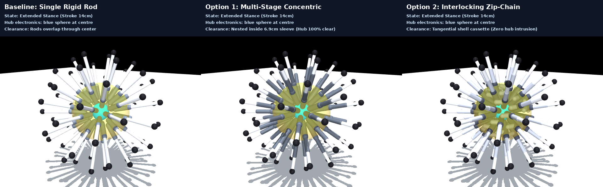

*The simulator can represent three bar architectures. This tutorial uses the
concentric multi-stage design in the middle.*

### 3.1 Start with one telescoping bar

We will use **bar** and **rod** to mean the same telescoping unit. One bar has
four visible parts:

- an outer sleeve fixed inside the spherical shell;
- a middle tube that slides through the sleeve;
- an inner tube that slides farther outward; and
- a rounded foot that touches the environment.

Let $\hat{\mathbf u}_i^B$ be the outward unit direction of bar $i$. The
superscript $B$ means that the direction is measured in a coordinate system
attached to the robot body. If the bar extends by $e_i$, its foot centre is

$$
\mathbf p_i^B=
\left(r_c+\ell_0+e_i\right)\hat{\mathbf u}_i^B.
$$

This equation says: begin at the robot centre, move one core radius
$r_c=15.0\,\text{cm}$, add the retracted offset
$\ell_0=1.0\,\text{cm}$, and then add the commanded extension $e_i$. The foot
centre is therefore $16.0\,\text{cm}$ from the robot centre when retracted and
$32.0\,\text{cm}$ away at the full $16.0\,\text{cm}$ stroke.

Although the bar contains two sliding tubes, the controller sends only the
single value $e_i$. MuJoCo couples their displacements:

$$
q_{i,\mathrm{middle}}=\frac{1}{2}e_i,
\qquad
q_{i,\mathrm{inner}}=e_i,
\qquad
0\leq e_i\leq16.0\,\text{cm}.
$$


*The outer sleeve remains fixed. At full stroke, the middle tube moves
$8.0\,\text{cm}$ while the inner tube and foot move $16.0\,\text{cm}$.*

The tubes nest inside one another instead of crossing the robot centre. This
leaves a central region of radius $7.2\,\text{cm}$ for electronics and power.
The simulation models the visible sliding motion and coupling; it does not yet
model the internal cable, screw, or pulley that a physical prototype would
need.

### 3.2 Why use 60 bars?

The number of bars is a design variable, not a law of physics. It creates a
trade-off:

- Too few bars leave large angular gaps, so a useful foot may not be available
  near the ground or an obstacle.
- More bars improve directional coverage, but add actuators, joints, sensors,
  mass, power demand, and control variables.

The current model uses $N=60$ as a practical starting point. With the
distribution used below, neighbouring directions are approximately
$23^\circ$ to $26^\circ$ apart. This gives the controller many possible contact
directions while keeping 60 actuator targets manageable.

We have not established that 60 is optimal. A physical design should compare
different values of $N$ using surface coverage, load capacity, mass, power, and
control complexity.

### 3.3 Place the bars around the sphere

We now need 60 directions that cover the sphere without clustering at the
poles. A **Fibonacci sphere** provides a simple nearly uniform construction.
For indices $i=0,\ldots,N-1$, define

$$
\phi_i=\arccos\left(1-\frac{2(i+0.5)}{N}\right),
\qquad
\theta_i=\pi(1+\sqrt{5})(i+0.5).
$$

Here, $\phi_i$ moves from the top of the sphere toward the bottom, while
$\theta_i$ turns around the vertical axis. The irrational golden-ratio spacing
in $\theta_i$ prevents the bars from lining up in a few repeated columns. The
two angles become a unit direction through

$$
\hat{\mathbf u}_i^B=
\begin{bmatrix}
\sin\phi_i\cos\theta_i \\
\sin\phi_i\sin\theta_i \\
\cos\phi_i
\end{bmatrix}.
$$

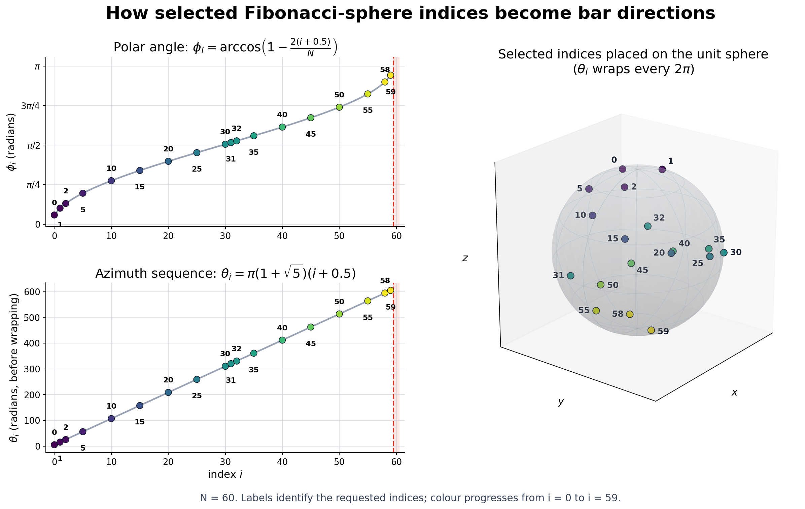

*The graphs show selected indices for $N=60$. The azimuth is drawn unwrapped
on the left but wraps every $2\pi$ when the direction is placed on the sphere.
Valid zero-based indices run from 0 to 59.*

These directions are stored in the body frame $B$, so they remain fixed
relative to the core. The room uses a separate world frame $W$. If the core
orientation is $q$, the rotation matrix $R_{WB}(q)$ expresses a body-frame bar
direction in world coordinates:

$$
\hat{\mathbf u}_i^W=R_{WB}(q)\hat{\mathbf u}_i^B.
$$

This calculation does not move the bar. It gives two coordinate descriptions
of the same physical direction: one measured using axes attached to the core,
and one measured using axes fixed in the room.

<iframe src="./assets/body-world-coordinate-frames.html" title="Interactive 3D RoboBall with world and body coordinate frames" width="100%" height="700" style="border: 1px solid #d0d5dd; border-radius: 8px;"></iframe>

[Open the interactive 3D coordinate-frame figure](./assets/body-world-coordinate-frames.html)

*The world frame stays fixed on the ground. The body frame and every
body-frame bar direction rotate with the core.*

Consequently, a bar does not have a permanent role such as “bottom” or “rear.”
Its index and body-frame direction stay unchanged, but its world-frame
direction changes as RoboBall rolls.

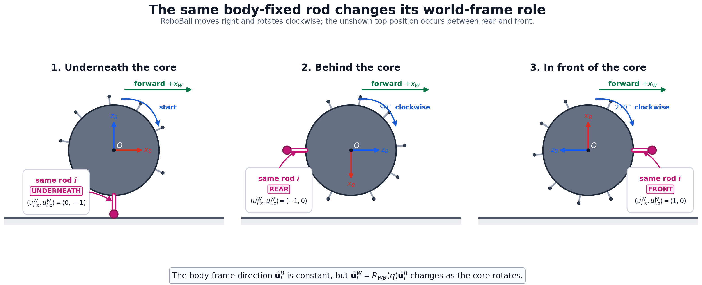

*The magenta bar is the same physical bar in every panel. While RoboBall moves
right and rotates clockwise, that bar moves from underneath to the rear,
passes over the unshown top, and later reaches the front.*

### 3.4 How one bar can rotate the core

Extending a bar in free space cannot push RoboBall across the floor. The foot
must exchange force with the environment. When an actuator extends a contacting
bar, it transmits an outward force to the foot. The robot pushes the ground
with $\mathbf F_{R\to G}$, and Newton's third law gives an equal and opposite
force on the robot:

$$
\mathbf F_i=-\mathbf F_{R\to G}
=\mathbf F_{n,i}+\mathbf F_{t,i}.
$$

The normal component $\mathbf F_{n,i}$ points away from the ground and supports
the robot. The tangential component $\mathbf F_{t,i}$ is friction along the
surface.

The contact point is offset from the core centre. Let $\mathbf r_i$ point from
the centre to that contact. The ground reaction then produces the torque

$$
\boldsymbol\tau_i=\mathbf r_i\times\mathbf F_i.
$$

Its magnitude is

$$
\lVert\boldsymbol\tau_i\rVert
=\lVert\mathbf r_i\rVert\,\lVert\mathbf F_i\rVert\sin\gamma,
$$

where $\gamma$ is the angle between the two vectors. A force whose line of
action passes through the centre has no lever arm and produces no torque. A
force whose line misses the centre can rotate the core.

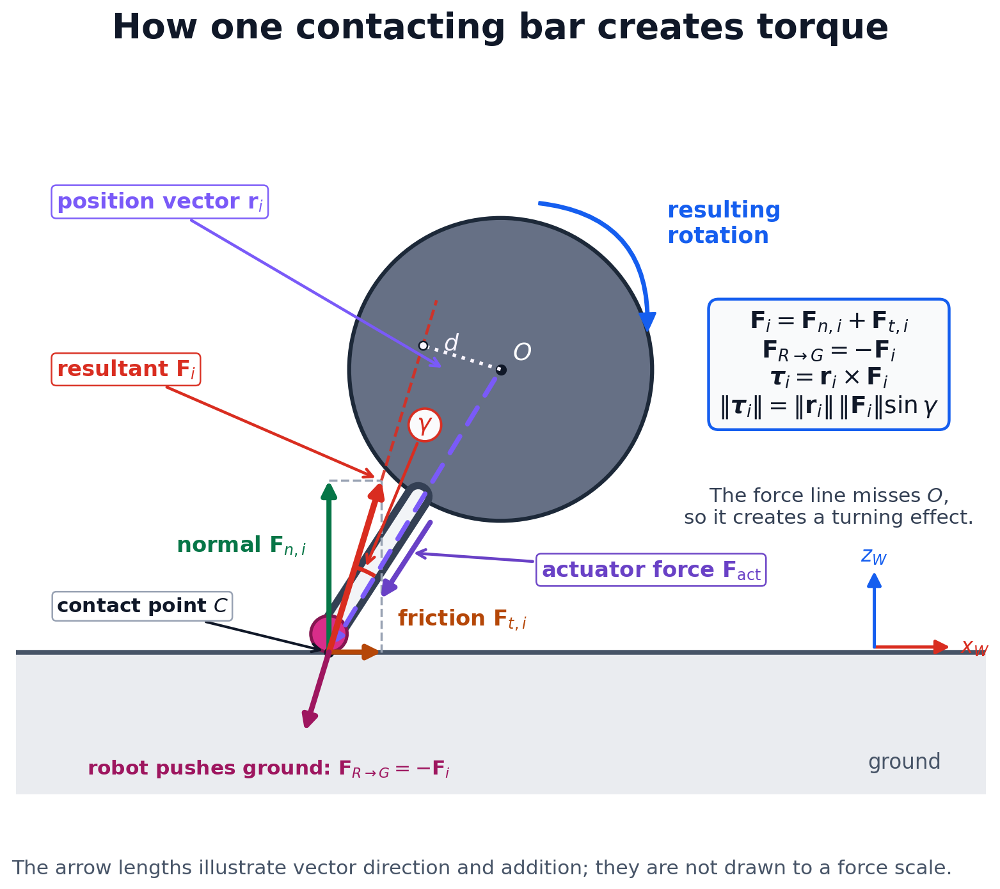

*Purple shows the actuator driving the foot outward. Magenta is the robot's
push on the ground; red is the equal and opposite ground reaction. Because the
red force line misses $O$, the illustrated force rotates the core clockwise.*

Locomotion is therefore a contact-coordination problem. The controller must
continually choose bars whose current world-frame positions can create useful
forces and torques.

### 3.5 Put the mechanism into a physics simulation

The geometry tells us where a foot should be, and the force diagram tells us
why contact can rotate the core. Neither tells us the resulting motion when
many feet, gravity, friction, impacts, and actuator limits interact. MuJoCo
solves that next part numerically.

#### 3.5.1 Represent the robot and its contacts

The MuJoCo model contains:

- a rigid spherical core with a free joint, so it can translate and rotate;
- two coupled slide joints for every multi-stage bar;
- a rounded collision foot at the end of each bar; and
- collision geometry for the floor, walls, stairs, and other obstacles.

A controller supplies one target extension per bar. These targets do not
teleport the joints. Actuators apply forces, and the physics determines how far
the bars actually move.

Friction also has a limit. If $F_n$ is the normal-force magnitude, the available
tangential force satisfies

$$
\lVert\mathbf F_t\rVert\leq\mu F_n,
$$

where $\mu$ is the sliding-friction coefficient. Pressing harder against the
surface permits more friction. If a requested motion needs more tangential
force than this bound, the foot slips.

#### 3.5.2 Advance time in small steps

Real motion is continuous, but a computer advances the simulation through
short intervals. At the beginning of step $k$, MuJoCo knows the state: core
position and orientation, linear and angular velocity, and every bar's
position and velocity.

One step follows this causal chain:

```text
target bar extensions
          ↓
actuator, gravity, contact, and friction forces
          ↓
linear and angular accelerations
          ↓
new velocities
          ↓
new core pose and bar positions
```

For intuition, we can describe the translation of RoboBall's centre of mass
with the simplified Newtonian update:

$$
\mathbf a_k=\frac{\sum\mathbf F_k}{m},
\qquad
\mathbf v_{k+1}=\mathbf v_k+\mathbf a_k\Delta t,
\qquad
\mathbf p_{k+1}=\mathbf p_k+\mathbf v_{k+1}\Delta t.
$$

MuJoCo does not literally use only these three equations. It solves the full
articulated rigid-body system, including contact constraints, and uses its
implicit integrator for the numerical update. It also performs the
corresponding rotational update using torque, angular velocity, and inertia. A
bar may fail to reach its target if an obstacle blocks it or its actuator cannot
provide enough force. Section 4 will explain how the actuator decides what
force to apply.

In the current environment configuration, the physics interval is
$2\,\text{ms}$. Bar targets are updated every $10\,\text{ms}$, so MuJoCo runs
five physics steps between controller updates. The smaller physics interval
resolves fast contact changes without requiring the rod-selection logic to run
equally often.

### 3.6 Choose bars for a requested movement

We can now formulate the coordination problem. Given a requested horizontal
direction, which bars are behind the core, close to the travel centreline, and
pointing downward enough to push against the ground?

#### 3.6.1 Measure each bar relative to the requested direction

Represent the requested horizontal direction by the unit vector

$$
\hat{\mathbf d}=[d_x,d_y].
$$

For example, $\hat{\mathbf d}=[1,0]$ requests motion along the positive world
$x$-axis. In three dimensions, the controller uses three task axes:

$$
\hat{\mathbf d}_{\parallel}=[d_x,d_y,0],
\qquad
\hat{\mathbf d}_{\perp}=[-d_y,d_x,0],
\qquad
\hat{\mathbf z}=[0,0,1].
$$

They mean forward, sideways, and vertical. Using the world-frame bar direction
computed in Section 3.3, three dot products measure the bar's alignment with
those axes:

$$
u_i^{\parallel}
=\hat{\mathbf u}_i^W\cdot\hat{\mathbf d}_{\parallel}
=u_{i,x}^Wd_x+u_{i,y}^Wd_y,
$$

$$
u_i^{\perp}
=\hat{\mathbf u}_i^W\cdot\hat{\mathbf d}_{\perp}
=u_{i,x}^W(-d_y)+u_{i,y}^Wd_x,
\qquad
u_i^z=u_{i,z}^W.
$$

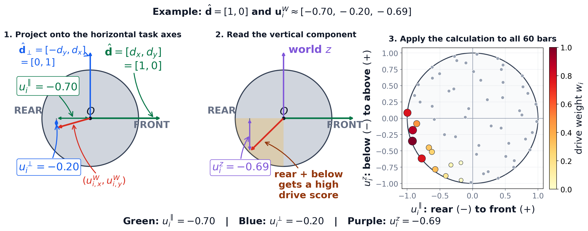

*Green measures forward or rearward alignment, blue measures sideways
alignment, and purple measures vertical alignment. The final panel repeats the
calculation for all bars.*

<iframe src="./assets/task-projections-3d.html" title="Interactive 3D visualization of RoboBall forward, sideways, and vertical bar projections" width="100%" height="760" style="border: 1px solid #d0d5dd; border-radius: 8px;"></iframe>

[Open the interactive 3D projection figure](./assets/task-projections-3d.html)

*Drag to rotate and scroll to zoom. The magenta arrow is one world-frame bar
direction; its green, blue, and purple components are the three projections.*

The signs now answer the selection questions:

- $u_i^{\parallel}<0$: the bar points behind the requested direction;
- $|u_i^{\perp}|\approx0$: the bar is near the travel centreline; and
- $u_i^z<0$: the bar points below the core.

For $\hat{\mathbf d}=[1,0]$, consider a bar with world-frame direction
$[-0.70,-0.20,-0.69]$. Its projections are $-0.70$, $-0.20$, and $-0.69$.
It is behind, only slightly sideways, and below the core, making it a useful
candidate for pushing.

#### 3.6.2 Combine the measurements into a drive weight

The projections describe where a bar points. We next convert them into a
dimensionless drive weight $w_i\in[0,1]$, where zero means “do not use this bar”
and one means “use it strongly.”

Create three smooth factors:

- $s_{i,\mathrm{rear}}$ increases as the bar points farther behind;
- $s_{i,\mathrm{centre}}$ is largest near the travel centreline; and
- $s_{i,\mathrm{down}}$ is largest at useful downward angles.

The movement gait combines them with a drive gain $g$:

$$
w_i=\mathrm{clip}\left(
g\,s_{i,\mathrm{rear}}^{1.1}
s_{i,\mathrm{centre}}s_{i,\mathrm{down}},\,0,\,1
\right).
$$

Multiplication acts like a soft **AND**: a bar needs useful rear, sideways,
and downward projections. The implementation also zeros leading and upper
sectors. Increasing $g$ changes the drive weights without reducing the
available rod stroke.

#### 3.6.3 Convert the weight into a target extension

The weight has no physical unit, so the actuator cannot use it directly.
Instead, map it into the available extension range:

$$
e_i^*=e_{\min}+\left(e_{\max}-e_{\min}\right)w_i.
$$

Here, $e_{\min}=2.5\,\text{cm}$ is the gait's minimum extension and
$e_{\max}=16.0\,\text{cm}$ is the configured maximum. Push strength has
already been included in $w_i$; `move` does not apply another amplitude
parameter after this mapping.

For example, $w_i=0.4$ gives

$$
e_i^*=2.5+(16.0-2.5)(0.4)=7.9\,\text{cm}.
$$

The coordination layer has now converted one requested direction into a target
for every bar. It still has not determined the actuator forces required to
reach those targets. That is the job of the low-level controller in Section 4.

## 4. Low-level actuator control

### 4.1 PD control for each rod

To make a bar reach $e_i^*$, we need a feedback controller. The target tells us
where the bar should go, but not how much force the actuator should apply. A
**PD controller** is a good first choice because the bar must move toward its
target quickly without bouncing around it.

At every simulation step, the controller computes

$$
F_i=K_p\left(e_i^*-e_i\right)-K_v\dot e_i.
$$

The error $e_i^*-e_i$ measures how far the bar is from its target. The
proportional gain $K_p$ turns that error into a correcting force. If the bar is
too short, the error is positive and the force extends it; if the bar is too
long, the error is negative and the force retracts it. The derivative term
$-K_v\dot e_i$ opposes fast motion, adding damping as the bar approaches the
target. We omit the integral term here, so this is PD rather than PI control.

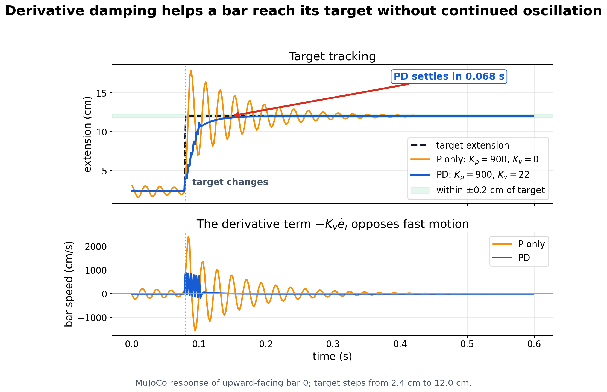

*Measured response of one upward-facing bar. With proportional-only control,
the bar repeatedly overshoots the target. Adding the derivative term damps its
speed and brings it within $\pm0.2\,\text{cm}$ of the target in $0.068\,\text{s}$.*

The complete path from a command to motion is therefore:

```text
desired direction → three projections → drive weight
                  → extension target → actuator force → MuJoCo motion
```

## 5. Motion skills and coordination

Sections 3 and 4 showed how rod targets become actuator forces and physical
motion. A skill packages the target-selection rule into a command such as
“move in this direction” or “jump.”

The current repository separates two kinds of skills:

- **Low-level primitives** in `skills/low_level/` generate targets for one
  behaviour: movement, turning, jumping, falling, or terrain traversal.
- **Mid-level coordinators** in `skills/mid_level/` choose or sequence
  primitives: `follow_path`, `stay_in_boundary`, and `climb_stairs`.
  High-level task planning is reserved for `skills/high_level/`.

We will start with primitives, then show coordination. The article covers
a selection of the registered skills, not the complete library.

Most calls calculate one update's rod targets. Jump and fall functions
receive a phase; their caller or runner manages transitions. Suspension
also has explicit `SuspensionState` history, so not every skill is a
stateless pure function.

The public entry point remains `from skills import execute_skill`.
A normal array-returning primitive produces one extension target per rod,
in metres. With `return_metadata=True`, the dispatcher returns
`(targets, metadata)`, including the requested name and target summary.
Some specialized primitives return tuples natively; their dedicated
runners handle those interfaces.

### 5.1 Moving at a chosen speed

Suppose we want RoboBall to move along the world's positive $x$-axis at
$120\,\text{cm/s}$. We give `move` a direction,
$\hat{\mathbf d}=[1,0]$, and a requested speed. “Forward” follows this
direction, since the rolling shell has no permanent front.

The skill reuses the selection rule from Section 3.6. At each update, bars
behind and below the core receive larger extension targets. As the ball rolls,
different bars enter that region and take over the push. This repeating
pattern is the **gait**; the PD controllers make each bar follow its target.

How do we choose the push strength? A **calibration curve**, measured for the
current antenna-style bars, maps requested speed to a parameter called
`back_gain`. This provides the initial push strength. With live velocity
feedback, the skill increases that strength when the ball is too slow and
reduces it when it is too fast. It also steers against sideways motion and
displacement from the requested line. These corrections act on the ball's
movement; the PD controllers still handle each bar's extension.

For travel along world $+x$, save the starting $y$-coordinate once, then call
the skill at every control update:

```python
# Before the movement loop:
y_start = float(env.data.qpos[1])

# Inside the loop:
targets = execute_skill(
    "move",
    env.data.qpos[3:7].copy(),  # current orientation
    env.dirs_body,
    env.max_extend,
    d_hat=[1.0, 0.0],
    speed=1.2,                 # 120 cm/s; the API uses m/s
    lin_vel=env.data.qvel[:2].copy(),
    cross_track_error=float(env.data.qpos[1] - y_start),
    rod_mechanism=env.cfg.robot.rod_mechanism,
)
env.step(targets)
```

Repeating this call keeps the ball moving. The caller decides when to switch
to another skill, such as `stop`.

**What happens in simulation?** In a six-second flat-ground run with the
current antenna-style bars, RoboBall travelled about $703\,\text{cm}$ forward.
Its average forward speed during the final two seconds was
$121.4\,\text{cm/s}$ for the requested $120\,\text{cm/s}$, and it finished about
$6.1\,\text{cm}$ to the side of its starting line.

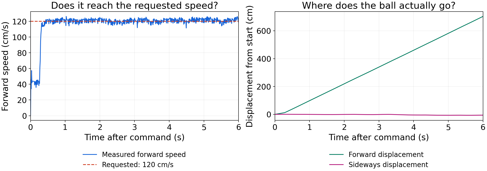

*Left: requested and measured forward speed. Right: forward and sideways
displacement. Both plots show the same run with the default configuration,
seed 42, and no randomization.*

[Watch the six-second run](./assets/move-forward.mp4).
Video path for the later HTML version: `assets/move-forward.mp4`.


Implementation: [movement skills](../../skills/low_level/locomotion.py).
Reproduce the results with the [measurement script](./plot_move_forward.py);
the [recorded data](./assets/move-forward.csv) and
[run summary](./assets/move-forward-results.json) are available alongside it.

### 5.2 Changing speed while moving

We can change speed while keeping the same direction and gait. In the
`move` call above, use `speed=0.6` to request $60\,\text{cm/s}$ or
`speed=2.0` to request $200\,\text{cm/s}$.

A higher request increases the push strength; a lower request reduces it.
The maximum bar stroke stays the same. With velocity feedback, the controller
adjusts the push as the ball approaches the requested speed, so the change
happens gradually rather than instantly.

In our six-second runs, these two requests produced average forward speeds of
$60.5\,\text{cm/s}$ and $196.9\,\text{cm/s}$ over the final two seconds.

Normal, fast, and slow movement are settings of this one skill. Only the
`speed` parameter changes; the caller keeps using `move`.

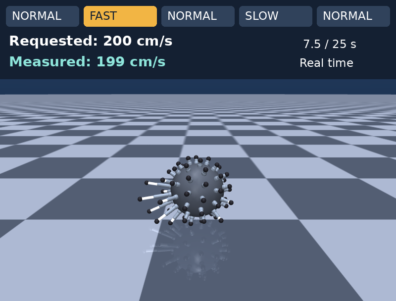

[Watch the continuous speed demonstration](./assets/move-speed-sequence.mp4):
normal (120 cm/s) → fast (200 cm/s) → normal → slow (60 cm/s) → normal.
Each phase lasts five seconds, with no reset between phases.

Video path for the later HTML version: `assets/move-speed-sequence.mp4`.

### 5.3 Turn right and left

One `turn` skill handles both directions through `angle_deg`: positive angles
turn right, negative angles turn left, and zero continues straight. For
example, `angle_deg=+30` requests 30° right and `angle_deg=-30` requests 30°
left, viewed from above.

The angle is measured relative to the supplied direction, `d_hat`. Keep that
reference fixed while the command runs; the angle specifies the new travel
direction rather than an additional rotation at every update.

```python
run_skill(env, "turn", steps=400, d_hat=[1, 0], angle_deg=+30)
```

The bars selected for pushing now lie behind the new requested direction.
The ball still has momentum along its previous direction, so its path bends
as the ground forces redirect its motion.

This reuses the rear-bottom selection rule from Section 3.6: changing the
requested direction changes which bars count as rear bars and receive larger
extension targets.

In the video, we keep the requested speed at $120\,\text{cm/s}$ and run three
four-second phases: straight along world $+x$, right toward $-y$, then left
back toward $+x$. After each turn, the new requested direction becomes the
reference for the next command.

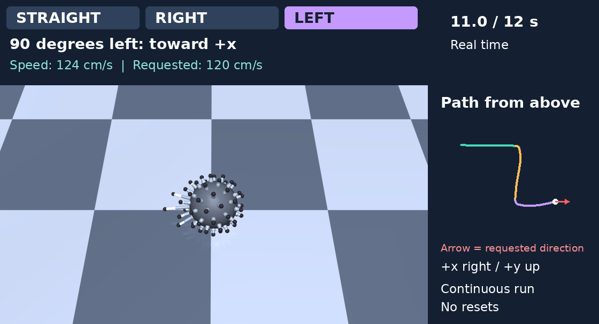

[Watch straight → right → left](./assets/move-turn-sequence.mp4).
The coloured trail shows the actual path; the red arrow shows the requested
direction. The ball keeps moving between phases, with no resets.

Video path for the later HTML version: `assets/move-turn-sequence.mp4`.

### 5.4 Stopping and reversing with signed speed

The same `move` skill handles forward travel, stopping, and reverse travel:

```python
run_skill(env, "move", d_hat=[1, 0], speed=+1.2)  # forward
run_skill(env, "move", d_hat=[1, 0], speed=0.0)   # stop
run_skill(env, "move", d_hat=[1, 0], speed=-1.2)  # reverse
```

At zero speed, `move` delegates to the `stop` controller. It reads the ball's
velocity and extends bars ahead of its motion and below the core. Their
contact forces oppose the rolling motion. As the ball slows, braking weakens;
near rest, the lower bars form a supporting stance.

This changes the selection rule we discussed earlier: rear-bottom bars drive
the ball, while front-bottom bars help brake it.

A negative speed reverses the requested travel direction. Bars that were
behind the ball relative to the old direction are now ahead of it, so the
rear-bottom selection rule switches to the opposite side. We can then adopt
this direction as the new forward reference: flip `d_hat` once and make
`speed` positive. For example, `d_hat=[1, 0], speed=-1.2` becomes
`d_hat=[-1, 0], speed=+1.2`, requesting exactly the same motion.

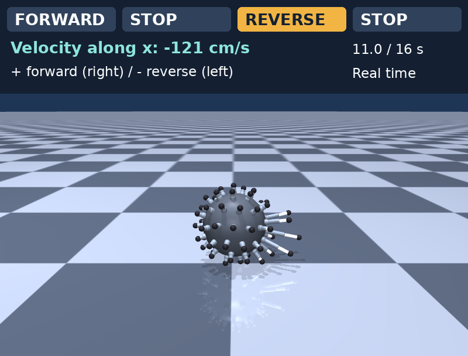

[Watch forward → stop → reverse → stop](./assets/move-stop-reverse.mp4).
Each phase lasts four seconds, without resets. Positive velocity means
forward travel; negative velocity means reverse travel. During each stop,
watch the velocity approach zero before the next action.

Video path for the later HTML version: `assets/move-stop-reverse.mp4`.

### 5.5 Jumping

#### 5.5.1 Jumping from a standstill

For a vertical jump, the bars must push upward together and then prepare for
landing. The `jump_up` skill therefore uses four phases:

1. **Crouch:** retract the bars, lowering the core and leaving room for the
   next extension.
2. **Takeoff:** command the lower bars to extend fully. Feet touching the
   ground push against it, and the ground reaction accelerates the ball upward.
3. **Airborne:** retract the bars to a compact $1.5\,\text{cm}$ extension as
   the ball rises and falls.
4. **Landing:** extend the downward-facing bars to $5.5\,\text{cm}$ so their
   feet meet the ground. Actuator damping helps absorb the impact.

This uses the same world-frame directions discussed earlier, but the selection
now favours bars below the core rather than behind a travel direction.

The caller passes the current phase to `jump_up`. In this example, crouching
lasts $0.20\,\text{s}$ and takeoff lasts $0.12\,\text{s}$. During descent, the
caller switches from airborne to landing when the core is below
$32\,\text{cm}$. These phase changes form a small **state machine**: each phase
has its own bar targets and a condition for moving to the next.

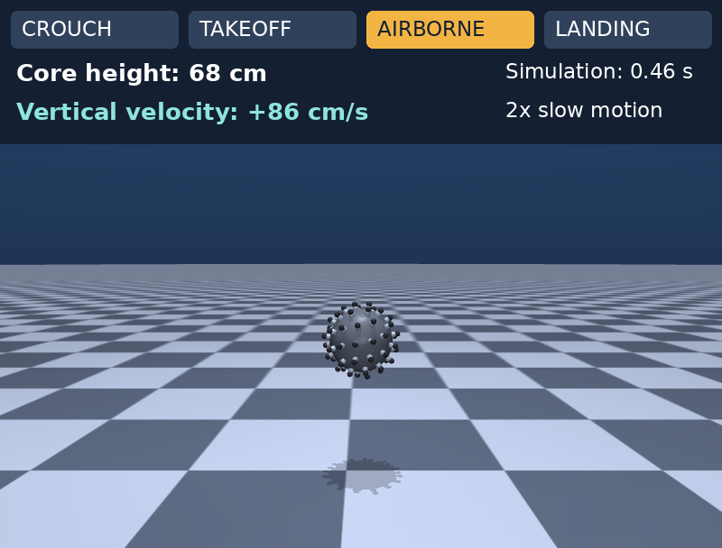

[Watch crouch → takeoff → airborne → landing](./assets/jump-up.mp4).
The video plays at 2× slow motion. In this run, the core rises from about
$20\,\text{cm}$ to $71\,\text{cm}$ above the ground—a lift of about
$52\,\text{cm}$.

Video path for the later HTML version: `assets/jump-up.mp4`.

#### 5.5.2 Jumping forward from a standstill

The complete action is **standstill → forward jump → standstill**. The ball
first holds a compact resting posture, then pushes off. During takeoff,
`jump_forward_while_stopped` favours the lower bars behind the requested
direction, launching the ball upward and forward.

This combines the selection rules we already know: downward-facing bars
provide lift, while a rear bias adds forward motion. The bars tuck in during
flight and prepare for contact during descent. As soon as the feet touch
down, the caller switches to `stop` to brake, then retracts the bars into a
compact resting posture.

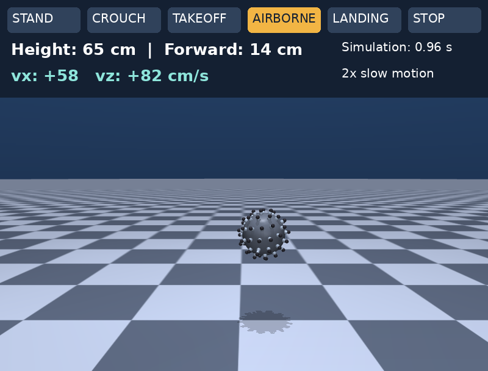

[Watch standstill → forward jump → standstill](./assets/jump-forward-standing.mp4).
The video plays at 2× slow motion and includes the resting posture before and
after the jump. The core rises about $52\,\text{cm}$ and first touches down
about $37\,\text{cm}$ ahead of its starting position.

Video path for the later HTML version: `assets/jump-forward-standing.mp4`.

#### 5.5.3 Jumping forward while moving

Here the action is **move forward → jump → continue moving forward**. We
begin with `move` at $120\,\text{cm/s}$. The ball already has forward
momentum when the jump begins, so an upward push carries it along a forward
arc.

The `jump_forward_while_moving` skill supplies the dip, launch, airborne, and
landing patterns. The dip retracts the bars to leave room for the launch
stroke. Leading bars stay tucked during launch so they do not brake the
forward motion, as they would in the stop skill.

Once the feet touch down, the caller resumes `move` with the same
direction and requested speed. The video includes forward travel both before
and after the jump.

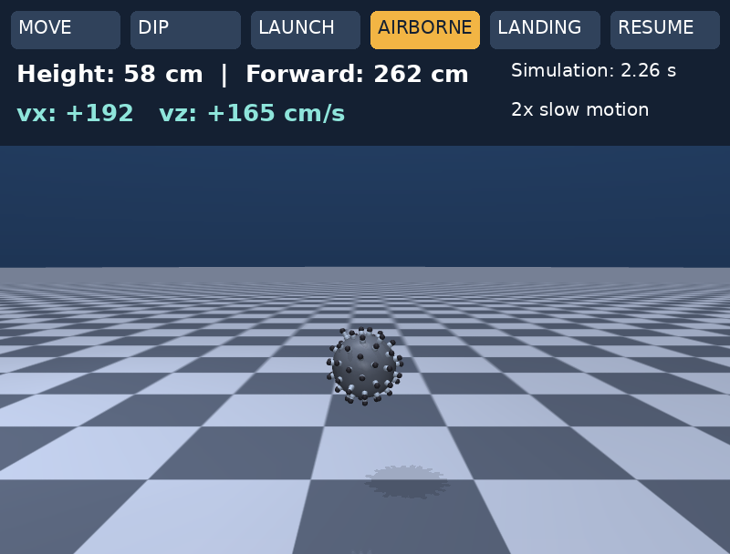

[Watch move forward → jump → continue moving forward](./assets/jump-forward-moving.mp4).
At 2× slow motion, watch the positive forward velocity carry through the
jump and the movement command resume after landing.

Video path for the later HTML version: `assets/jump-forward-moving.mp4`.

#### 5.5.4 Controlling jump height

A short hop and a high jump use the same phases. What changes is the
takeoff stroke. All three jump skills accept `jump_height_cm`: a requested
rise of the core above its pre-jump height, not its height above the floor
or the clearance beneath its feet.

The code interpolates a measured, skill-specific calibration table to choose
`power`. During takeoff, this scales the selected rods' extension targets:

$$
e_i^* = \mathrm{power}\;e_{\max}w_i.
$$

This is calibrated height control, not feedback from measured jump height.
`jump_height_cm` overrides `power`; requests outside the stored range are
clipped. The current tables span $5$–$54\,\text{cm}$ for `jump_up`,
$5$–$48\,\text{cm}$ for `jump_forward_while_stopped`, and
$5$–$50.8\,\text{cm}$ for `jump_forward_while_moving`.

Why does takeoff matter? In a point-mass approximation, once ground contact
ends, upward speed determines the additional rise:

$$
h_{\mathrm{flight}} \approx \frac{v_{z,\mathrm{liftoff}}^2}{2g},
\qquad g \approx 981\,\text{cm/s}^2.
$$

This is rise **after liftoff**, whereas our recorded core rise also includes
motion during takeoff. The approximation neglects air resistance and relative
motion between the core and rods. See the
[projectile-motion explanation](https://openstax.org/books/university-physics-volume-1/pages/4-3-projectile-motion).

For a forward jump, set the same parameter in either takeoff phase:

```python
# Forward jump from rest: inside the takeoff phase
targets = execute_skill(
    "jump_forward_while_stopped", quat, dirs_body, max_extend,
    d_hat=[1.0, 0.0], phase="takeoff", jump_height_cm=35.0,
)

# Forward jump while moving: inside the launch phase
targets = execute_skill(
    "jump_forward_while_moving", quat, dirs_body, max_extend,
    d_hat=[1.0, 0.0], phase="launch", jump_height_cm=35.0,
)
```

The caller still manages the other phases, including braking after a
standing forward jump or resuming movement after a running jump.

The comparison recordings show three consecutive requests without resetting:

| Requested rise | Measured vertical-jump rise | Measured moving-jump rise |
|---|---:|---:|
| $20\,\text{cm}$ | $20.9\,\text{cm}$ | $21.0\,\text{cm}$ |
| $35\,\text{cm}$ | $30.5\,\text{cm}$ | $30.3\,\text{cm}$ |
| $50\,\text{cm}$ | $53.4\,\text{cm}$ | $45.7\,\text{cm}$ |

These are measured rises, not obstacle-clearance tests.

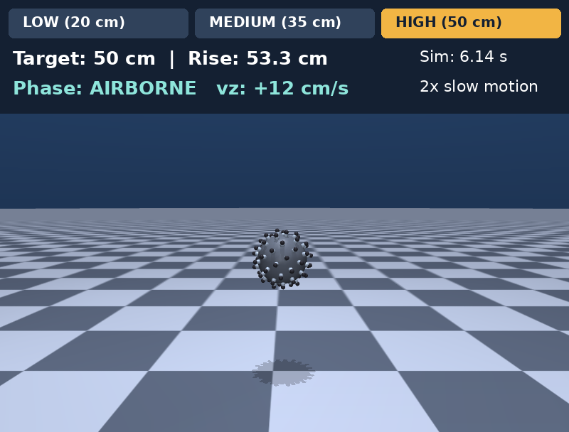

[Watch vertical jumps: low → medium → high, at 2× slow motion](./assets/jump-height-standing.mp4).

Video path for the later HTML version: `assets/jump-height-standing.mp4`.

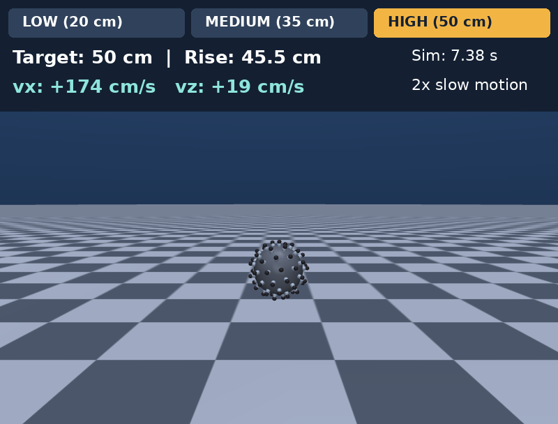

[Watch moving jumps: low → medium → high, at 2× slow motion](./assets/jump-height-moving.mp4).

Video path for the later HTML version: `assets/jump-height-moving.mp4`.

Implementation: [jumping skills](../../skills/low_level/jumping.py).
Reproduce with the [jump-height recording script](./render_jump_height.py).
[Standing data](./assets/jump-height-standing.csv) ·
[moving data](./assets/jump-height-moving.csv) ·
[standing summary](./assets/jump-height-standing-results.json) ·
[moving summary](./assets/jump-height-moving-results.json).

### 5.6 Following curved paths and winding roads

A turn changes the requested travel direction; it does not instantly rotate
the robot or its velocity. To follow a bend, we need to keep adjusting that
direction as the ball moves.

The first recording tries a bend with three timed heading changes. Its
maximum distance from the reference lane is $318\,\text{cm}$. This shows
the behavior of that command sequence—not that discrete commands must
produce a polygonal path or that slipping has been measured.

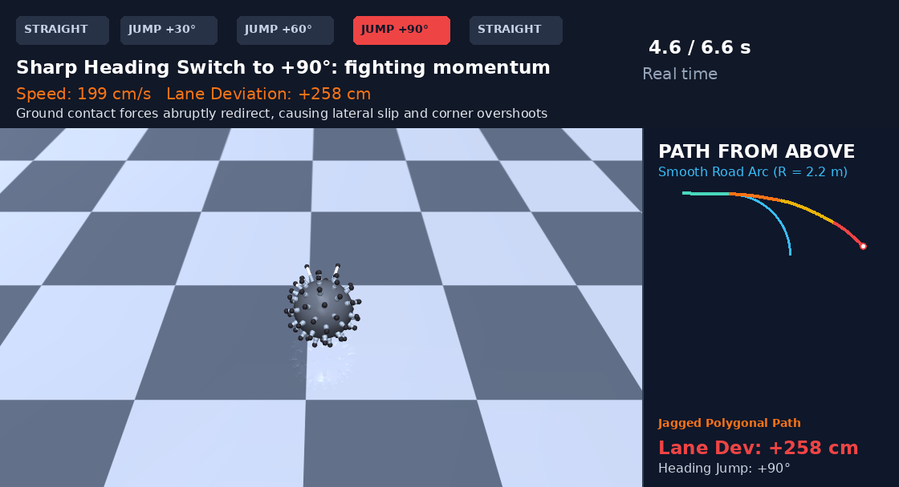

[Watch the timed heading-change example](./assets/move-curve-discrete-jumps.mp4).

Video path for the later HTML version: `assets/move-curve-discrete-jumps.mp4`.

#### 5.6.1 Why a curve needs continuous steering

Even at constant speed, moving around a circle changes the velocity's
direction. That requires acceleration toward the circle's centre:

$$
a_c=\frac{v^2}{R}.
$$

For $v=120\,\text{cm/s}$ and $R=200\,\text{cm}$, this is
$72\,\text{cm/s}^2$. Faster travel or a tighter bend requires more inward
acceleration. Ground contact must supply the corresponding net horizontal
force. This is [centripetal acceleration](https://openstax.org/books/university-physics-volume-1/pages/4-summary),
not an additional outward force in the world frame.

A heading that rotates at $v/R$ would suit an ideal robot that follows its
command exactly. RoboBall has inertia and imperfect tracking. In the
open-loop recording, the final distance from the intended circle centre
is $658\,\text{cm}$ instead of $200\,\text{cm}$; this is a radial-distance
measurement, not a fitted turning radius.

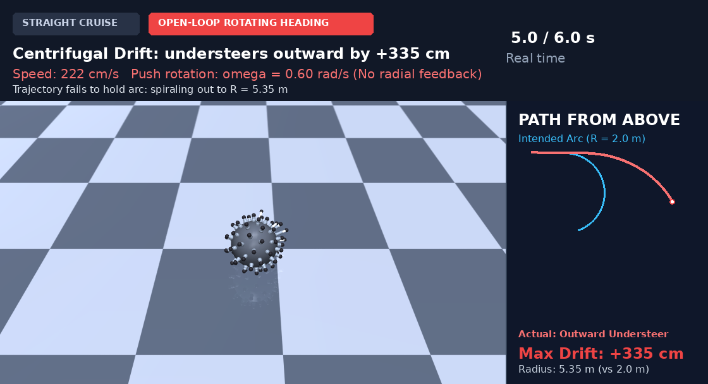

[Watch the open-loop curve example](./assets/move-curve-openloop-drift.mp4).

Video path for the later HTML version: `assets/move-curve-openloop-drift.mp4`.

The `curve` skill instead aims toward a point ahead around a reference
circle. It also moves that target inward when the ball is too far from
the centre. For position $\mathbf p$, centre $\mathbf c$, and a requested
radius $R\ge40\,\text{cm}$, the implemented radial correction is:

$$
e_r=\|\mathbf p-\mathbf c\|-R,\qquad
R_{\mathrm{target}}=\max(20\,\text{cm},\,R-\delta-2.5e_r).
$$

Here $\delta$ is the code's speed-dependent inward offset, capped at
$20\,\text{cm}$. It is a tuning heuristic, not a computed contact force.
The controller advances the target angle by a lookahead distance
(default $35\,\text{cm}$), then sends the direction from the ball to that
target to `move`. This resembles
[lookahead path pursuit](https://publications.ri.cmu.edu/implementation-of-the-pure-pursuit-path-tracking-algorithm);
it is not the vehicle-steering law from that paper.

#### 5.6.2 The skill interface

For a fixed arc, compute its centre once and retain it during the curve.
Otherwise, `curve` recomputes a centre from the current position on every
call, so it does not measure error relative to the original circle.

```python
# Once at the start of a right bend; heading is a horizontal unit vector.
radius = 2.0  # 200 cm; this API uses metres
arc_center = start_xy + radius * np.array([heading[1], -heading[0]])

# At each control update:
targets = execute_skill(
    "curve", quat, dirs_body, max_extend,
    d_hat=heading, speed=1.2, radius=radius, direction="right",
    ball_xy=current_xy, center_xy=arc_center,
    rod_mechanism="multi_stage",
)
```

Alternatively, `curvature` uses reciprocal metres: `+0.5` requests a
$200\,\text{cm}$ right bend, `-0.5` a left bend, and zero straight motion.
Positive-right is this API's convention, not the usual positive-left
convention for signed planar curvature.

#### 5.6.3 A right bend followed by a left bend

The recording combines straight → right curve → straight → left curve →
straight over $11.1\,\text{s}$, with a requested radius of $200\,\text{cm}$
for both bends. Mean speeds during the right and left bends were
$183.9$ and $199.2\,\text{cm/s}$ respectively; the $120\,\text{cm/s}$ speed setting
is a request, not the measured curve speed.

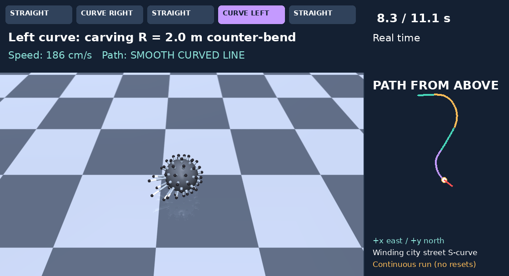

[Watch the right-and-left curve sequence](./assets/move-curved-street.mp4).

Video path for the later HTML version: `assets/move-curved-street.mp4`.

Implementation: [locomotion skills](../../skills/low_level/locomotion.py).
Recording scripts: [curved motion](./render_curved_motion.py),
[timed heading changes](./render_discrete_jumps.py),
[open-loop rotation](./render_openloop_drift.py).
Summaries: [curve sequence](./assets/move-curved-street-results.json),
[heading changes](./assets/move-curve-discrete-jumps-results.json),
[open-loop rotation](./assets/move-curve-openloop-drift-results.json).

### 5.7 Controlled falling and stepping off ledges

Going down a ledge does not require an upward launch. We need to leave
the edge, prepare the feet for contact, and reduce the impact on the core.

A longer fall generally means a faster touchdown. For an ideal free fall
starting with zero vertical velocity, a vertical drop $h$ gives
$v_z^2=2gh$. An $18\,\text{cm}$ fall would therefore reach about
$188\,\text{cm/s}$ downward. Platform height alone does not determine the
actual impact speed: the rods can contact the floor before the core has
fallen that distance.

`fall_down` provides four rod patterns; the caller chooses when to switch:

1. `edge`: use a low-speed forward gait to approach and leave the lip.
2. `freefall`: tuck most rods and extend landing rods. For a supplied drop
   below $50\,\text{cm}$, only rear-bottom rods deploy; for taller or
   unspecified drops, the bottom cluster deploys.
3. `absorb`: request a partial downward extension. The actuator's
   position and velocity feedback provides spring-like support and damping.
4. `settle`: return the bottom cluster to a short stance.

The absorption target increases with the square root of the supplied drop
height, with stroke limits. This is a tuned rule for allocating landing
travel, not a guarantee that every impact can be absorbed.

```python
targets = execute_skill(
    "fall_down", quat, dirs_body, max_extend,
    d_hat=[1.0, 0.0], phase=current_phase,
    drop_height=0.18, edge_speed=0.35, gear=0.5,
)
```

Here `gear=0.5` requests half of the available stroke for the selected
landing rods. A core-height threshold can help the caller choose phases,
but height alone does not establish whether a foot is touching a surface.

In the $18\,\text{cm}$ platform recording, peak downward speed was
$155.4\,\text{cm/s}$. The core's minimum height above the lower floor was
$17.5\,\text{cm}$, leaving $2.5\,\text{cm}$ beneath its $15\,\text{cm}$
radius shell. Its final height was $19.9\,\text{cm}$.

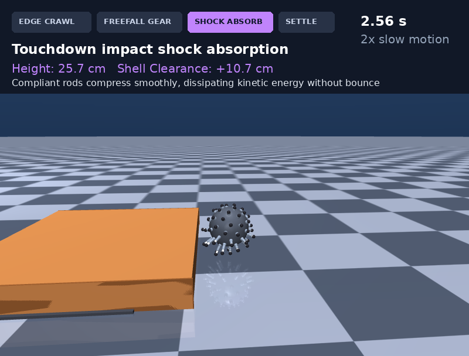

[Watch the platform descent at 2× slow motion](./assets/fall-down-platform.mp4).

Video path for the later HTML version: `assets/fall-down-platform.mp4`.

Implementation: [falling skills](../../skills/low_level/falling.py).
[Recording script](./render_fall_down.py) ·
[trajectory](./assets/fall-down-platform.csv) ·
[summary](./assets/fall-down-platform-results.json).

### 5.8 Moving along a trench

Here the gap runs **along** the travel direction, between two parallel
platforms. This is straddling a trench, not jumping across a transverse gap.

Rods pointing into the empty middle cannot provide ground support.
`straddle_gap` therefore favours rear-facing rods on the two flanks and
retracts central and leading rods. Its selection uses the dimensionless
sideways projection $u_i^\perp$, not a distance:

$$
\text{central tuck:}\quad |u_i^\perp|<u_{\min}+0.02
\quad\text{and}\quad u_i^z<0.12.
$$

The default is $u_{\min}=0.10$. Whether a selected foot actually reaches a
platform also depends on its extension and the robot's position.
`straddle_gap` takes neither `gap_half_width` nor `speed`.
Use `min_lat` to adjust the central selection window and `back_gain`
to set drive-wave strength. Tucked rods receive a true zero target, so
this skill has no `min_offset` parameter either.

A supplied lateral offset steers the gait back toward the centreline.
The correction is clipped to $\pm0.25$ radians (about $\pm14.3^\circ$).
Leading rods are then retracted to reduce unwanted contacts with the lips.

```python
targets = execute_skill(
    "straddle_gap", quat, dirs_body, max_extend,
    d_hat=[1.0, 0.0], lateral_offset=current_y,
    centering_gain=2.2, back_gain=3.8,
)
```

The recorded trench is $22\,\text{cm}$ wide between decks
$25\,\text{cm}$ above the floor. RoboBall advances $479\,\text{cm}$,
with a mean cruise speed of $104\,\text{cm/s}$. Its largest centreline
deviation is $13.1\,\text{cm}$ and its final offset is $2.1\,\text{cm}$.
The minimum core-centre height is $37.3\,\text{cm}$: this is not
$12.3\,\text{cm}$ of shell clearance, because the core itself has a radius.

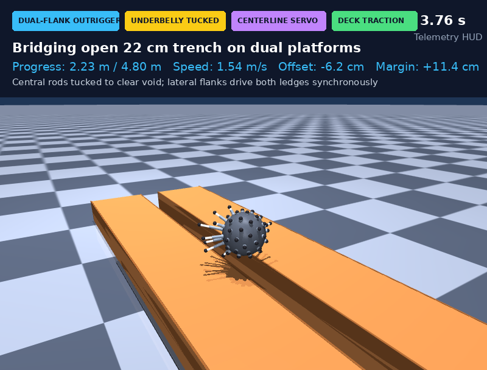

[Watch the trench traversal](./assets/move-straddle-gap.mp4).

Video path for the later HTML version: `assets/move-straddle-gap.mp4`.

Implementation: [locomotion skills](../../skills/low_level/locomotion.py).
[Recording script](./render_straddle_gap.py) ·
[trajectory](./assets/move-straddle-gap.csv) ·
[summary](./assets/move-straddle-gap-results.json).

### 5.9 Pushing away from a wall

A wall can provide a reaction force as well as an obstacle. If a rod pushes
into a fixed wall, the wall pushes back on that foot. The resulting motion
also depends on floor contact, friction, and the robot's existing momentum.

`push_against_wall` receives a normal pointing **from the wall toward the
robot**. Rods pointing the opposite way face the wall:

$$
u_{\mathrm{wall},i}=
\hat{\mathbf u}_i^W\cdot[n_x,n_y,0]^T<0.
$$

The skill favours these rods around mid-height and maintains at least a
$4.5\,\text{cm}$ extension target on bottom rods. That is a rod extension,
not a commanded core height. `push_strength` scales extension targets;
the low-level actuators and contact solver determine the actual forces.

```python
# Wall on the -y side: its reaction pushes the robot toward +y.
targets = execute_skill(
    "push_against_wall", quat, dirs_body, max_extend,
    wall_normal=[0.0, 1.0], push_strength=0.95,
)
```

The demo's caller alternates approaching the wall, pushing, and returning
for another contact. Across three engagements, recorded peak outward
velocities were $202$, $203$, and $198\,\text{cm/s}$, with
$705\,\text{cm}$ of forward progress. This demonstrates pushing the robot
away from a fixed wall, not moving a loose crate or other object.

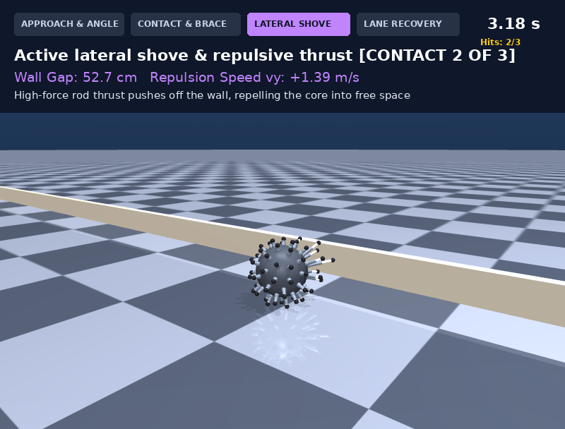

[Watch three wall engagements](./assets/wall-push-shove.mp4).

Video path for the later HTML version: `assets/wall-push-shove.mp4`.

Implementation: [interaction skills](../../skills/low_level/climbing.py).
[Recording script](./render_wall_push.py) ·
[trajectory](./assets/wall-push-shove.csv) ·
[summary](./assets/wall-push-shove-results.json).

### 5.10 Aiming a jump with takeoff-velocity feedback (`jump_to`)

A height request alone does not specify where a jump will land.
Horizontal takeoff velocity matters too. `jump_to` adjusts the selected
rods during takeoff using measured velocity.

`vx_target` is the requested speed **along `d_hat`**, not necessarily
world $x$. The controller reduces leading-rod extension when more forward
speed is needed, reduces trailing-rod extension after an overshoot, and
trims the lateral sectors to reduce sideways velocity. It also tapers
the vertical push as `vz_target` is approached.

The caller manages stand → crouch → takeoff → airborne → landing.
In the linked recording, takeoff is commanded for $120\,\text{ms}$,
not $10$–$12\,\text{ms}$. The skill does not switch phases itself and
does not accept a target position or calculate a complete landing trajectory.

```python
targets = execute_skill(
    "jump_to", quat, dirs_body, max_extend,
    d_hat=[1.0, 0.0], phase=current_phase, vel=world_velocity,
    vx_target=0.70, vz_target=2.60, drop_height=0.12,
)
```

These velocity arguments use metres per second: $70$ and
$260\,\text{cm/s}$. In flight, the rods tuck to $1.5\,\text{cm}$.
Retraction changes the robot's geometry; it cannot steer the whole
robot's centre-of-mass trajectory without an external force.
Landing requests a downward support pattern without adding a rollout gait.
This is actuator/contact compliance, not a simulated hydraulic mechanism.
MuJoCo's [actuation and contact model](https://mujoco.readthedocs.io/en/stable/computation/index.html)
determines the resulting forces.

The recorded example aims toward $x=50\,\text{cm}$ on a platform
$12\,\text{cm}$ high. Peak upward speed sampled during takeoff was
$274.5\,\text{cm/s}$, with forward speed $80.5\,\text{cm/s}$ at that sample.
The core reached $51.7\,\text{cm}$ above the floor.

At the final recorded sample, the core was at
$(x,y)=(48.08,-1.19)\,\text{cm}$: an x-error of $1.92\,\text{cm}$,
or a horizontal distance of about $2.26\,\text{cm}$ from $(50,0)$.
It was still moving forward at about $24\,\text{cm/s}$.
These are final-sample measurements, not first-touchdown error or a
verified stop.

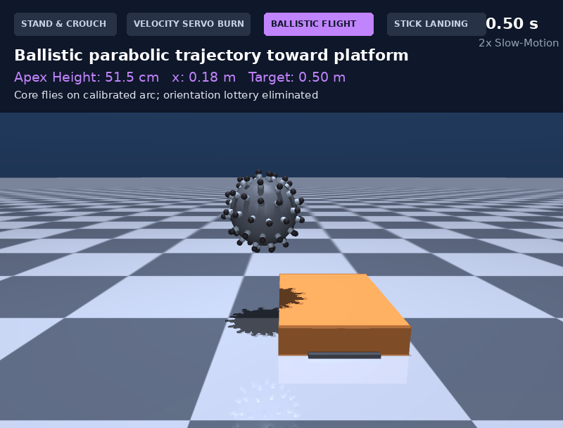

[Watch the target-jump example](./assets/jump-to-precision.mp4).

Video path for the later HTML version: `assets/jump-to-precision.mp4`.

Implementation: [jumping skills](../../skills/low_level/jumping.py).
[Recording script](./render_precision_jump.py) ·
[trajectory](./assets/jump-to-precision.csv) ·
[summary](./assets/jump-to-precision-results.json).

### 5.11 Following a supplied path (`follow_path`)

Now we can compose skills. Give the controller a sequence of horizontal
waypoints, the ball's position, and its velocity. It chooses `move`,
`turn`, `curve`, or `stop` at each update. This is a hand-written
mid-level coordinator built from low-level primitives.

The painted lane in the video helps us see the route. The controller does
not detect that paint: it receives waypoint coordinates and simulator state.

First it finds the nearest waypoint and uses the following segment to
estimate the path direction. With left normal $\hat{\mathbf n}$ and
that segment's start $\mathbf p_i$, its signed lateral error is

$$
e_{\mathrm{ct}}=(\mathbf p-\mathbf p_i)\cdot\hat{\mathbf n}.
$$

A positive value means the ball is left of that local path direction.
The implementation uses this nearest-waypoint approximation, rather than
searching for the exact nearest point on every segment.

It looks ahead along the waypoint list (default $85\,\text{cm}$), estimates
the bend, and reduces requested speed on sharper curves and near the goal.
Dispatch follows this priority:

```text
Within goal tolerance → stop
Otherwise, large heading error → turn
Otherwise, large estimated curvature → curve
Otherwise → move
```

Defaults are $35\,\text{cm}$ for goal tolerance, $28^\circ$ for heading
error, and $0.0018\,\text{cm}^{-1}$ for the curvature threshold.
Selecting `stop` starts braking; it does not establish that velocity is zero.

There is also a sign mismatch in the current curve dispatch: the path
estimator makes leftward curvature positive, but `curve` expects positive
to mean rightward. The estimated curvature needs negating at that API
boundary; the recorded trajectory is not evidence that this mapping is correct.

```python
targets = execute_skill(
    "follow_path", quat, dirs_body, max_extend,
    ball_xy=current_xy, path_pts=path_waypoints, lin_vel=world_velocity,
    lookahead=0.85, speed=1.2, goal_tolerance=0.35,
)
```

The saved run reports a mean absolute lateral-error signal of
$12.8\,\text{cm}$ and a maximum of $56.3\,\text{cm}$. That mean includes
the stop phase, where the controller reports zero lateral error.
The final distance to the goal was $27.9\,\text{cm}$, with speed still
about $26\,\text{cm/s}$. All four sub-skills were selected during the run.

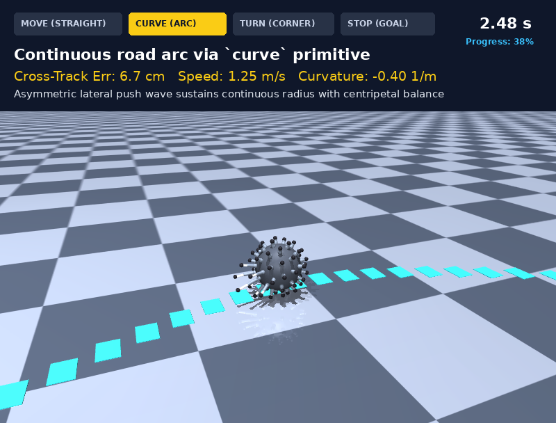

[Watch waypoint following](./assets/follow-path-ground.mp4).

Video path for the later HTML version: `assets/follow-path-ground.mp4`.

Implementation: [navigation skills](../../skills/mid_level/navigation.py).
[Recording script](./render_path_following.py) ·
[trajectory](./assets/follow-path-ground.csv) ·
[summary](./assets/follow-path-ground-results.json).

### 5.12 Staying inside a circular boundary (`stay_in_boundary`)

Suppose we want RoboBall to move within a marked circle without physical
walls. The controller receives the circle's centre $\mathbf c$, radius $R$,
and the ball's position $\mathbf p$. Its distance to the boundary is

$$
d_{\mathrm{edge}}=R-\|\mathbf p-\mathbf c\|.
$$

Positive means the **core centre** is inside. This does not test whether
every foot is inside.

Away from the edge, the caller's step count drives a sequence of exploratory
actions. Near the edge, the controller uses position and outward velocity
to select inward movement, a turn, a curve, or braking. It uses simulator
state—not visual boundary detection or a model of odometry.

With the default safety margin of $60\,\text{cm}$, the normalized proximity
$s=\mathrm{clip}((60\,\text{cm}-d_{\mathrm{edge}})/(60\,\text{cm}),0,1)$
sets the steering blend:

$$
\hat{\mathbf d}_{\mathrm{cmd}}=
\mathrm{normalize}\left[
(1-0.75s)\hat{\mathbf t}+(1+1.25s)\hat{\mathbf n}_{\mathrm{in}}
\right].
$$

Here $\hat{\mathbf t}$ follows the perimeter in the current travel sense,
and $\hat{\mathbf n}_{\mathrm{in}}$ points inward. Getting closer increases
the inward contribution. The code commands stronger braking when
$d_{\mathrm{edge}}<28\,\text{cm}$ with outward speed above $8\,\text{cm/s}$,
or below $16\,\text{cm}$ with outward speed above $2\,\text{cm/s}$.
Neither command stops momentum instantaneously.

In the saved $120\,\text{s}$ simulation, the core centre stayed inside the
$200\,\text{cm}$ circle. Its maximum radius was $182.86\,\text{cm}$,
leaving a centre-to-line margin of $17.14\,\text{cm}$.
Mean speed was $67.4\,\text{cm/s}$ and all four sub-skills were used.
This is an observed centre-containment result, not a whole-robot safety
guarantee. The video's “IN-PLACE TURN” label denotes a turn command;
the robot can translate during that action.

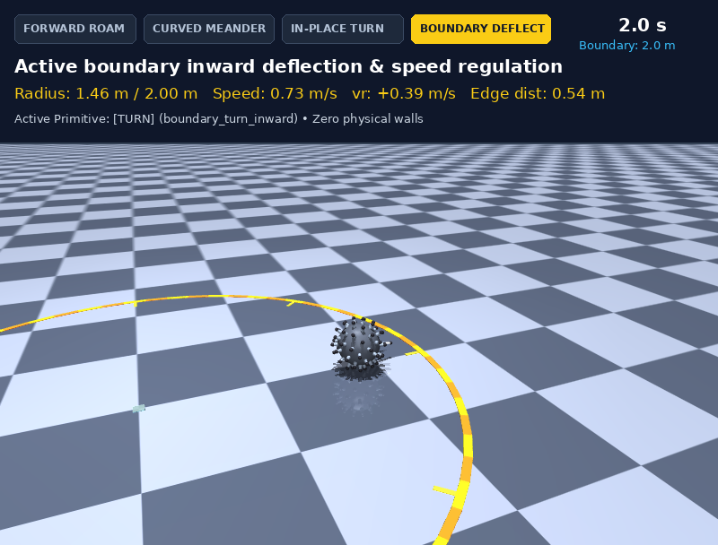

[Watch circular-boundary roaming](./assets/stay-in-boundary.mp4).

Video path for the later HTML version: `assets/stay-in-boundary.mp4`.

Implementation: [navigation skills](../../skills/mid_level/navigation.py).
[Recording script](./render_stay_in_boundary.py) ·
[trajectory](./assets/stay-in-boundary.csv) ·
[summary](./assets/stay-in-boundary-results.json).

**Circular boundary filled with rough stones.** In the next example, the
same wall-less circular arena ($R = 200\,\text{cm}$) contains 130
procedural rocks and slabs. RoboBall combines boundary coordination with
rod-support feedback. This recording demonstrates roaming over stones;
it does not contain the recessed pits introduced in Section 5.13.

In this $120\,\text{s}$ simulation over stones, maximum radius reached was
$156.03\,\text{cm}$ (leaving a safety margin of $43.97\,\text{cm}$ to the line),
with mean core ride height maintained at $18.63\,\text{cm}$ and mean speed of
$30.15\,\text{cm/s}$.

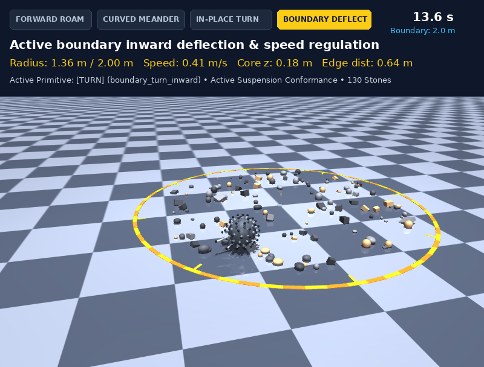

[Watch circular-boundary roaming over stones](./assets/boundary-stones.mp4).

Video path for the later HTML version: `assets/boundary-stones.mp4`.

[Recording script](./render_boundary_stones.py) ·
[trajectory](./assets/boundary-stones.csv) ·
[summary](./assets/boundary-stones-results.json).

### 5.13 Adjusting rod support on rough terrain (`traverse_rough_terrain`)

On uneven ground, one foot may be unsupported while another presses against
a rock. This low-level skill combines the rolling gait with extra support,
rear-rod drive boosting, and bounded suspension corrections.

**Height and contact feedback.** The height term uses the core's world-frame
height $z$ and vertical velocity $v_z$:

$$
\Delta e_{\mathrm{height}}=
\mathrm{clip}\!\left[-K_p(z-z^*)-K_dv_z,\,
-2.5\,\text{cm},\,2.5\,\text{cm}\right].
$$

Below the requested height, this increases support; upward velocity reduces
it. $K_p$ is dimensionless and $K_d$ has units of seconds. This is an
extension-target correction, not a force-command suspension model.

A contact-force term retracts a loaded rod by up to $1.2\,\text{cm}$.
A low force alone does not trigger hole outreach: the terrain measurement
must also indicate a depression.

**Local terrain measurements.** `get_terrain_clearances` casts rays along
downward rods while excluding robot geometry and decorative non-colliders.
It returns a signed **vertical** offset from the nominal floor: negative
for raised terrain, positive for a depression. Rays beyond the configured
reach window—core radius plus stroke plus a $5\,\text{cm}$ margin—return
`NaN`, meaning no usable measurement. This is a sensing window, not proof
that a foot can support the robot at every reported point.

The measured vertical offset is scaled and clipped into a rod-extension
correction. That mapping is a control heuristic, not an exact inverse
kinematic solution for an inclined rod.

**Which rods receive corrections?** The shared
[rod-support rule](../../radial_sphere/gait.py) smoothly increases
`support_weight` from zero near the leading sector to one farther behind.
Downward participation is also smoothed. Leading rods are normally excluded;
rods deliberately selected for braking can remain active. This lets support
transfer as the sphere rolls instead of switching every correction on at once.

**Keeping the commands smooth.** A persistent `SuspensionState` filters
terrain, force, and heave measurements, then smooths and rate-limits the
extension targets. Defaults are a $60\,\text{ms}$ filter time and a
$45\,\text{cm/s}$ target-rate limit. At a $10\,\text{ms}$ update interval,
a target can change by at most $0.45\,\text{cm}$ per update.

Create this state once per run, not on every update. The standard skill
runner manages it automatically. For direct calls:

```python
from skills import execute_skill, SuspensionGains, SuspensionState

# Once after resetting the environment:
suspension = SuspensionGains(target_ride_height=0.23)
state = SuspensionState(targets=env.data.ctrl.copy())

# At every control update:
targets = execute_skill(
    "traverse_rough_terrain",
    env.data.qpos[3:7].copy(), env.dirs_body, env.max_extend,
    d_hat=[1.0, 0.0], speed=0.8,
    lin_vel=env.data.qvel[:3].copy(),
    core_z=float(env.data.qpos[2]), core_vz=float(env.data.qvel[2]),
    contact_forces=env.get_rod_contact_forces(),
    terrain_clearances=env.get_terrain_clearances(),
    suspension=suspension, suspension_state=state,
    control_dt=float(env.model.opt.timestep * env.action_repeat),
)
env.step(targets)
```

`SuspensionGains` groups the height target, feedback gains, and smoothing
limits. The example requests $23\,\text{cm}$; the class default remains
$28\,\text{cm}$. Neither is a guaranteed ride height.

**Driving over an obstacle.** Rear-rod boosting and the underbelly stance
come from the shared gait module. `back_gain` sets the initial drive
amplitude. Unlike `move`, this terrain skill still reduces that amplitude
on speed overshoot when velocity feedback is supplied.

For roaming, the mid-level `stay_in_boundary` coordinator can select this
gait with `rough_terrain_gait=True`. Its `rough_drive_gain` is passed to
the primitive as `back_gain`. When obstructed, it tries boosted climbing
for `climb_patience` control updates before selecting an escape turn.
The caller maintains the obstruction counter. These are commanded modes,
not confirmations that a particular obstacle has been crossed.

**The recorded comparison.** Both panels use the same arena, seed, roaming
policy, speed command, and drive-gain setting. One uses
`SuspensionGains.without_feedback()`; its feedback gains are zero, but it
retains the same filtering and rate limit. Thus “fixed stance” does not mean
all rods are frozen.

Both robots make decisions from their own evolving state, so they can
choose different actions and encounter different parts of the terrain.
The arena contains 160 boulders up to $8\,\text{cm}$, eight
$6.5\,\text{cm}$ ledges, and eight $4\,\text{cm}$-deep pits.

| Recorded 120-second run | Feedback off | Active suspension |
|---|---:|---:|
| Distance travelled | $8485\,\text{cm}$ | $9769\,\text{cm}$ |
| Mean speed | $70.6\,\text{cm/s}$ | $81.3\,\text{cm/s}$ |
| Time below $6\,\text{cm/s}$ | $1.6\%$ | $1.3\%$ |
| Longest interval below that speed | $0.23\,\text{s}$ | $0.38\,\text{s}$ |
| Control updates in climb mode | 21 | 49 |
| Control updates in escape-turn mode | 0 | 0 |
| Mean core height | $20.54\,\text{cm}$ | $20.53\,\text{cm}$ |
| Core-height standard deviation | $2.09\,\text{cm}$ | $2.10\,\text{cm}$ |
| Vertical-speed RMS | $20.68\,\text{cm/s}$ | $21.61\,\text{cm/s}$ |

The climb-mode counts are **control updates, not completed climbs**.
The active run travelled about $15\%$ farther, but these measurements do not
show a smoother ride: height variation is almost unchanged and vertical-speed
RMS is slightly higher. They also do not establish which individual rocks
or pits were crossed.

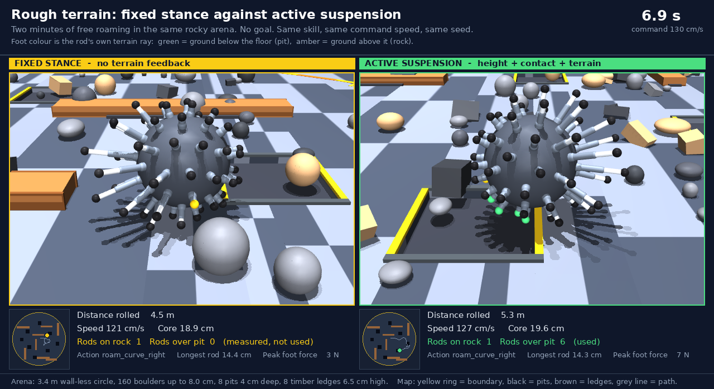

[Watch the two-minute comparison](./assets/rough-terrain-suspension.mp4).

Video path for the later HTML version: `assets/rough-terrain-suspension.mp4`.

Implementation: [terrain skill](../../skills/low_level/terrain_following.py) ·
[navigation coordinator](../../skills/mid_level/navigation.py) ·
[shared gait](../../radial_sphere/gait.py) ·
[suspension](../../skills/low_level/suspension.py).
[Recording script](./render_rough_terrain.py) ·
[trajectory](./assets/rough-terrain-suspension.csv) ·
[summary](./assets/rough-terrain-suspension-results.json).
