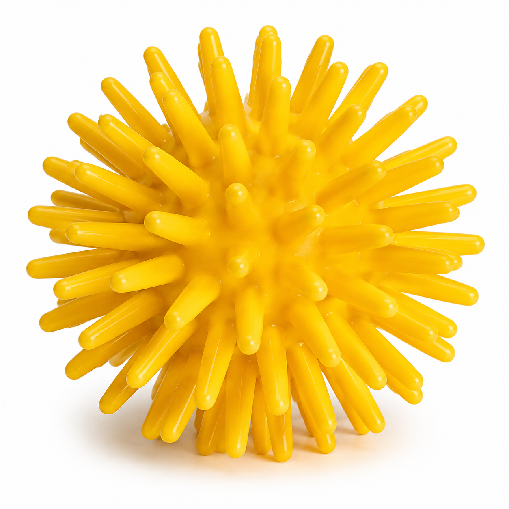
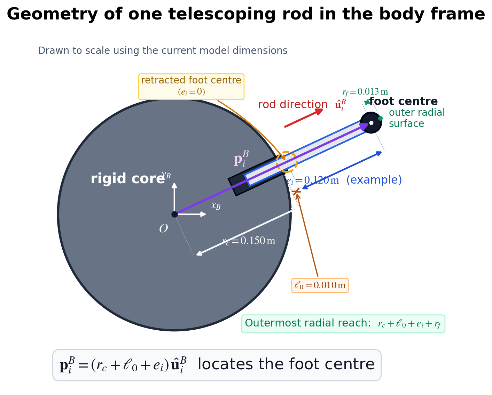

# Building RoboBall: From an Old Idea to a Robot That Moves, Jumps, and Climbs Stairs

*How a student idea became a physics-based robot simulation—and why building
complex behavior from small, reusable skills turned out to be the most useful
way to approach it.*

> **Video — RoboBall climbing and descending stairs:**
> [stairs_verified_composite.mp4](assets/stairs_verified_composite.mp4)

## 1. An old idea, revisited

During the early years of my bachelor studies, I had an idea for a robotic
ball: a rigid spherical body surrounded by telescoping rods. By extending and
retracting selected rods, the robot could push against the ground and move. I
found the concept exciting, but at the time I did not have a clear vision of
what such a robot would be useful for. More importantly, it was not my highest
priority, and I did not have enough time to turn the idea into a working
project.

### A quick visual reference

For an immediate visual idea, think of a spiky toy ball. RoboBall has a similar
overall appearance, but with one important difference: its rods are
individually actuated and can extend or retract, while the central spherical
body remains rigid.



*Visual analogy: a spiky toy ball. RoboBall uses controllable telescoping rods
instead of fixed spikes.*

So the idea stayed with me, but mostly in the background.

Years later, coding assistants made it easier for me to return to the project.
I decided to take the old idea off the shelf and investigate it properly: not
only as an animation, but as a robot governed by gravity, friction, contact
forces, actuator limits, and control decisions.

Building it also gave me something I did not have during my bachelor studies:
a clearer view of where a rod-actuated ball robot might be useful. A compact
spherical body can protect its internal mechanism, while its telescoping rods
can interact with uneven terrain, brace against surrounding surfaces, and
absorb landings. This suggests possible uses in inspection, exploration,
hazardous environments, and robotics research.

The purpose of this project is not to present a finished product. It is to
learn how such a robot can be built and controlled. For that reason, this
article is written as a step-by-step tutorial. We will begin with the robot's
rigid spherical body and telescoping rods, then gradually add the physical
simulation and control system.

At the low level, we will study the physics and actuator control: coordinate
frames, contacts, friction, position targets, and feedback controllers such as
PI control. Above that, the mid-level controller will provide a small library
of primitive skills, including moving forward and backward, turning, stopping,
jumping, and landing safely.

Once these primitive skills work independently, we can combine them to create
new behaviors. For example, moving into position, stopping, jumping, and
landing can be composed into a stair-climbing behavior. Controlled movement,
falling, impact absorption, and braking can then be combined to descend the
stairs.

Later, the project can add a high-level controller responsible for planning,
memory, skill selection, and learning through reinforcement learning and other
AI methods. This article focuses first on the low- and mid-level foundations
that those future systems will need.

## 2. What we will build

We will build RoboBall in layers, beginning directly with its defining
mechanism: a rigid spherical body surrounded by 60 telescoping rods. From
there, we will make the model and its control system progressively more
capable.

Each new layer will solve a limitation of the previous one:

1. **The robot geometry:** create a rigid spherical body surrounded by 60 rods
   distributed across its surface.
2. **The telescoping mechanism:** allow each rod to extend and retract within
   its physical stroke limits.
3. **A physical simulation:** introduce mass, gravity, friction, contact,
   actuator force limits, and rigid-body dynamics in MuJoCo.
4. **Low-level control:** transform desired motion into individual rod-length
   targets and use feedback to make the actuators follow those targets.
5. **Primitive mid-level skills:** give reusable names to behaviors such as
   `move`, `turn`, `stop`, `jump`, and `fall_down`.
6. **Skill composition:** combine tested primitives into more involved
   behaviors, using stair traversal as the main example.

The resulting control stack will look like this:

```text
Future task planner / learning system
planning, memory, RL, and skill selection
                    ↓
Mid-level skill library
move, turn, stop, jump, and fall_down
                    ↓
Low-level controller
60 rod targets, actuator feedback, and contact response
                    ↓
MuJoCo physics
mass, gravity, friction, collisions, and rigid-body motion
```

The article is intended for readers who are comfortable with basic Python but
do not necessarily have a robotics background. Concepts such as coordinate
frames, quaternions, feedback control, and state machines will be introduced
when we first need them. Equations will describe the physical or control idea;
small code examples will then show how that idea becomes part of the robot.

By the end, the goal is not merely to watch RoboBall complete a staircase. We
should understand how every layer contributes to that behavior, how the result
is verified, and which parts can later be replaced or extended by learned
high-level controllers.

## 3. Meet RoboBall

RoboBall consists of a rigid spherical core with 60 telescoping units pointing
outward. The core itself does not deform. The robot changes how it interacts
with the environment by changing the lengths of individual rods.


*The current RoboBall model in MuJoCo. The two views show the same simulated
robot with rods at different extensions around its rigid core.*

### 3.1 One core and 60 telescoping units

Each telescoping unit, which we will also call a **bar**, has three main parts:

- a **sleeve** fixed to the spherical core;
- an **inner rod** that slides through the sleeve; and
- a rounded **foot** that makes contact with the ground, walls, and obstacles.

Let $e_i$ be the extension of rod $i$. Its controller can choose any target
between the retracted and fully extended positions:

$$
0 \leq e_i \leq e_{\max}.
$$

If $\hat{\mathbf u}_i^B$ is the outward direction of the rod in the robot's
body frame, the centre of its foot can be written in simplified form as

$$
\mathbf p_i^B =
\left(r_c + \ell_0 + e_i\right)\hat{\mathbf u}_i^B,
$$

where $r_c$ is the core radius and $\ell_0$ is the fixed distance between the
core surface and the foot centre when the rod is retracted. In this project,
the rigid core has a radius of $0.15\,\text{m}$. Different tasks may use
different maximum strokes, so $e_{\max}$ is a configuration value rather than
a permanent property of the core.



*Geometry of one telescoping unit, drawn to scale using the current model
dimensions and an example extension of $e_i=0.120\,\text{m}$. The position
vector begins at the core centre and ends at the foot centre; the outer radial
surface is one foot radius farther.*

This equation captures the main mechanical idea: changing $e_i$ moves only
the foot along its radial direction. It does not change the radius or shape of
the central ball.

### 3.2 Distributing the rods around a sphere

The rods should cover the whole surface without forming dense clusters near
the poles. We therefore generate their directions using a **Fibonacci
sphere**, which gives a nearly uniform distribution with very little code.
For $N=60$ rods and $i=0,\ldots,N-1$,

$$
\phi_i = \arccos\left(1-\frac{2(i+0.5)}{N}\right),
\qquad
\theta_i = \pi(1+\sqrt{5})(i+0.5),
$$

and the corresponding unit direction is

$$
\hat{\mathbf u}_i^B =
\begin{bmatrix}
\sin\phi_i\cos\theta_i \\
\sin\phi_i\sin\theta_i \\
\cos\phi_i
\end{bmatrix}.
$$

The superscript $B$ means that these directions are expressed in the robot's
**body frame**: a coordinate system attached to the core. The 60 body-frame
directions never change. However, when the ball rotates, their directions in
the world do change. If $R(q)$ is the rotation matrix obtained from the
core's orientation quaternion $q$, then

$$
\hat{\mathbf u}_i^W = R(q)\hat{\mathbf u}_i^B.
$$

This distinction will become important in the controller. A particular rod
is not always a "bottom rod" or a "rear rod"; its role changes continuously
as the ball rolls.

### 3.3 How extending rods can move the ball

A rod foot in contact with the ground experiences a reaction force
$\mathbf F_i$. That force produces a torque about the centre of the core:

$$
\boldsymbol\tau_i = \mathbf r_i \times \mathbf F_i,
$$

where $\mathbf r_i$ points from the core centre to the contact point. The
normal part of the contact force supports the robot, while friction supplies
the tangential force needed for controlled rolling.

If all rods use the same extension, the contact pattern is approximately
symmetric and there is no preferred travel direction. To move forward, the
controller creates an asymmetric pattern. It extends rods that point downward
and slightly behind the desired direction of travel, while retracting rods
that would touch down in front and act as brakes. As the core rotates, the
controller transfers this job from one set of rods to the next, creating a
travelling wave around the ball.

The same mechanism can produce several kinds of behavior:

- a repeating wave of ground contacts makes the robot roll;
- extending downward rods together can launch a jump;
- opening selected rods before impact can help absorb a landing; and
- side-facing rods can push or brace against walls.

The hardware idea is therefore simple—60 independently controlled radial
extensions—but useful behavior depends on choosing the right rods at the
right time. The next step is to represent this mechanism in a physics
simulation where gravity, friction, impacts, and actuator limits are real
parts of the problem.
