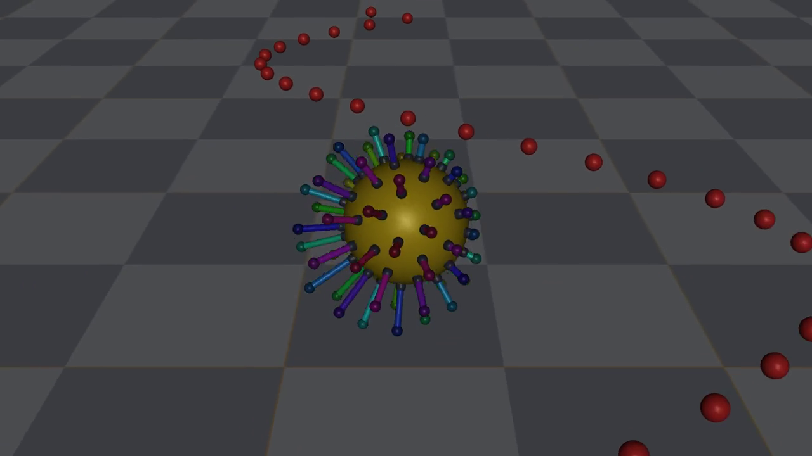
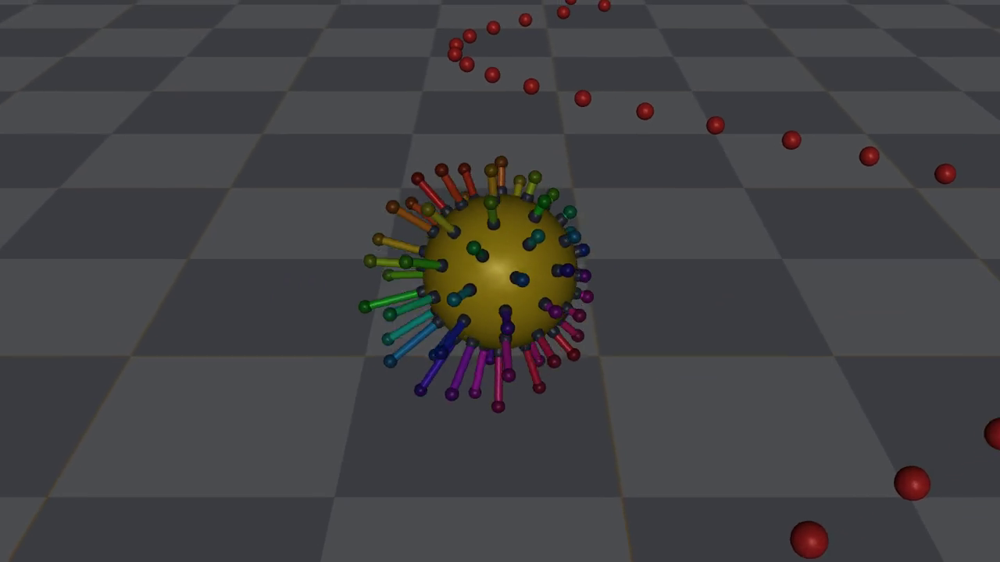
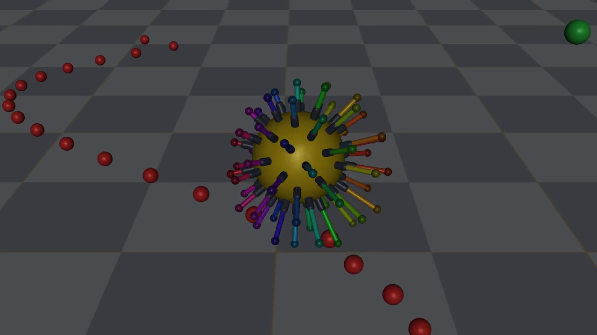
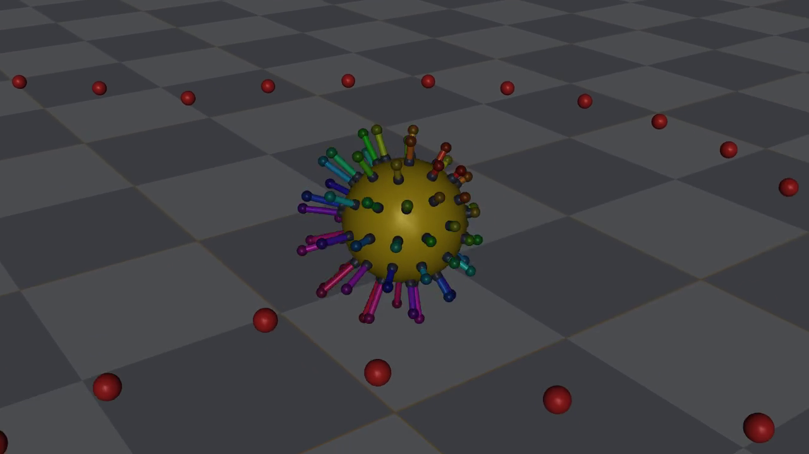
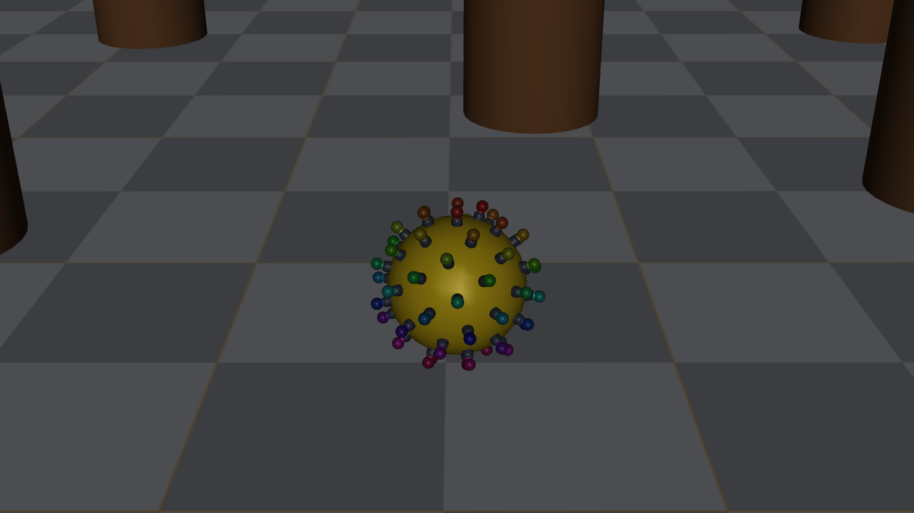
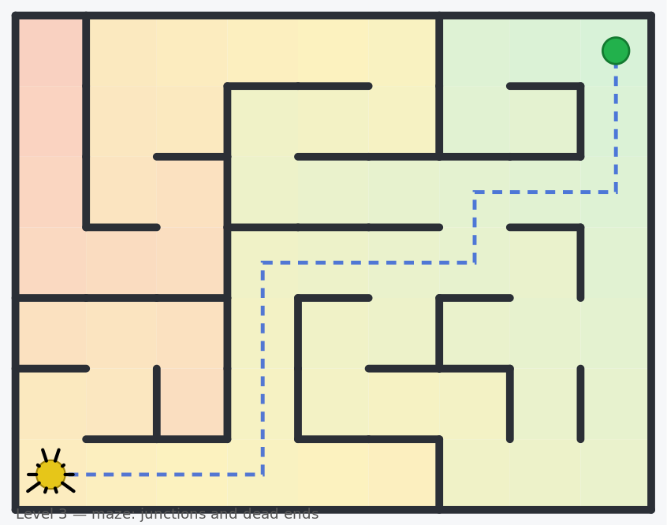
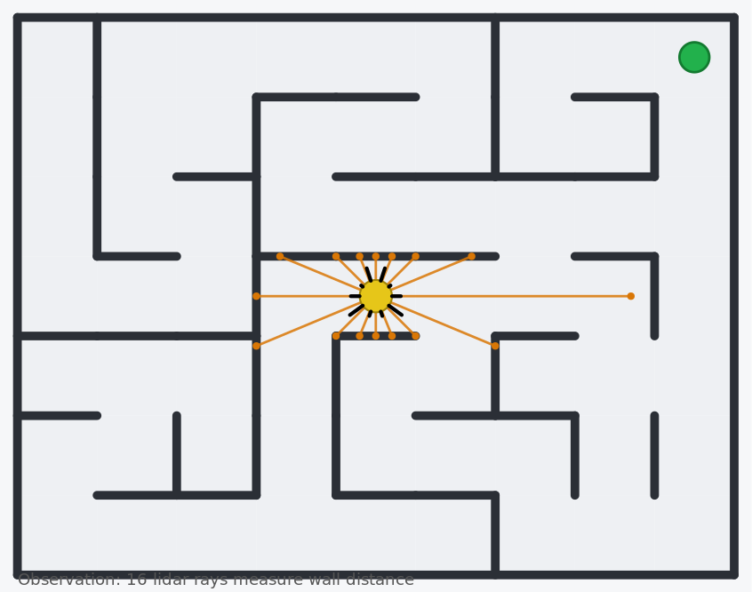
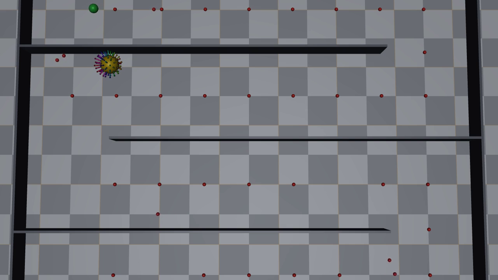
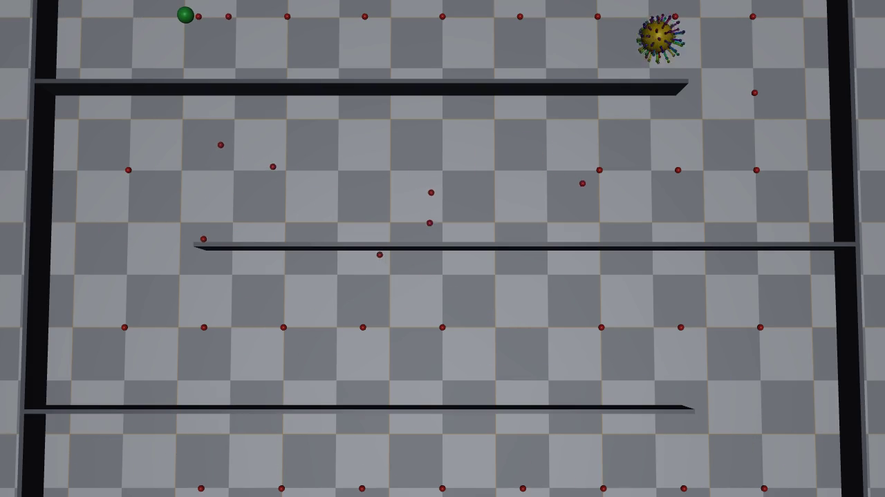

# 01 — From a telescoping ball to maze navigation with RL

Period: 2026-06-02 → 2026-08-13 (chapter closed with maze level 1 solved).
Scope: the whole project so far — robot, environment, visualisation,
scripted control, the RL steering layer, and the first maze.
Companion docs: `docs/ENV_OVERVIEW.md` (env spec), `docs/STATUS.md`
(current state + how to run), `ops/run_guide.md`.

Evidence used for the numbers in this file:

| source | what it holds |
|---|---|
| git commits `a30ec15 … 32c3b65` | when each stage landed |
| `storage_local/<run id>/` dirs + `code/` snapshots | exact settings per run |
| `storage_local/sci_out/*.out` | training logs (job id in the name) |
| `sacct` on jobs 20380091, 20381975, 20431881 | job states and run times |
| chat session 2026-08-12/13 (this doc is its distillation) | in-session measurements |

## Key terminology

- **Bar** — one telescopic unit: sleeve (guide tube) + rod (slides) + foot
  (round tip that touches the ground).
- **Scripted controller / heuristic** — the hand-written policy in
  `radial_sphere/controller.py`; no learning.
- **SteeringEnv** — the high-level RL env: RL picks a direction, the
  scripted controller moves the 60 bars.
- **Goal frame** — coordinate frame whose x-axis points along the
  look-ahead direction toward the goal/path.
- **Geodesic distance** — distance to the goal measured through free
  space (around walls), not the straight line.
- **Decision** — one RL action, held for `rl.decision_every` (10) physics
  env steps.

## 1. Motivation and problem definition

A sphere of radius 0.15 m carries 60 telescopic bars pointing outward.
Extending bars on one side pushes the ball; done in the right rhythm, it
rolls. Questions, in order:

1. Can this robot locomote at all? (scripted control)
2. Can we SEE it working? (visualisation came first for a reason —
   nothing can be debugged if the mechanism is invisible)
3. Can RL plan on top — "go 45° right" — while the scripted layer
   handles the 60 actuators? (hierarchy)
4. Does the hierarchy pay off on tasks the scripted layer cannot do?
   (obstacles, mazes)

The bars sit on a Fibonacci sphere: for bar $i$ of $N$,

$$\phi_i=\arccos\!\Big(1-\tfrac{2(i+0.5)}{N}\Big),\qquad
\theta_i=\pi(1+\sqrt5)\,(i+0.5),$$

giving near-uniform directions $\hat u_i$. Each bar is a MuJoCo slide
joint with a position actuator; the agent action $a_k\in[-1,1]$ maps to an
extension target $e_k=\tfrac{a_k+1}{2}\,e_{\max}$ with $e_{\max}=0.12$ m.

## 2. First life, invisible mechanism (commits `a30ec15`, `2f73684`)

**Did:** modular package (`config/geometry/mjcf/controller/action/
observation/reward/render/scenario/snapshot`), config as single source of
truth, gym registration, heuristic + random agents.

**Result:** the ball rolled a sinusoidal path (path task, 100 % success).
But in videos the bars looked FROZEN: sleeves were hidden inside the
opaque sphere and rods barely poked out.

## 3. Making the telescoping visible (commit `050bda9`)

Three separate causes, found one at a time:

**3a. Geometry.** Rebuilt each bar as sleeve/rod/foot. First with 3 cm
protruding sleeves, later (section 6 era) with near-flush ports so a
retracted bar sinks fully into the ball.

**3b. A real physics bug.** The 4-gram feet sank up to 5.7 cm into the
floor and the ball rested on its core. MuJoCo's default contact stiffness
scales with the touching body's effective mass
($k_\text{eff}\propto m_\text{eff}/\tau^2$), so tiny feet make mushy
contacts. Worse: contact parameters of the two geoms are AVERAGED, so
stiffening only the foot changed little. Fix: `priority="1"
solref="0.005 1" solimp="0.95 0.99 0.001"` on the feet → 1.8 mm
penetration. *Rule: with light bodies, always set contact params
explicitly, and set priority so they actually apply.*

**3c. Perception.** Even with real motion (measured joint excursions
4.4–8.6 cm), 60 identical bars looked static: the extension pattern is
stationary relative to the chase camera; only the (invisible) identity of
the bars rotates through it. Fix 1: one hue per bar. Fix 2: use the FULL
stroke — the controller score

$$s_k=-g_b\,(\hat u_k^w\!\cdot\hat d)+g_d\max(0,-\hat u^w_{k,z})$$

is min-max normalised each step,
$f_k=b+(1-b)\frac{s_k-\min_j s_j}{\max_j s_j-\min_j s_j}$, $e_k=f_k\,e_{\max}$,
so the least useful bar fully retracts and the best pusher fully extends.
Side effect: the gait got faster and more efficient (path task: 984 → 610
steps at the same gains).

| retracted side sinks into the ball | extended side reaches out |
|---|---|
|  |  |

**3d. Video pipeline.** metasim's `ObsSaver` buffers every frame in RAM;
with dense capture a long episode was OOM-killed by the login node's
10 GB per-user cgroup and the whole video was lost. Replaced by a
streaming `VideoRecorder` (constant memory). *Rule: on capped nodes,
stream to disk; never buffer a video in RAM.*

**3e. Camera + course.** Chase camera moved closer and tilted down; new
`roundtrip` course (sine out, semicircle turn, offset lane back) so the
ball also rolls TOWARD the camera; camera aims along the path's initial
tangent, not spawn→goal.

## 4. The RL steering layer (commit `faeb71b`)

**Believed:** end-to-end RL on 60 actions would spend millions of steps
re-learning what `bar_targets` already does. **Chosen design:** RL emits a
unit direction $c$ in the goal frame (+ a drive scalar), held for 10 env
steps; the world-frame command is $d^w=c_x\,\hat g+c_y\,\hat g^\perp$.
Reward per decision: the summed low-level reward
$r_t=c_p\,(d_{t-1}-d_t)+R\,\mathbf 1[d_t<\varepsilon]$.

**Enabler:** the chase camera renders 1280×720 inside `get_states` every
step → ~3 env-steps/s. With the camera off: ~176 steps/s (measured).
Training always runs camera-off; only eval renders.

**Result (goal task, random target per episode):** PPO (SB3,
VecNormalize, MLP 64×64, CPU) reached 100 % success after ~100k
decisions (local run `radial_sphere__20260812_1857__local__rl_train__goal`;
eval 3/3, mean return +13.5). **But the task was trivial** — with the
action already in the goal frame, the optimal policy is almost the
constant $(1,0)$. *Rule: a sanity task proves the pipeline, not the
method.*

## 5. Obstacles — the first task the heuristic cannot do

**Did:** `obstacle` kind — random goal + 3–6 immovable pillars (100 kg,
repositioned every episode), of which 2 are placed ON the spawn→goal
line (uniform sampling alone often left the line free). Observation adds
the 3 nearest pillars in the goal frame.

**Baseline:** scripted controller drives straight → stalls at a pillar,
**0/6 episodes**, return ≈ +1 (vs ~+13 when reachable).

**Training (job 20381975, scicore CPU, 6 envs, 300k decisions):**
`ep_rew_mean` 13.1 — solved. **But the job hit its 4 h time limit at
step 299,988 of 300,000** and died before the final save; the
VecNormalize statistics were lost with it. Repaired by resuming the last
checkpoint for 8k decisions to rebuild stats. Fixes that came out of it:
1-day time limit in `ops/sb_train.sh`, and `save_vecnormalize=True` so
every checkpoint carries its own obs stats. *Rule: a model file without
its normalisation stats is not a model.*

**Eval:** 3/3 random layouts solved, mean return +13.5.

## 6. Maze level 1 and the reward fix (commit `faeb71b`, runs of 08-13)

**Process change:** mockups BEFORE code. A generated HTML page
(`docs/env_mockups/maze_env_proposal.html`) showed 3 difficulty levels,
the lidar observation, and the geodesic idea; the design was approved on
the pictures first.

| mockup: geodesic heat + route | mockup: lidar rays |
|---|---|
|  |  |

**Env:** level 1 = serpentine corridor, 5×4 cells of 1.5 m, ~28.5 m
centreline, walls 4 cm thin with `fix_base_link=True` — measured wall
movement after deliberately ramming: 0.00000 m. New `bird_fixed` camera
sees the whole maze from one static pose.

**The reward fix.** Straight-line distance is wrong in a maze: at the
spawn it says 4.5 m while the true travel distance is 24.4 m, and its
gradient points INTO walls. Replaced by a geodesic field: occupancy grid
(0.25 m cells), walls inflated by the ball radius (0.32 m), Dijkstra
(8-connected) from the goal. Continuous lookup:

$$d_\text{geo}(x)=\min_{c\in N_{3\times3}(x),\,F[c]\ge 0}
\big(F[c]+\lVert x-p_c\rVert\big).$$

The same $d$ plugs into the old reward — only the metric changed.
Observation adds 16 lidar rays (walls + pillars, goal frame, range 3 m).

**Baseline:** the heuristic follows the nearest centreline point. It
cleared 3 of 4 rows, then — where the final lane is 1.5 m away across a
wall — the nearest-point search jumped lanes and it pressed into the
wall under the goal until truncation. **0 % success, forever stuck one
wall away from the goal:**

**Training (job 20431881, 6 envs, 150k decisions, COMPLETED in 2 h 10 m):**
`ep_rew_mean` **33.9** of a ~34.4 ceiling (24.4 geodesic + 10 bonus);
episode length fell ~400 → ~204 decisions. First run with wandb
(project `telescopic_robot`, run name = run id). **Eval: 100 %**, goal in
1763 of 4000 allowed steps. The policy takes the exact turn that killed
the heuristic:

## 7. Where we are

| task | heuristic | PPO steering |
|---|---|---|
| path / roundtrip | 100 % | (not needed) |
| goal | 100 % | 100 % (trivial) |
| obstacle | 0 % | solved (~13 / 13.5 ceiling-ish) |
| maze level 1 | 0 % | solved (33.9 / ~34.4, eval 100 %) |

Videos (copies live in `assets/` so they travel with git; the originals
stay in their `storage_local/` run dirs):

| what | file |
|---|---|
| telescoping + roundtrip (bars pumping) | [assets/04_roundtrip_telescoping.mp4](assets/04_roundtrip_telescoping.mp4) |
| RL steering around pillars | [assets/05_rl_obstacle.mp4](assets/05_rl_obstacle.mp4) |
| heuristic stuck in the maze | [assets/08_heuristic_stuck_maze.mp4](assets/08_heuristic_stuck_maze.mp4) |
| RL solving the maze (bird view) | [assets/09_rl_solving_maze.mp4](assets/09_rl_solving_maze.mp4) |

**Next (agreed):** maze level 2 (rooms) and 3 (random maze per episode,
fixed-size wall pieces parked like the pillars), drop the centreline
crutch (goal frame from the geodesic gradient or raw goal direction) so
the policy must truly plan from lidar. Then the heuristic has no chance
and memorisation is impossible.

## Rules produced along the way

1. Visualise first; an invisible mechanism cannot be debugged.
2. Light bodies need explicit contact params AND `priority` — defaults
   average with the floor and stay mushy.
3. If motion looks frozen, check what is trackable by eye, not only the
   physics.
4. Stream videos to disk; never buffer frames in RAM on capped nodes.
5. Camera rendering inside `get_states` is the step-time budget; train
   camera-off (~50× faster).
6. A sanity task proves the pipeline, not the method — make the baseline
   fail before claiming RL is needed.
7. Straight-line rewards break behind the first wall; shape with a
   geodesic field.
8. Checkpoints must carry their normalisation stats; time limits eat
   final saves.
9. One run id for log + run dir + wandb makes every number traceable.
10. Mockups before code: approving pictures is cheaper than rewriting
    environments.
