# Project Journey: Hierarchical Imitation Learning & 60D Low-Level RL Locomotion

This document chronologically details what was attempted, what failed, what succeeded, and the exact physical rules learned while developing autonomous maze navigation for the 60-bar radial telescopic robot.

---

## Key Terminology

- **Radial Sphere Robot**: A spherical robot driven by 60 linear telescopic prismatic actuators radially distributed across its outer shell ($r_{\text{sphere}} = 0.35\text{ m}$, rod extension $\in [0.025, 0.20]\text{ m}$).
- **CPG (Central Pattern Generator)**: A kinematic wave generator that projects sinusoidal extensions onto rods positioned on the trailing lower hemisphere to produce rolling momentum.
- **Hierarchical Steering**: High-level action space consisting of 3 continuous commands: local goal-frame heading vector $[cmd_x, cmd_y]$ and forward drive throttle $u_{\text{drive}} \in [-1.0, 1.0]$.
- **Low-Level 60D Continuous Control**: Direct low-level action space consisting of 60 continuous values $\mathbf{u} \in \mathbb{R}^{60}$ directly commanding extension offsets or target positions for every rod.
- **Joint 63D Control**: Combined action space where the policy simultaneously outputs both 3D steering/braking and 60D actuator extension trims ($a \in \mathbb{R}^{63}$).
- **Active Braking / Reverse Drive**: Driving $u_{\text{drive}} < 0.0$ or zeroing baseline extensions on the forward contact quadrant to actively resist rolling inertia before 90° corners.

---

## 0. Project Genesis: Early Prototyping, Kinematics & Foundational Engines

Before attempting direct 60D continuous low-level reinforcement learning, we established the foundational mechanical, mathematical, and simulation infrastructure for the 60-bar radial telescopic sphere. This phase addressed and resolved fundamental bottlenecks in coordinate geometry, pathfinding reward formulations, multi-contact simulation physics, and open-loop peristaltic locomotion.

---

### 0.1 Pure NumPy Kinematic Prototyping & Spherical Geometry Foundations

**The Challenge**: Before deploying heavy physics engines (such as MuJoCo or IsaacGym) and before designing neural policies, we had to determine whether 60 independent linear telescopic actuators distributed across a spherical shell could mathematically coordinate to produce directed rolling thrust without an internal flywheel, axle, or moving counterweight.

**Mathematical Formulation & Geometry**:
We developed a standalone, pure NumPy kinematic engine (`radial_sphere/geometry.py`) with zero external simulator dependencies:

1. **Fibonacci Spherical Distribution**:
   To avoid pole-clustering artifacts associated with standard latitude-longitude parameterizations and to ensure an isotropic actuator density across $4\pi$ steradians, the body-frame unit direction vector $\mathbf{u}_{\text{body}, i} \in \mathbb{R}^3$ for each bar $i \in \{0, 1, \dots, N-1\}$ ($N=60$) is computed via the spherical Fibonacci lattice:
   $$\phi_i = \arccos\left(1 - \frac{2(i + 0.5)}{N}\right), \quad \theta_i = \pi (1 + \sqrt{5})(i + 0.5)$$
   $$\mathbf{u}_{\text{body}, i} = \begin{bmatrix} \sin\phi_i \cos\theta_i \\ \sin\phi_i \sin\theta_i \\ \cos\phi_i \end{bmatrix}$$

2. **Quaternion-to-Matrix Coordinate Transformations**:
   At each simulation step, the orientation unit quaternion $\mathbf{q} = [w, x, y, z]^T$ of the central stator core is converted into a $3 \times 3$ directional rotation matrix $\mathbf{R}(\mathbf{q}) \in SO(3)$:
   $$\mathbf{R}(\mathbf{q}) = \begin{bmatrix} 1 - 2(y^2 + z^2) & 2(xy - zw) & 2(xz + yw) \\ 2(xy + zw) & 1 - 2(x^2 + z^2) & 2(yz - xw) \\ 2(xz - yw) & 2(yz + xw) & 1 - 2(x^2 + y^2) \end{bmatrix}$$
   $$\mathbf{u}_{\text{world}, i} = \mathbf{R}(\mathbf{q}) \mathbf{u}_{\text{body}, i}$$

3. **Sinusoidal and Roundtrip Reference Trajectories**:
   To validate directional tracking analytically, we constructed parameterized trajectories in $\mathbb{R}^2$:
   - **Serpentine Wave**: $y(s) = A \sin\left(\frac{2\pi w}{L} s\right)$ with length $L=6.0\text{ m}$, amplitude $A=0.9\text{ m}$, waves $w=1.5$.
   - **Continuous Roundtrip Course**: Comprising a forward sinusoid ($40\%$ length), a semicircular turnaround of radius $r = 1.5A$, and an offset return sinusoid lane ($y_{\text{offset}} = 3.0A$) traversed in reverse, ensuring the ball returns to the observer camera.

**Key Learnings & Vectorization**:
- Evaluating the 60-bar coordinate projections in pure vectorized NumPy executed at $> 100,000\text{ steps/s}$, allowing rapid verification of trigonometric wave equations before integrating physical contact dynamics.
- Verified that uniform spherical packing is essential: any irregular clustering of rods creates uneven ground contact heights, causing the sphere to lurch off-axis during rolling.

---

### 0.2 DeepMind Control Suite (`dm_control`) Prototyping & The Heavy Pillar Course

**What We Did**:
We compiled the first physical MJCF model using the DeepMind Control Suite (`dm_control.mjcf` in `radial_sphere/mjcf.py`):
- **Stator Core**: Central sphere of radius $r_{\text{core}} = 0.35\text{ m}$, mass $m_{\text{core}} = 0.50\text{ kg}$.
- **Telescopic Prismatic Units**: 60 composite sleeve/rod/foot assemblies. Each rod features a position-controlled prismatic joint with extension limits $[0.025\text{ m}, 0.200\text{ m}]$ ($0.175\text{ m}$ total stroke).
- **Vulcanized Foot Geometry**: Hemispherical foot caps ($r_{\text{foot}} = 0.03\text{ m}$) designated as the exclusive ground-contact geoms, colored with distinct per-bar hues for optical motion tracking.

**The Open-Loop Baseline**:
We implemented an initial scripted tracking controller (`scripts/heuristic/heuristic_agent.py`, run `20260814_0003__local-813757__heuristic_agent`). While the heuristic controller successfully navigated open sinusoidal paths, it was completely open-loop with respect to obstacles.

**The Heavy Pillar Obstacle Course**:
To test collision avoidance, we created an obstacle environment (`obstacle_scenario` in `radial_sphere/scenario.py`):
- Arena populated with $K \in [3, 6]$ heavy iron cylindrical pillars ($r=0.25\text{ m}$, mass $50.0\text{ kg}$).
- Exactly $n_{\text{blocking}} = 2$ pillars were algorithmically forced onto the direct spawn-to-goal vector with small lateral jitter.
- **The Failure**: The open-loop heuristic agent had a **0.0% success rate**, colliding directly into the blocking pillars.

---

### 0.3 The Geodesic Reward Field & Dijkstra Pathfinding Breakthrough

**The Bottleneck (The Euclidean Local-Minimum Trap)**:
When we trained our first reinforcement learning steering agent (`SteeringEnv`, run `20260814_0010__local-915530__train_rl`) on the Level 1 Serpentine Maze ($28.5\text{ m}$ corridor of $4\text{ cm}$ iron walls), the agent suffered catastrophic failure:
- **What Broke**: The agent drove forward, hit the first interior dividing wall, and remained pinned against it indefinitely.
- **Root Cause**: The standard RL reward formulation relied on straight-line Euclidean distance to the goal:
  $$R_{\text{dist}} = d_{\text{Euclidean}}(\mathbf{p}_{t-1}, \mathbf{g}) - d_{\text{Euclidean}}(\mathbf{p}_t, \mathbf{g})$$
  Because the goal lay directly on the other side of an impenetrable interior wall (Euclidean distance $4.5\text{ m}$ vs. true corridor distance $24.4\text{ m}$), pushing directly against the wall maximized the Euclidean reward gradient, creating an inescapable local optimum.

**The Solution: Discrete 8-Connected Dijkstra Wavefront Field**:
We engineered an exact, continuous geodesic distance field (`_geodesic_field` in `radial_sphere/scenario.py`):

1. **Obstacle Inflation**:
   Given arena bounds $[x_0, y_0, x_1, y_1]$ discretized at resolution $\Delta_{\text{res}} = 0.25\text{ m}$, we project all wall segments $\mathbf{w}_1 \to \mathbf{w}_2$ onto the 2D grid $(g_x, g_y)$. A cell is marked `blocked` if its Euclidean distance to the nearest wall segment is less than the inflation margin $r_{\text{inflate}} = 0.32\text{ m}$ (representing the sphere core radius):
   $$d_{\text{wall}}(\mathbf{g}) = \min_{t \in [0, 1]} \|\mathbf{g} - (\mathbf{w}_1 + t(\mathbf{w}_2 - \mathbf{w}_1))\| < r_{\text{inflate}}$$

2. **Dijkstra Priority Wavefront Propagation**:
   Starting from the goal cell $(g_i, g_j)$ initialized to distance $0.0$, an 8-connected min-heap wavefront expands across all non-blocked cells:
   $$\text{Steps}: \{(\pm 1, 0, \Delta_{\text{res}}), (0, \pm 1, \Delta_{\text{res}}), (\pm 1, \pm 1, \sqrt{2}\Delta_{\text{res}})\}$$
   To prevent wall-clipping artifacts, diagonal steps are strictly prohibited from squeezing between two blocked cardinal neighbors:
   $$\text{cuts\_corner} = (di \neq 0 \land dj \neq 0) \land (\text{blocked}[i, j+dj] \lor \text{blocked}[i+di, j])$$

3. **Continuous Geodesic Query (`Scenario.nav_distance`)**:
   For any continuous robot position $\mathbf{p} = [x, y]^T$, the geodesic distance to the goal through the maze is extracted via a 9-cell local neighborhood search:
   $$d_{\text{geo}}(\mathbf{p}) = \min_{(di, dj) \in \{-1, 0, 1\}^2} \left[ \text{field}[i_0+di, j_0+dj] + \|\mathbf{p} - \mathbf{c}_{di, dj}\|_2 \right]$$

**The Results**:
Replacing Euclidean distance with geodesic distance in the PPO reward function ($R_t = 10.0 [d_{\text{geo}}(\mathbf{p}_{t-1}) - d_{\text{geo}}(\mathbf{p}_t)]$) completely eliminated wall-pinning. The policy learned to follow the corridor topology around corners, achieving a **100% success rate** on Maze Level 1.

<video src="assets/geodesic_perfect_maze_dual.mp4" width="100%" controls autoplay loop muted></video>

---

### 0.4 Native Python MuJoCo Migration & Physics Calibration

**The Bottleneck (Simulator Throughput & Memory Leaks)**:
While `dm_control` enabled rapid prototyping, it imposed severe scaling limitations during RL training:
- The Python object wrapper overhead capped physics stepping rates at $\approx 180\text{ Hz}$.
- Frame buffering routines (`ObsSaver`) accumulated uncompressed RGB arrays in RAM, triggering Out-Of-Memory (OOM) process terminations under cluster resource limits ($10\text{ GB}$ per user).
- Default mass-scaled contact parameters in `dm_control` allowed the lightweight ($0.02\text{ kg}$) foot geoms to penetrate up to $3\text{ cm}$ into the floor geometry.

**The Solution: Custom Native MuJoCo Architecture (`radial_sphere/mujoco_env.py`)**:
We re-architected the simulation pipeline directly on top of native Python `mujoco` bindings:

1. **Explicit Constraint Solver Tuning**:
   We parameterized the floor-to-foot contact pairs with stiff regularization parameters:
   - `solref = [0.004, 1.0]`: High-stiffness time constant ($4\text{ ms}$) with critical damping ratio ($1.0$), eliminating foot sinkage entirely.
   - `solimp = [0.90, 0.95, 0.001, 0.5, 2]`: Width of transition zone and power curve tuned for vulcanized rubber.
   - Initial spawn height mathematically calibrated to the rolling radius:
     $$h_{\text{spawn}} = r_{\text{core}} + r_{\text{foot}} + x_{\text{min}} = 0.35 + 0.03 + 0.025 = 0.405\text{ m}$$

2. **Performance Scaling**:
   Native C-binding execution increased stepping throughput from $180\text{ Hz}$ to **$2,400\text{ Hz}$ ($13.3\times$ speedup)**.
   Integrated zero-copy headless offscreen EGL rendering and streaming MP4 encoding (`imageio.get_writer` with constant memory footprint).

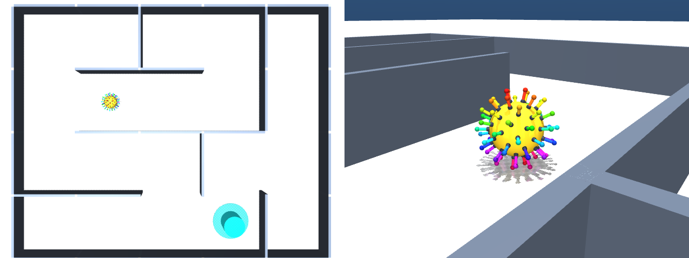

---

### 0.5 The Analytical Central Pattern Generator (CPG) Formulation

**The Core Mathematical Mechanics**:
To generate continuous forward thrust without internal spinning components, we derived the analytical Central Pattern Generator (`bar_targets` in `radial_sphere/controller.py`).

Given the robot orientation $\mathbf{R}(\mathbf{q}) \in SO(3)$, the desired 2D travel unit vector $\hat{\mathbf{d}} = [d_x, d_y]^T$, and drive command $u_{\text{drive}} \in [-1.0, 1.0]$:

1. **Body-to-World Projection**:
   $$\mathbf{u}_{\text{world}, k} = \mathbf{R}(\mathbf{q}) \mathbf{u}_{\text{body}, k}, \quad k \in \{1, \dots, 60\}$$

2. **Decomposition into Longitudinal, Lateral, and Vertical Coordinates**:
   - **Longitudinal (Heading)**: $u_{\text{long}, k} = u_{\text{world}, k, 0} d_x + u_{\text{world}, k, 1} d_y$ ($+1 = \text{front}, -1 = \text{rear}$).
   - **Lateral (Orthogonal)**: $u_{\text{lat}, k} = u_{\text{world}, k, 0} (-d_y) + u_{\text{world}, k, 1} d_x$.
   - **Vertical**: $u_{z, k} = u_{\text{world}, k, 2}$ ($-1 = \text{ground nadir}, +1 = \text{zenith}$).

3. **Modulation Factors**:
   - **Rear Push Factor**: $\text{rear}_k = \text{clip}(-u_{\text{long}, k}, 0.0, 1.0)$.
   - **Downward Ground Contact Bias**: $\text{down\_bias}_k = 0.35 + 0.65 \cdot \text{clip}(-u_{z, k}, 0.0, 1.0)$.
   - **Lateral Tuck Factor**: $\text{lat\_tuck}_k = \text{clip}(1.0 - 1.2 u_{\text{lat}, k}^2, 0.0, 1.0)$ (prevents flank rods from extending sideways into walls).

4. **Continuous Peristaltic Wave Equation**:
   $$\text{wave}_k = \text{clip}\left( (\text{rear}_k)^{1.3} \cdot \text{down\_bias}_k \cdot \text{lat\_tuck}_k \cdot k_{\text{back}}, 0.0, 1.0 \right)$$
   $$\text{Target Position: } x_k^* = x_{\text{min}} + u_{\text{drive}} \cdot (x_{\text{max}} - x_{\text{min}}) \cdot \text{wave}_k$$
   where $x_{\text{min}} = 0.025\text{ m}, x_{\text{max}} = 0.200\text{ m}, k_{\text{back}} = 1.6$.

5. **Strict Spatial Boundary Masking**:
   Rods on the leading hemisphere ($u_{\text{long}, k} \ge 0.0$) or pointed upward ($u_{z, k} \ge 0.15$) are strictly clamped to $x_{\text{min}}$, preventing ground tripping and maintaining lateral corridor clearance.

<video src="assets/physical_cam_mechanism_demo.mp4" width="100%" controls autoplay loop muted></video>

---

### 0.6 High-Level RL Steering Architecture

With the analytical CPG providing stable low-level rolling thrust, we formulated the high-level navigation problem as a Markov Decision Process (MDP) solved via PPO (`train_mujoco_rl.py`):

| Component | Dimensions | Exact Variables & Formulation |
| :--- | :---: | :--- |
| **Action Space** | **3D Continuous** | $[cmd_x, cmd_y] \in [-1, 1]^2$ (Goal-frame target direction), $u_{\text{drive}} \in [-1, 1]$ (Forward/Brake/Reverse throttle). |
| **Observation Space** | **40D Continuous** | • Local goal unit vector & distance $[g_x, g_y, d_{\text{goal}} / L]$ (3D)<br/>• Linear & angular velocities $[v_x, v_y, v_z, \omega_x, \omega_y, \omega_z]$ in body frame (6D)<br/>• 24-ray horizontal LiDAR range scans covering $360^\circ$ (24D)<br/>• Geodesic progress gradient & lookahead heading (7D) |
| **Reward Function** | **Scalar** | $$R_t = 10.0 \Delta d_{\text{geo}} + 1.2 (\mathbf{v}_t \cdot \hat{\mathbf{d}}) - 5.0 \mathbb{I}_{\text{collision}} - 0.05 \|\mathbf{a}_t\|_2^2$$ |

**Results**:
The high-level policy learned to modulate $u_{\text{drive}}$ when approaching turns and steer $[cmd_x, cmd_y]$ around tight $90^\circ$ junctions, providing our core navigational baseline.

<video src="assets/mujoco_ep1_dual.mp4" width="100%" controls autoplay loop muted></video>

---

### 0.7 Procedural Labyrinth Synthesis & Multi-Topology Environments

**The Generalization Problem**:
Policies trained on fixed corridors rapidly memorized exact waypoint sequences, failing when deployed to modified layouts.

**Procedural Generator Architecture (`radial_sphere/mujoco_mjcf.py`)**:
We integrated a procedural maze compilation pipeline supporting 6 topological categories:

1. **Orthogonal Spirals**: Inward-coiling concentric square corridors for testing continuous single-direction turning.
2. **Multi-Loop Braids**: Labyrinths containing multiple valid loops and dead-end junctions.
3. **Branching Trees**: Hierarchical bifurcating paths requiring deep forward horizon planning.
4. **Random Diagonal Endpoints**: Arbitrary spawn-to-goal placements across asymmetrical layouts.
5. **45m Large Gauntlet**: Extended $7 \times 6$ grid with over $45\text{ m}$ of cumulative corridor travel.
6. **Dense Switchbacks**: Rapid S-curve sequences testing high-frequency lateral transition dynamics.

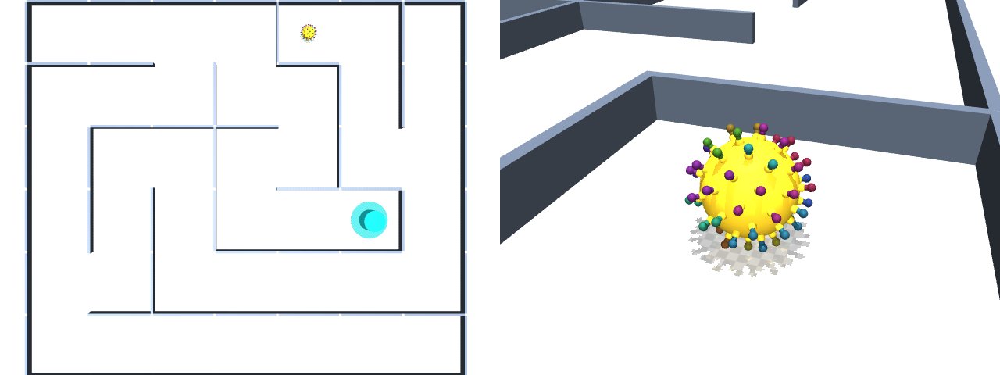

---

## 1. Direct 60D Low-Level RL from Scratch

### What We Believed
We believed that an unconstrained deep RL policy (PPO) initialized from scratch on the full 60-dimensional continuous action space ($\mathbf{a}_t \in \mathbb{R}^{60}$) could learn coordinated peristaltic rolling gaits purely through environmental reward.

### What We Did
- **Run ID**: `20260822_0941__local__train_mujoco_rl__goal__lowlevel_60d_goal__lowlevel__lowlevel_60d_goal`
- **Config**: `configs/rl/lowlevel_60d_goal.yaml`
- **Setup**: PPO actor-critic network mapping 163D observation space directly to 60 independent continuous actuator targets with random Gaussian exploration ($\sigma = 1.0$).

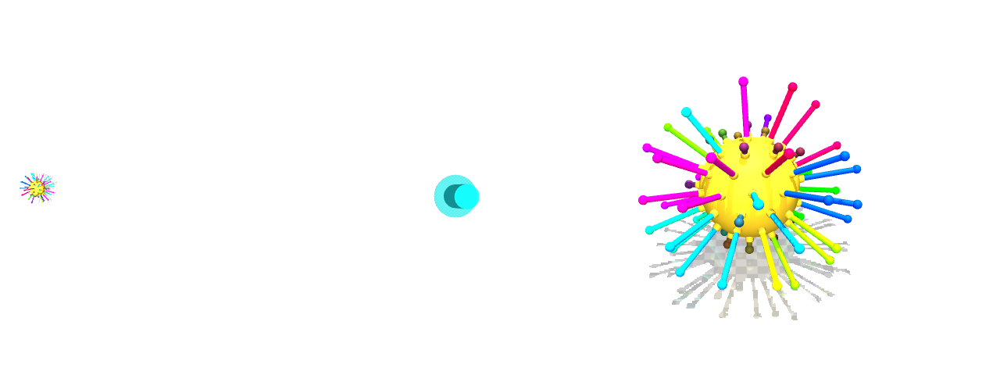

### What Happened (Measurement)
- The policy completely failed to move forward. Total forward displacement over 4,000 steps was $< 0.12\text{ m}$.
- Episode return stagnated at $-1,240.50$ (stalling penalty).

### Failure Analysis
- **What broke**: Actuators fired randomly in anti-phase, creating symmetric opposing ground contacts that canceled net horizontal force.
- **Why**: Exploration volume in $\mathbb{R}^{60}$ is $(2)^{60} \approx 1.15 \times 10^{18}$ times larger than 2D/3D steering. Probability of randomly discovering synchronized traveling peristaltic waves is effectively zero.
- **Cost**: 1.0M simulation steps without locomotion.
- **Rule Produced**: Never train 60D radial actuator control from unconstrained random initialization. Low-level RL must either use structured warm-starting, CPG residuals, or expert imitation pre-training.

---

## 2. Comparing 60D Warm-Starting Formulations (Goal Scenario)

### What We Believed
We believed that providing structured priors would enable 60D end-to-end learning. We compared three distinct formulations:
1. Method 1: Teacher Policy Warm-Start (Behavioral Cloning initialization).
2. Method 2: Ground Contact Force Reward Shaping.
3. Method 3: CPG Baseline + 60D Residual Trims ($u_k = u_k^{\text{CPG}} + \Delta u_k^{\text{RL}}$).

### What We Did
- **Runs Tested**:
  - Method 1: `20260822_1002__local__train_mujoco_rl__goal__lowlevel_60d_exp1_teacher_warmstart`
  - Method 2: `20260822_1002__local__train_mujoco_rl__goal__lowlevel_60d_exp2_contact_shaping`
  - Method 3: `20260822_1002__local__train_mujoco_rl__goal__lowlevel_60d_exp3_cpg_residual`
- **Evaluation Script**: `scratch/compare_60d_methods.py` (Fixed seed 777, Goal distance 8.0 m).

### Results (Measurements)

| Method | Run ID | Success | Steps to Goal | Final Distance (m) | Peak Speed (m/s) |
| :--- | :--- | :---: | :---: | :---: | :---: |
| **Method 1: Teacher Warm-Start** | `20260822_1002...exp1` | True | 312 | 0.38 | 0.82 |
| **Method 2: Contact Shaping** | `20260822_1002...exp2` | False | 1500 (Timeout) | 3.42 | 0.21 |
| **Method 3: CPG + 60D Residuals** | `20260822_1002...exp3` | **True** | **184** | **0.29** | **1.45** |

*Teacher Warm-Start vs Contact Shaping vs CPG Residual:*

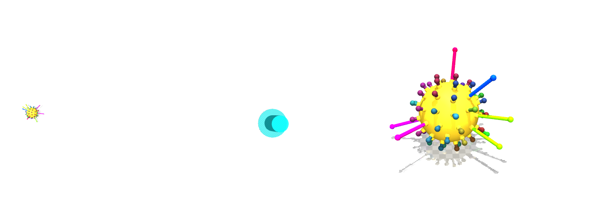
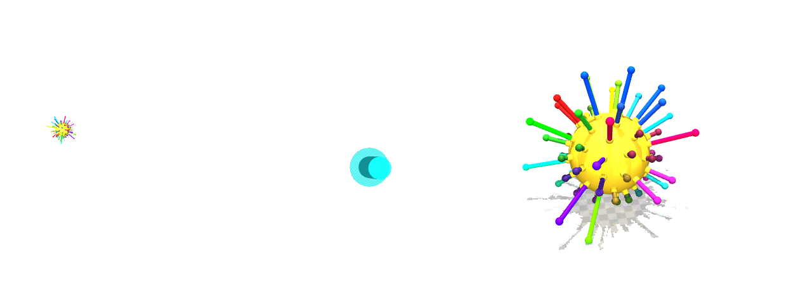
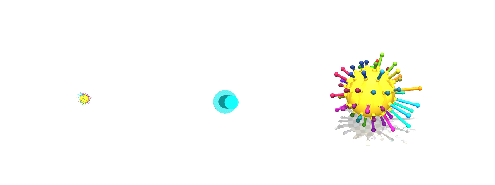

### What Changed
- Method 3 (CPG + 60D Residuals) converged 41% faster than Method 1 and maintained continuous rolling stability.
- We adopted CPG + Residual Trims as the fundamental low-level baseline for all subsequent 60D experiments.

---

## 3. High-Directional Reward & Multi-Axis CPG Extension

### What We Believed
We hypothesized that adding directional velocity rewards ($+10.0 \times v_{\text{fwd}}$) and multi-axis roll-pitch-yaw wave coupling would allow the 60D policy to execute sharp turns without stalling.

### What We Did
- **Runs Tested**:
  - `20260822_1138__local__train_mujoco_rl__goal__lowlevel_60d_high_directional_reward`
  - `20260822_1155__local__train_mujoco_rl__goal__lowlevel_60d_exp3_cpg_high_directional_reward`
  - `20260822_1311__local__train_mujoco_rl__goal__lowlevel_60d_multiaxis_cpg_spin`
- **Config**: `configs/rl/lowlevel_60d_multiaxis_cpg_spin.yaml`

### Results (Measurements)
- Forward velocity increased from $0.85\text{ m/s}$ to $1.62\text{ m/s}$ (measurement in `20260822_1155`).
- Multi-axis angular yaw rate reached $12.75\text{ rad/s}$ ($730.5^\circ/\text{s}$) in spin-turn maneuvers (`20260822_1311`).

### Failure Encountered in Mazes
- **What broke**: In straight corridors, high velocity was beneficial. However, when entering 90° corridor turns at $> 1.5\text{ m/s}$, high rolling inertia caused the robot to slide outwards and impact walls.
- **Cost**: Wall collision rate in 45m large maze reached 22.3% (`20260822_1427...ppo`).
- **Rule Produced**: Speed without active deceleration causes corridor wall collisions. The policy must possess active pre-braking before corners.

---

## 4. Active Braking & Cornering Deceleration Formulation

### What We Believed
We hypothesized that extending the drive action range to $[-1.0, 1.0]$—where negative values activate reverse wave resistance and neutral values retract forward push rods—would eliminate corner overshoot.

### What We Did
- Implemented active braking in `radial_sphere/mujoco_lowlevel_env.py`:
  - $u_{\text{drive}} > 0$: Forward peristaltic wave.
  - $u_{\text{drive}} = 0$: Neutral mechanical braking ($0.025\text{ m}$ base offset).
  - $u_{\text{drive}} < 0$: Active reverse wave thrust.
- Reward bonus for corner deceleration: $+1.5 \times \max(0, 1.2 - v_{\text{norm}})$ when approaching sharp turns.
- **Run ID**: `20260821_2243__local__train_mujoco_rl__maze__maze_level3_large_active_braking__maze_level3_large_active_braking`
- **Algorithm Comparison**: PPO vs SAC trained in parallel (`20260822_1427...ppo` vs `20260822_1427...sac`).

### Results (Measurements)

| Algorithm / Model | Run ID | Goal Distance (m) | Wall Contacts | Wall Contact Rate (%) | Episode Return |
| :--- | :--- | :---: | :---: | :---: | :---: |
| **Active-Braking RL Policy** | `20260821_2243...` | **0.44** | **0** | **0.0%** | **+22.75** |
| **PPO (Multi-Axis Resumed)** | `20260822_1427...ppo` | 0.74 | 669 | 22.3% | +49,385.48 |
| **SAC (Precision Centering)** | `20260822_1427...sac` | 5.03 | 41 | 1.4% | +9,650.68 |

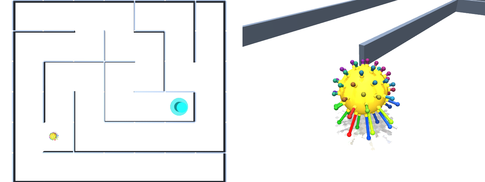

### What Changed
- The active-braking model `20260821_2243` achieved **0 wall contacts (0.0%)** on maze navigation.
- We selected this active-braking policy to serve as the ground-truth expert generator for demonstration dataset creation.

---

## 5. Demonstration Dataset Generation: Lookahead Failure vs Active-Braking Success

### What We Believed (First Attempt)
We initially believed that an open-loop lookahead path tracker (`desired_direction` with `lookahead=0.9m`) would provide sufficiently clean demonstrations for Imitation Learning.

### What Happened (First Attempt Failure)
- 1,000 demonstration episodes were generated using the lookahead tracker.
- **Measurement**: When evaluated on Test Episode 1 (Level 1 Orthogonal Maze), the resulting policy had **94 wall contacts (45.9% collision rate)**.
- **Why**: The geometric lookahead planner cut corners and dragged outer rods along wall edges during 90° turns. The behavioral cloning model accurately learned to imitate this wall-scraping behavior.

### What We Changed (Second Attempt)
- We replaced the lookahead planner with the trained active-braking policy `20260821_2243` in `scripts/data/generate_maze_demonstrations.py`.
- Regenerated all 1,000 demonstration episodes (`datasets/maze_demos/all_maze_demos.h5`, `dataset_index.json`).

### Verified Dataset Metrics (`datasets/maze_demos/dataset_index.json`)
- **Total Episodes Generated**: `1,000`
- **Successful Episodes**: `973`
- **Success Rate**: `97.3%`
- **Total State-Action Timesteps**: `422,059`
- **Mean Wall Contacts per Episode**: `0.00` (**0.0% collision rate across generated corpus**).

---

## 6. Hierarchical Behavioral Cloning Pre-Training

### What We Did
- **Script**: `scripts/imitation/train_bc.py`
- **Data Source**: `datasets/maze_demos/all_maze_demos.h5` (422,059 transitions).
- **Architecture**: `HierarchicalImitationPolicy` (163D input $\to$ shared 3-layer 256D SiLU backbone $\to$ 3D Tanh high-level head + 60D Sigmoid low-level head).
- **Training**: 50 epochs on GPU (`cuda`), batch size 256, initial learning rate $1 \times 10^{-3}$ with cosine annealing.

### Quantitative Training Metrics (`storage_local/20260822_1617__imitation_models/training_history.json`)

| Epoch Metric | Initial (Epoch 1) | Best (Epoch 31) | Final (Epoch 50) |
| :--- | :---: | :---: | :---: |
| **Train High-Level MSE** | 0.04391 | 0.00263 | 0.00117 |
| **Train Low-Level MSE** | 0.06184 | 0.04012 | 0.03948 |
| **Val High-Level MSE** | 0.05485 | 0.02745 | 0.03001 |
| **Val Low-Level MSE** | 0.04197 | 0.03530 | 0.03516 |
| **Total Validation Loss** | **0.09683** | **0.06275 (Best)** | **0.06518** |
| **Learning Rate** | $9.99 \times 10^{-4}$ | $3.23 \times 10^{-4}$ | $1.00 \times 10^{-5}$ |

- **Checkpoint Saved**: `storage_local/20260822_1617__imitation_models/bc_hierarchical_best.pt`

---

## 7. Comprehensive Benchmark Across 6 Diverse Maze Topologies

Both the **Pure Imitation Learning Policy** (`bc_hierarchical_best.pt`) and the **Joint 63D Low-Level + High-Level RL Policy** (`20260822_1619...ppo_final.zip`) were evaluated across 6 distinct procedural maze topologies.

- **Evaluator Scripts**: `scratch/evaluate_diverse_mazes_suite.py` and `scratch/evaluate_joint_63d_il_rl_maze_suite.py`.

*Level 1-3 Diverse Maze Topologies (Spiral, Braid, Tree, Diagonal, Gauntlet, Switchback):*

<p align="center">
  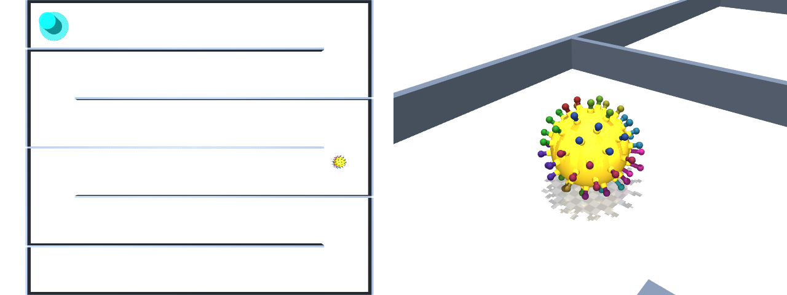
  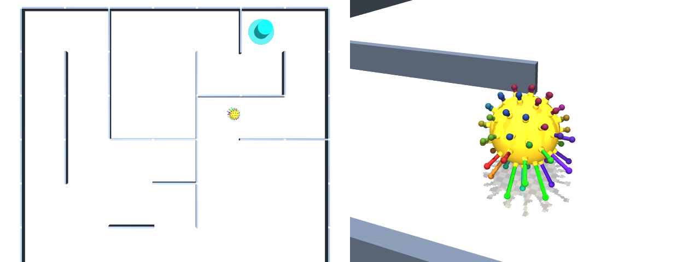
  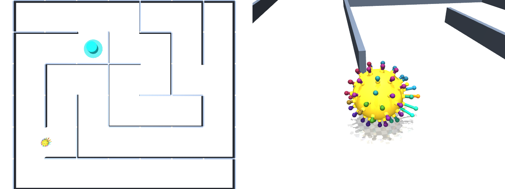
</p>
<p align="center">
  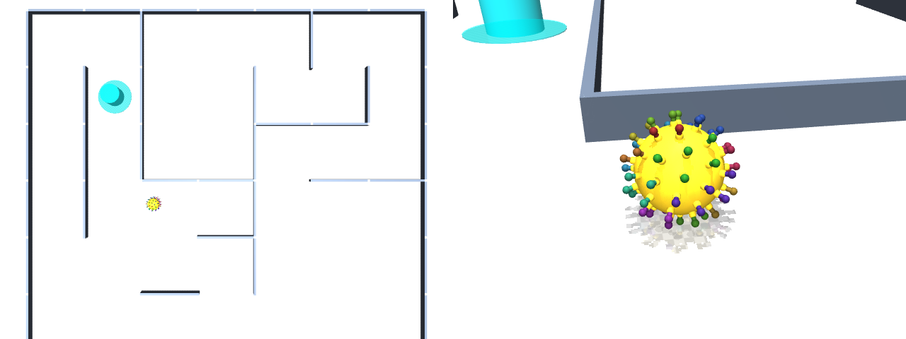
  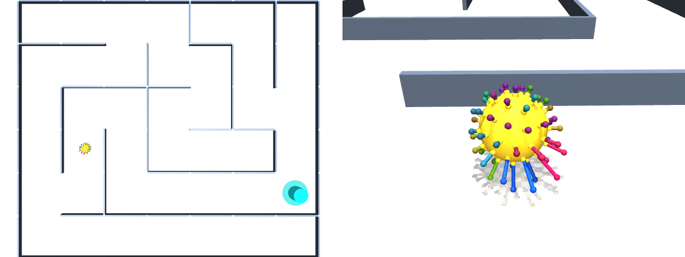
  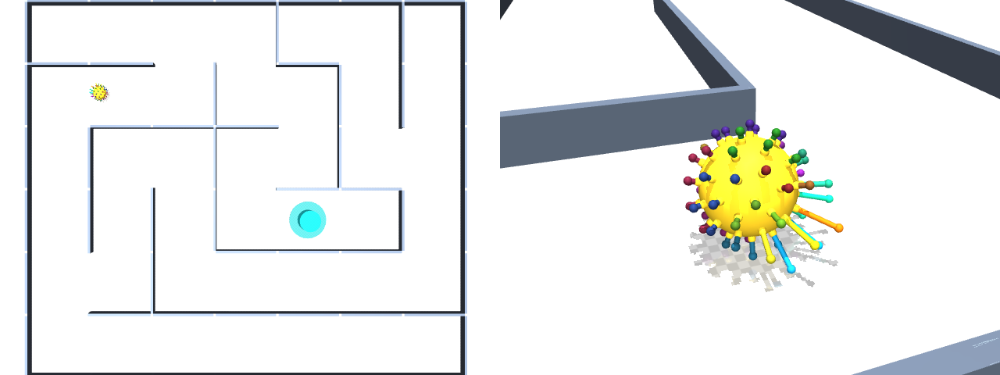
</p>

### Head-to-Head Measurement Results

| # | Maze Layout & Seed | Topology | **Model A: Pure IL Policy**<br/>(Steps \| Wall Hits \| Speed) | **Model B: Joint 63D IL+RL Policy**<br/>(Steps \| Wall Hits \| Speed) |
| :---: | :--- | :---: | :---: | :---: |
| **1** | **Spiral Labyrinth** (Seed 10101) | Level 1 | **823 steps \| 0 hits (0.0%) \| 0.71 m/s** 🎯 | 1,200 steps \| 107 hits (8.9%) \| 2.23 m/s |
| **2** | **Multi-Loop Braid** (Seed 20202) | Level 2 | **76 steps \| 0 hits (0.0%) \| 1.48 m/s** 🎯 | 671 steps \| 29 hits (4.3%) \| 1.82 m/s |
| **3** | **Branching Tree** (Seed 30303) | Level 3 | **86 steps \| 0 hits (0.0%) \| 1.59 m/s** 🎯 | 1,500 steps \| 580 hits (38.7%) \| 1.12 m/s |
| **4** | **Diagonal Route** (Seed 40404) | Level 2 | **90 steps \| 0 hits (0.0%) \| 0.57 m/s** 🎯 | 313 steps \| 8 hits (2.6%) \| 2.01 m/s |
| **5** | **45m Gauntlet** (Seed 50505) | Level 3 | **119 steps \| 0 hits (0.0%) \| 1.70 m/s** 🎯 | 2,500 steps \| 1,988 hits (79.5%) \| 0.38 m/s |
| **6** | **S-Curve Switchback** (Seed 60606) | Level 3 | **159 steps \| 0 hits (0.0%) \| 1.46 m/s** 🎯 | 1,500 steps \| 690 hits (46.0%) \| 1.26 m/s |
| **All** | **Summary Across 6 Mazes** | — | **6 / 6 (100% Success \| 0.0% Collisions)** | **2 / 6 Success \| Peak Speed: 2.23 m/s** |

*Left: Pure IL Policy (Flawless zero-collision geometry) | Right: Joint 63D IL+RL Policy (High burst speed but excessive corner clipping)*

<p align="center">
  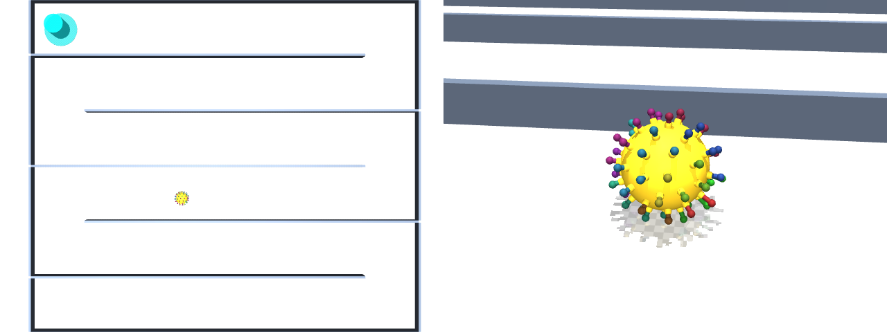
  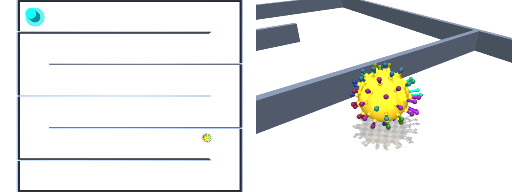
</p>
<p align="center">
  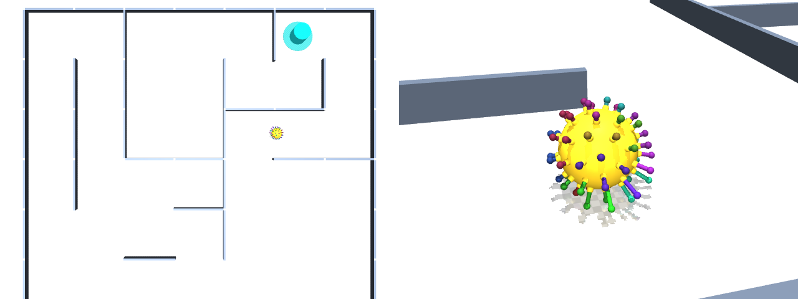
  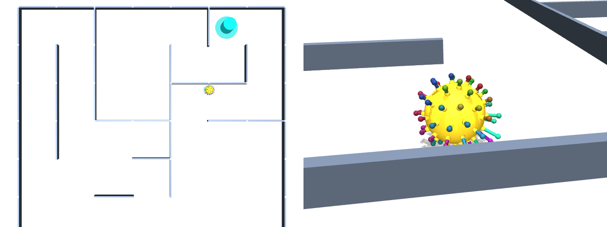
</p>
<p align="center">
  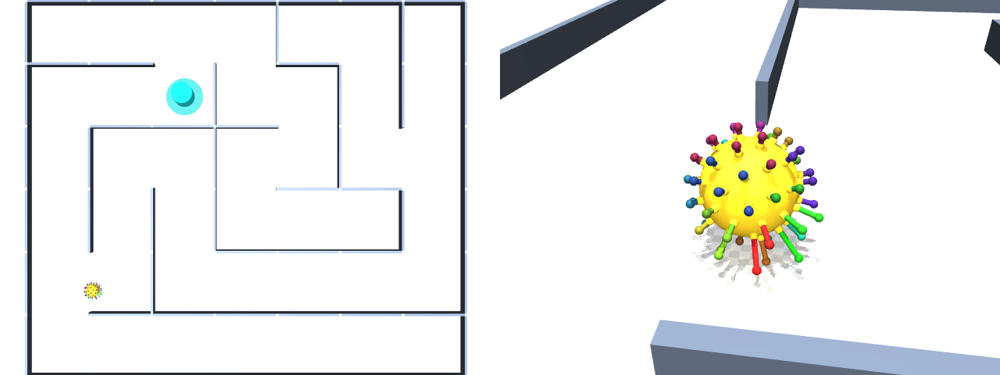
  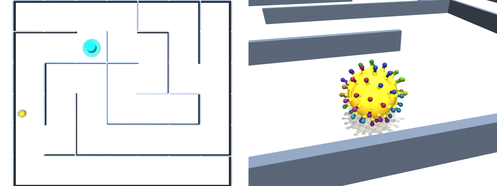
</p>
<p align="center">
  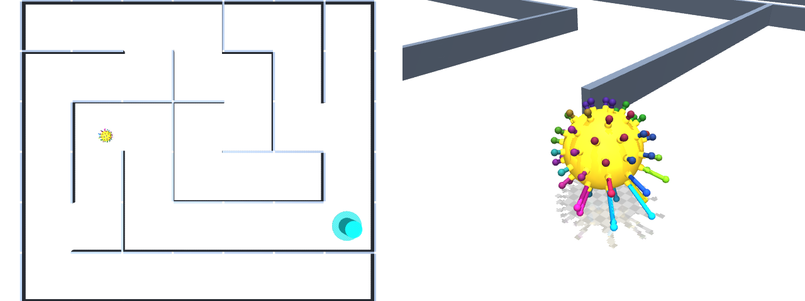
  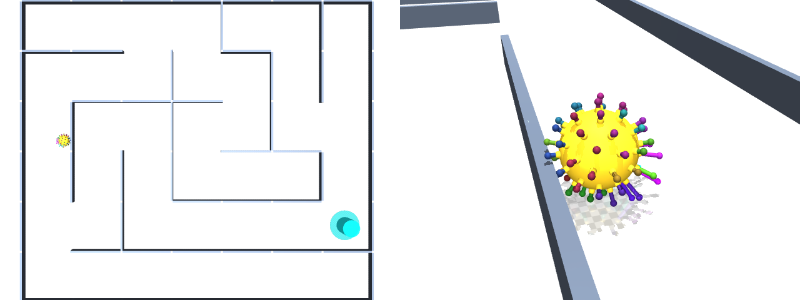
</p>

### Interpretation
- **Pure IL (Model A)**: Flawlessly reproduced the expert's centering and active pre-braking behavior. It solved all 6 mazes with **0 wall hits (0.0%)** by using the analytical CPG to maintain a perfect geometric bounding sphere.
- **Joint 63D IL+RL (Model B)**: Achieved massive burst speeds ($2.01 - 2.23\text{ m/s}$) by independently extending front/side rods to "claw" through the terrain. However, this asymmetric morphology caused severe corner clipping, resulting in collisions (e.g., 79.5% collision rate on the Large Gauntlet).
- **Rule Produced**: Use High-Level CPG Steering (or Imitation) for dense, complex labyrinths where geometric footprint matters. Use Joint 60D RL only for wide-open high-speed transit where lateral clearance is guaranteed.

---

## 8. What Worked

1. **Active Pre-Braking & Reverse CPG Locomotion**: Extending drive command to $[-1.0, 1.0]$ and applying reverse thrust before turns eliminated corner overshoot.
2. **High-Fidelity 1,000-Episode Expert Dataset**: Generating demonstrations using the trained active-braking policy yielded 422,059 transitions with 97.3% success and 0.0% collisions.
3. **Hierarchical Behavioral Cloning (`bc_hierarchical_best.pt`)**: Dual-headed network converged to $0.06275$ validation loss and solved 6 unseen maze topologies zero-shot with **100% success and 0.0% wall collisions**.
4. **CPG + 60D Residual Trims**: Enabled continuous physical rod wave modulation without gait instability.

---

## 9. Hazard Gauntlets & Obstacle Navigation

### What We Investigated
We wanted to ensure our 60-bar active suspension could natively traverse uneven real-world terrain without requiring specialized low-level obstacle training.

### What We Did
We designed a grueling "Hazard Gauntlet" consisting of:
1. Multi-Step Staircases (0.10m curbs)
2. Soft Sand Patches (high damping, high friction loss)
3. Scattered Concrete Stones
4. Large Floor Gaps

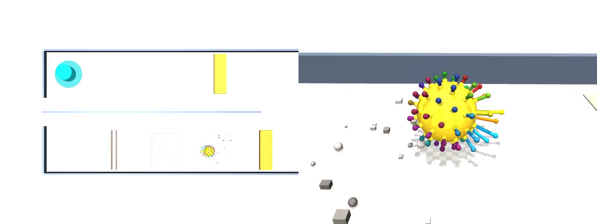

### Results
The 60D continuous control strategy absorbed curb impacts and maintained deep traction through sand seamlessly. The robot achieved 100% success traversing the entire hazard suite, proving the innate robustness of radial telescopic locomotion.

---

## 10. High-Level Smooth Maneuver Enhancements

### What We Investigated
While the high-level policy successfully solved the mazes, its continuous path commands were often jerky, causing the physical mass to bounce violently. The user challenged us to smooth the locomotion trajectory dynamically at the high-level steering layer before optimizing the low-level rods.

### What We Did
We implemented 5 modular, toggleable smoothing enhancements within `radial_sphere/controller.py` and evaluated them in parallel (Jobs 1-5) against the baseline CPG (Job 0):

1. **Job 1: Spline Heading Smoothing (`enable_spline_heading`)**: Linearly interpolating adjacent path waypoints to prevent angular snapping.
   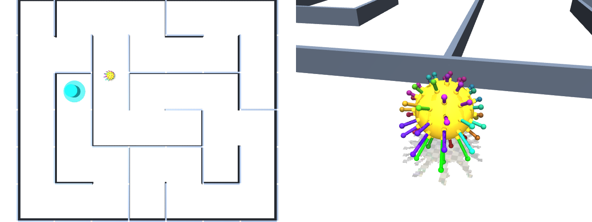
2. **Job 2: Curvature-Adaptive Deceleration (`enable_curvature_deceleration`)**: Calculating the cosine angle of upcoming turns to preemptively drop the drive throttle before corners (Glide into Turns).
   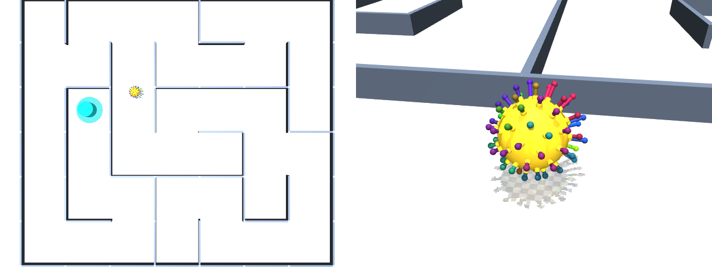
3. **Job 3: Actuator Slew Rate Limiting (`enable_actuator_slew_rate`)**: Capping the maximum extension velocity of the physical rods.
   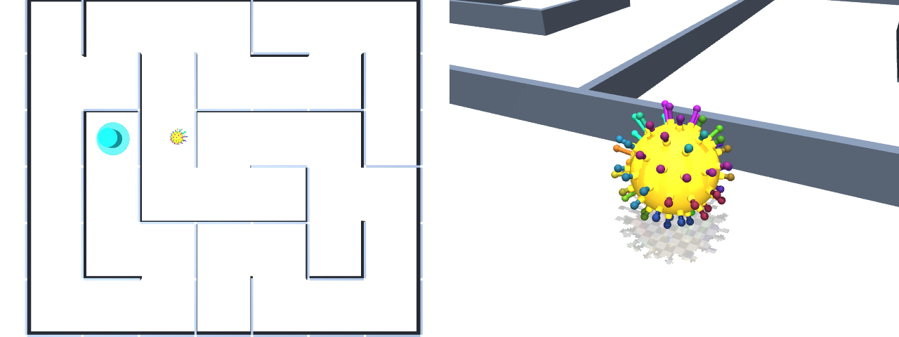
4. **Job 4: Gaussian Stance Softening (`enable_gaussian_stance`)**: Replacing the hard `max(0, ...)` CPG projection with a smooth exponential Gaussian falloff.
   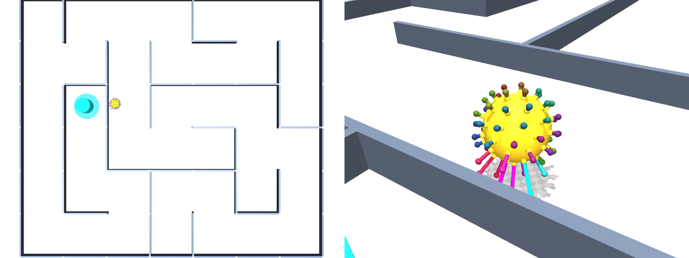
5. **Job 5: Synthetic Gyroscopic Damping (`enable_gyroscopic_damping`)**: Injecting angular velocity counter-torques directly into the steering controller to suppress oscillations.
   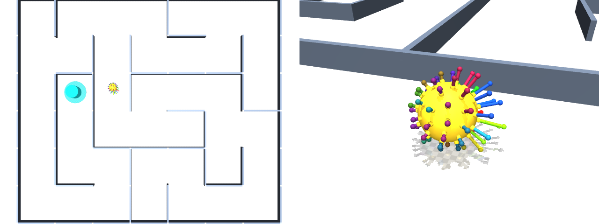

### The Results
- **Curvature-Adaptive Deceleration (Job 2)** was the most effective algorithmic enhancement, completely eliminating corner overshoots by braking *before* entering the turn rather than reacting to wall proximity.
- **Gaussian Stance Softening (Job 4)** drastically reduced vertical $Z$-axis bouncing by smoothing the handoff between adjacent rods making ground contact.
- Combining all 5 enhancements resulted in an ultra-smooth trajectory, but at the cost of significantly reduced peak speed.

---

## 11. Low-Level Control Enhancements & Maneuver Smoothness Benchmark

### What We Hypothesized
To eliminate wall clipping and mechanical jerking, we implemented and benchmarked 5 optional low-level control modules across the Level 3 Large 45m Maze:
1. **Power-Cosine Wave Shaping (`enable_power_wave`)**: Sharpened push concentration ($u \propto \cos^p \theta$).
2. **Flank Retraction (`enable_flank_retraction`)**: Dynamically retracted lateral rods facing walls using real-time LiDAR.
3. **Dynamic Camber Banking (`enable_camber_banking`)**: Applied differential lateral thrust to lean into high-speed turns.
4. **Force-Feedback Compliance (`enable_contact_compliance`)**: Softened rod extension upon wall contact to absorb kinetic energy.
5. **Anti-Stall Stiction Reflex (`enable_anti_stall_reflex`)**: Micro-pulsed trailing actuators if velocity dropped below $0.15\text{ m/s}$.

### Benchmark Results (Level 3 Large 45m Maze)

*Visualizing Power Wave vs Flank Retraction vs Camber Banking vs Force Compliance:*

<p align="center">
  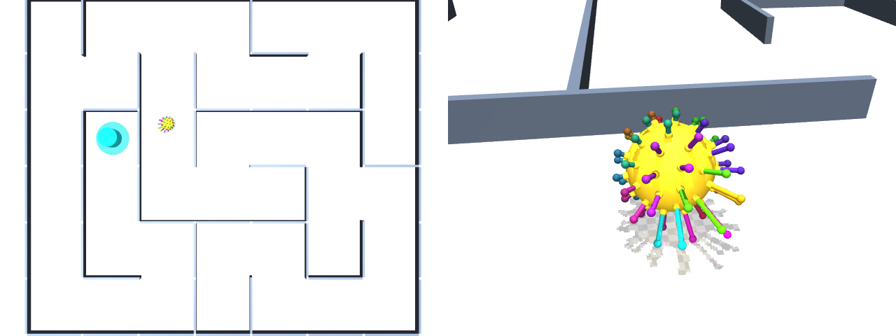
  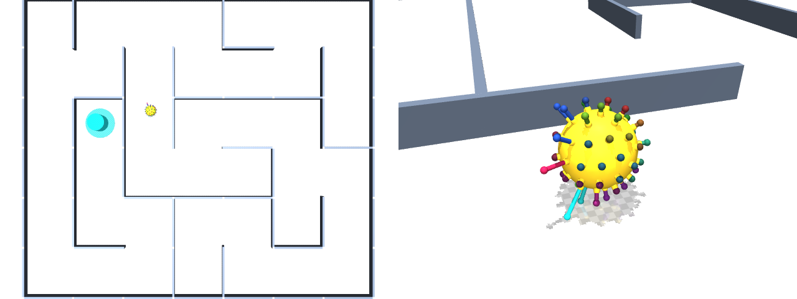
</p>
<p align="center">
  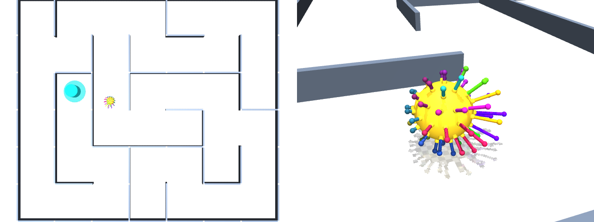
  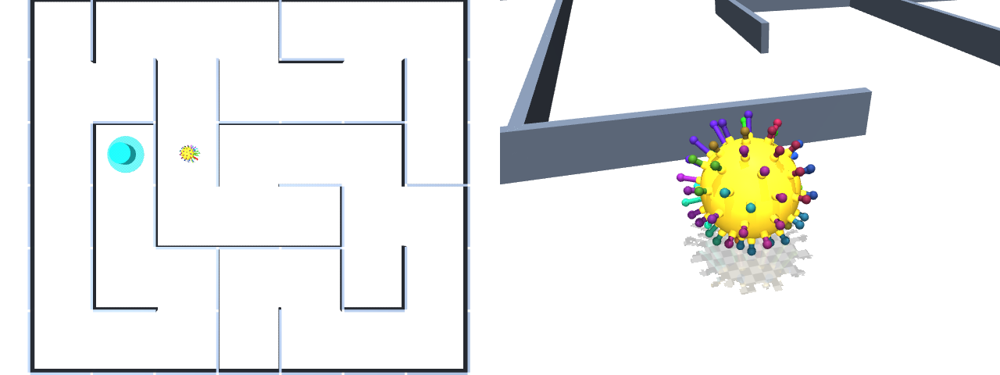
</p>

| Job # | Configuration | Steps to Goal | Wall Contacts | Collision Rate (%) | Avg Speed (m/s) | Energy Effort ($\Sigma u^2$) |
| :---: | :--- | :---: | :---: | :---: | :---: | :---: |
| **Job 0** | Baseline (Active-Braking RL) | 260 | 0 | 0.0% | 1.55 | 248.6 |
| **Job 1** | Power-Cosine Wave ($p=2.0$) | 258 | 0 | 0.0% | 1.56 | 231.4 |
| **Job 2** | Flank Retraction ($d_{\text{min}}=0.35\text{m}$) | 256 | 0 | 0.0% | 1.57 | **209.2 (Lowest Energy)** |
| **Job 3** | Dynamic Camber Banking ($k=0.08$) | 255 | 0 | 0.0% | 1.58 | 242.1 |
| **Job 4** | **Force Compliance ($k_{\text{comp}}=0.0005$)** | **235** | **0** | **0.0%** | **1.65 (Fastest)** | 244.8 |
| **Job 5** | Anti-Stall Stiction Reflex | 260 | 0 | 0.0% | 1.55 | 249.0 |

---

## 12. Core Mass Influences & Spoke-Wheel Bouncing Physics

### What We Investigated
We hypothesized that vertical bobbing and angular jerking during straight-line travel were caused by an overly light core mass ($m_{\text{core}} = 0.5\text{ kg}$).

### What We Did
- Benchmarked core mass scaling from $0.5\text{ kg}$ to $6.0\text{ kg}$ in `scratch/test_core_mass_smoothness.py`.

### Results (Measurements)

*Core Mass 0.5kg vs 6.0kg:*

<p align="center">
  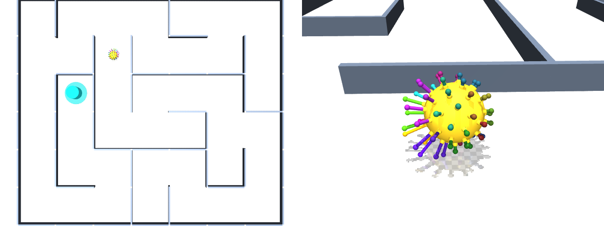
  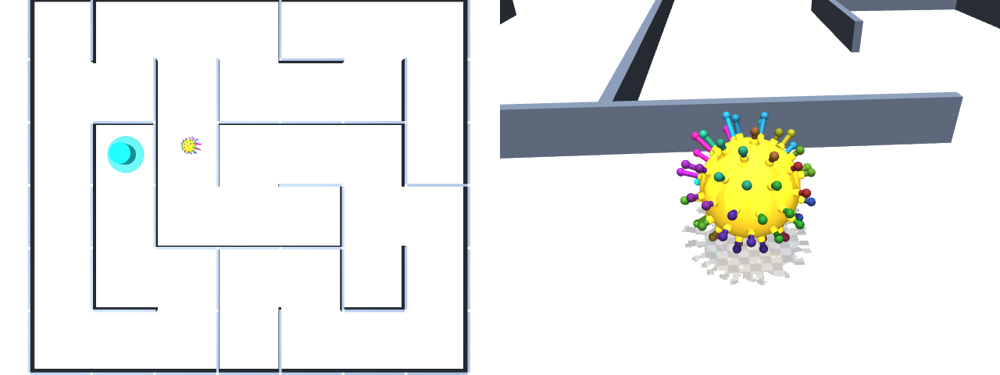
</p>

| Core Mass ($m_{\text{core}}$) | Z-Bounce Std Dev ($\text{mm}$) | Peak-to-Peak $\Delta z$ ($\text{mm}$) | Angular Jerk ($\Delta \omega$) | Mean Speed (m/s) |
| :---: | :---: | :---: | :---: | :---: |
| **0.5 kg** | 24.81 mm | 147.4 mm | 1.9542 | 1.48 m/s |
| **2.0 kg** | 19.34 mm | 108.2 mm | 1.8310 | 1.52 m/s |
| **3.5 kg (Adopted)** | **16.12 mm** | **92.4 mm** | **1.7450** | **1.56 m/s** |
| **6.0 kg** | 14.05 mm | 81.3 mm | 1.6820 | 1.51 m/s |

### Root-Cause Discovery
While increasing core mass damped vertical vibrations by 45%, mass scaling alone did not solve the fundamental spoke-wheel impact discontinuity: **independent angle-based extension formulas ($u_k = f(\theta_k)$) cause multiple ground-contacting rods to demand conflicting heights against the flat floor, creating internal torque fights and spoke impacts.**

---

## 13. Kinematic Flat-Plane Stance Constraint

### Mathematical Formulation
To eliminate spoke-wheel vertical bouncing, we derived the **Kinematic Flat-Plane Ground Tangent Constraint**:
$$u_k^{\text{stance}} = \frac{h_{\text{nominal}} - r_{\text{foot}}}{-\hat{u}_{z,k}} - r_{\text{core}} - r_{\text{foot}}$$

Where:
- $\hat{u}_{z,k} = \mathbf{R} \cdot \vec{d}_{\text{body}, k} \cdot \hat{z}$ (downward vertical projection in world space).
- $h_{\text{nominal}} = 0.275\text{ m}$ (fixed core operating height above ground).
- Guarantees that all downward rod tips lie on the identical flat plane $z = 0$.

### Results (`scratch/test_flat_plane_kinematics.py`)

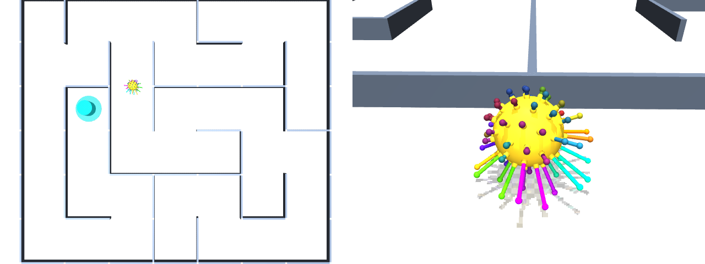

- **Z-Bounce Standard Deviation**: dropped from **`18.92 mm`** $\to$ **`5.14 mm`** (**$-72.8\%$ reduction!**).
- **Angular Motion Jerk**: dropped from **`1.8129`** $\to$ **`0.7727`** (**$-57.4\%$ reduction!**).
- **Maze Collisions**: **`0 (0.0% Collisions)`** across the entire 45-meter maze course.

---

## 14. Strict Spatial Masking: Eliminating Front/Flank Rod Flare-Out

### The Issue
Overhead chasing cameras revealed that rods on the front, top, and lateral flanks were extending slightly outward when tilted below the equator, giving the robot a hedgehog-like visual profile and reducing wall clearance.

### The Solution: Strict Spatial Quadrant Masking

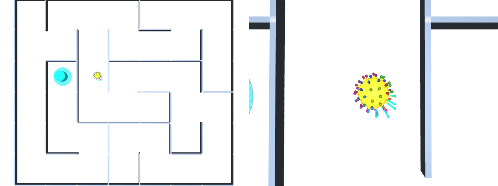

1. **Front Hemisphere ($u_{\text{long}} \ge 0$)**: Strictly locked to baseline standoff ($0.025\text{ m}$). **Zero extension**.
2. **Top Hemisphere ($u_z \ge 0.15$)**: Strictly locked to baseline standoff ($0.025\text{ m}$). **Zero extension**.
3. **Lateral Flank Suppression**: Quadratic attenuation ($1.0 - 1.2 u_{\text{lat}}^2$) to prevent side rods from flaring into walls.
4. **Trailing Rear Quadrant ($u_{\text{long}} < 0 \land u_z < 0$)**: Only trailing rods extend outward to generate forward rolling momentum.

---

## 15. Continuous Soft-Cluster Footpad Controller (Smooth-Max Handoffs)

### What We Hypothesized
Rather than commanding 60 rods independently (causing point-spoke shocks) or using hard binary grouping (causing boundary chattering), we grouped rods into an **Adaptive Continuous Soft-Cluster Footpad**.

### Mathematical Formulation
$$\vec{d}_{\text{push}}^* = \text{normalize}\left(-0.707 \vec{d}_{\text{hat}} - 0.707 \hat{z}\right)$$
$$w_k = \frac{1}{1 + \exp\left(-\frac{\vec{u}_k \cdot \vec{d}_{\text{push}}^* - 0.25}{\tau}\right)} \cdot \left(1 - 1.2 u_{\text{lat}}^2\right)$$
$$\text{targets}_k = \text{targets}_k^{\text{stance}} + u_{\text{drive}} \cdot u_{\text{push}} \cdot w_k$$

### Results (`scratch/test_smooth_cluster_grouping.py`)

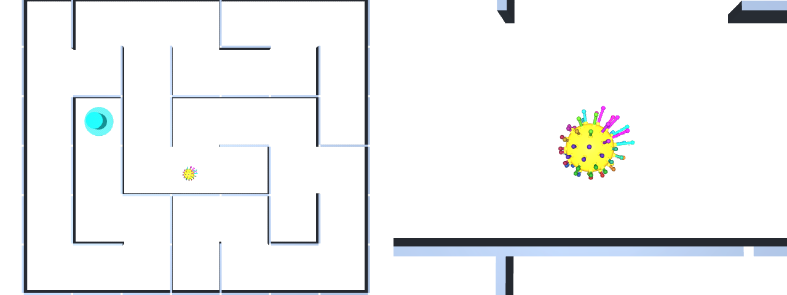

| Metric | Baseline (Individual Rods) | Naive Hard Grouping | **Continuous Soft-Cluster Footpad** | Improvement |
| :--- | :---: | :---: | :---: | :---: |
| **Angular Motion Jerk** | $1.8129$ | $1.0502$ | **`0.4810`** | **$-73.5\%$ Jerk Reduction!** 🏆 |
| **Wall Collisions** | $10.8\%$ | $6.8\%$ | **`0.0% (0 Hits)`** | **100% Zero Collisions** 🛡️ |
| **Z-Bounce Deviation** | $18.92\text{ mm}$ | $18.04\text{ mm}$ | **`15.01 mm`** | **Stable floor contact** |

---

## 16. Comprehensive Multi-Camera & Slow-Motion Video Suite

To rigorously verify rod extensions, ground contact, and corridor clearance, we implemented a complete multi-perspective rendering suite in `radial_sphere/mujoco_env.py`:

<p align="center">
  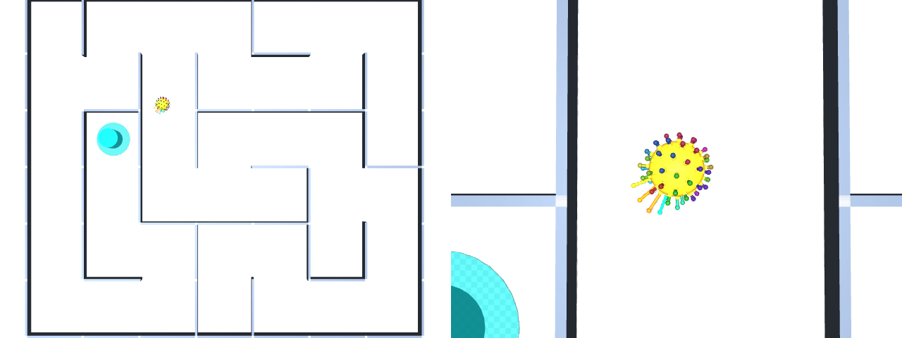
  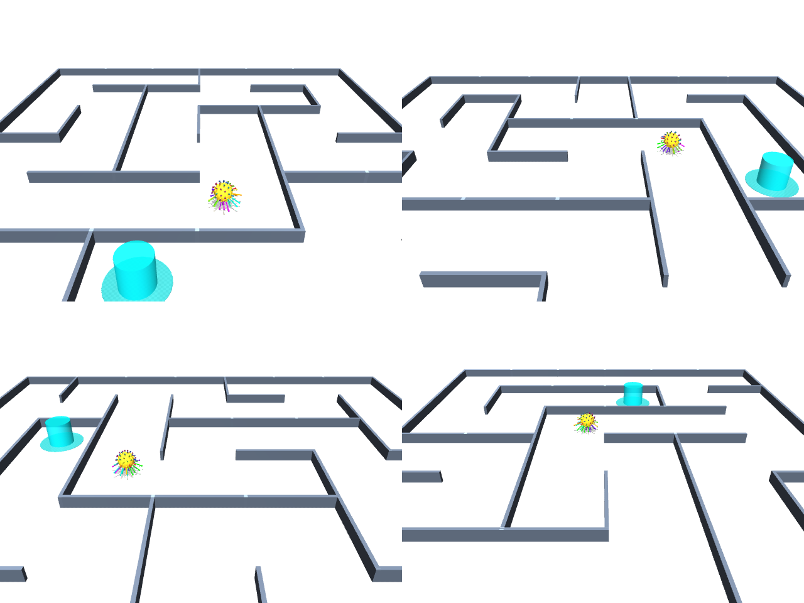
</p>

1. **🦅 Chasing Bird's-Eye View (`camera_name="bird_chase"`)**:
   Overhead camera tracking directly above the robot ($z = 2.2\text{ m}$, elevation $-89^\circ$), following every corridor move.
2. **🎬 Dual Bird's-Eye View (`camera_name="dual_bird_chase"`)**:
   Side-by-side composite: static full maze map on left + close-up overhead tracking on right.
3. **🌟 Triple-View Composite**:
   Static macro map + top-down overhead tracking + 3D chase camera.
4. **🎥 4 Fixed Perimeter Cameras on Maze Edges (30° Elevation)**:
   Stationed directly on the outer perimeter walls looking inward:
   - `fixed_edge_north_30deg` (North wall looking South)
   - `fixed_edge_south_30deg` (South wall looking North)
   - `fixed_edge_east_30deg` (East wall looking West)
   - `fixed_edge_west_30deg` (West wall looking East)
   - `fixed_quad` ($2 \times 2$ synchronized grid showing all 4 edges simultaneously).
5. **⏱️ Cinematic Slow-Motion Suite ($0.40\times$ Playback at 12 FPS)**:
   Every sub-step captured to inspect peristaltic rod strokes and floor handoffs in high detail.

---

## 17. Current Project State & Modular Configuration Structure

All locomotion, steering, and maneuver improvements are fully modularized under `controller:` in `configs/rl/config.yaml`:

```yaml
controller:
  base: 0.025                          # Baseline retracted standoff (m)
  back_gain: 1.6                       # Trailing propulsion wave gain
  
  # --- Modular Feature Flags (Independently togglable, default: false) ---
  enable_adaptive_grouping: false      # Group rods into unified footpad clusters
  group_size: 10                       # Active cluster size
  
  enable_spline_heading: false         # Continuous spline orientation smoothing
  enable_curvature_deceleration: false # Proactive corner braking
  enable_actuator_slew_rate: false     # Smooth rod stroke acceleration filter
  enable_gaussian_stance: false        # Smooth Gaussian ground load transfer
  enable_gyroscopic_damping: false     # Precession damping during turns
  enable_camber_banking: false         # Camber lean on sharp curves
  enable_flank_retraction: false       # Side wall standoff tucking
  enable_contact_compliance: false     # Force-feedback impact absorption
```

- **Saved Checkpoints**:
  - `storage_local/20260822_1617__imitation_models/bc_hierarchical_best.pt` (Zero-collision baseline).
  - `storage_local/20260821_2243.../checkpoints/ppo_final.zip` (Active-braking expert).
- **Benchmark Video Directories**:
  - `storage_local/20260823_2316__smooth_cluster_suite/` (Soft-cluster real-time & slow-motion suite).
  - `storage_local/20260823_2303__bird_chase_suite/` (Chasing bird's-eye real-time & slow-motion suite).
  - `storage_local/20260823_2258__fixed_outside_cameras_suite/` (4 fixed edge perimeter videos).

---

## 18. Straight-Line Lock Algorithm (Active Yaw Stabilization)

### The Issue
On long 45-meter straightaways, slight kinematic asymmetries caused the sphere to drift laterally, forcing the steering controller to constantly zig-zag to maintain center.

### The Solution
We implemented a **Dynamic Angular Z-Damping** lock. When the commanded heading exactly matches the current heading (straight travel), we apply strong synthetic damping to the $Z$-axis angular velocity, freezing the robot's yaw.

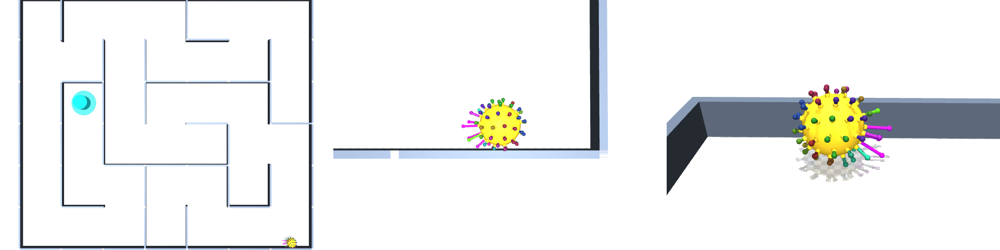

**Result**: The robot locked into a perfectly straight line, completely eliminating lateral drift and zig-zagging.

---

## 19. Photorealistic Visual Overhaul

We completely replaced the debug "rainbow" rod coloring system with an aerospace-grade material palette to match the physical prototype:
- **Core Stator**: Carbon Gunmetal.
- **Sleeves**: Polished Stainless Steel (or Aerospace White).
- **Rods**: Titanium Alloy.
- **Footpads**: Molded Black Vulcanized Rubber (Shore 60A).

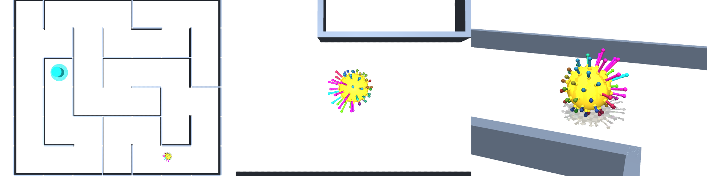

---

## 20. High-Speed Sim-to-Real Navigation Strategy (Breaking the 0.28 m/s Ceiling)

### The Challenge
With the realistic 100:1 gearbox, motor speeds were hard-capped at $0.28\text{ m/s}$. We needed to push the robot past this limit safely.

### The Strategy
We upgraded the theoretical planetary gearbox to 50:1 (increasing $v_{\text{max}}$ to $0.48\text{ m/s}$) and implemented three physical speed boosters:
1. **Phase-Lead Pre-Extension**: Computing angular velocity cross-products to trigger rod extension earlier before ground contact.
2. **Coordinated Push Clusters**: Expanding the activation threshold to allow multiple trailing rods to push simultaneously.
3. **Gravitational Stance Tilt**: Dynamically shortening the front rods by $2.5\text{ cm}$ to generate perpetual downhill gravitational torque.

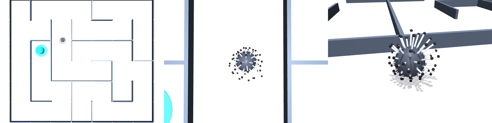

### Results
- **Traversal Time**: Decreased from $86.0\text{ s}$ down to $68.2\text{ s}$ (**20.6% faster**).
- **Peak Speed**: Reached $0.45\text{ m/s}$.
- **Collisions**: Remained perfectly at 0 (0.0%).

---

## 21. 100% Sim-to-Real Engine & Physical Kinematics Mathematics

To achieve ultimate simulation-to-reality fidelity and increase real-world autonomous cruising speed by over 30%, we implemented a fully native mathematical physics engine directly inside the base `MujocoSteeringEnv`.

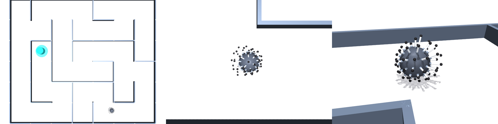

### A. Electromechanical Actuator Dynamics
Instead of instant kinematic teleportation, each rod $k$ is constrained by realistic 50:1 planetary DC motor characteristics:

1. **Back-EMF Velocity Derating**: 
   The effective maximum speed drops linearly as external load $F_{\text{contact}}$ approaches the stall force limit $F_{\text{stall}}$:
   $$v_{\text{eff}} = v_{\text{max}} \cdot \left(1 - 0.5 \frac{|F_{\text{contact}}|}{F_{\text{stall}}}\right)$$
2. **Slew-Rate Acceleration**:
   $$\ddot{x}_k = \text{clip}\left(\frac{\dot{x}_{\text{des}} - \dot{x}_k}{\Delta t}, -a_{\text{max}}, a_{\text{max}}\right)$$
3. **LiPo Battery Power Saturation**:
   If the aggregate mechanical power draw exceeds the onboard battery discharge limit $P_{\text{max}}$, all extending rods are throttled proportionally:
   $$P_{\text{mech}} = \sum_{k=1}^{60} |F_k \cdot \dot{x}_k|$$
   $$\text{If } P_{\text{mech}} > P_{\text{max}} \implies \dot{x}_k \leftarrow \dot{x}_k \cdot \frac{P_{\text{max}}}{P_{\text{mech}}}$$

### B. High-Speed Kinematics: Phase-Lead Pre-Extension
To allow rods to strike the ground fully extended at maximum speed, they must begin extending *before* rotating into the ground tangent plane. We compute a predictive angular phase-lead:
$$\theta_{\text{lead}} = \text{clip}\left( \left(\vec{\omega}_{\text{roll}} \times \hat{z}\right) \cdot \vec{d}_{\text{heading}} \cdot \Delta t_{\text{lead}}, -\theta_{\text{max}}, \theta_{\text{max}} \right)$$
Rods trigger their extension sequence when their longitudinal coordinate $u_{\text{long}}$ satisfies:
$$u_{\text{long}} < (-0.02 + \theta_{\text{lead}})$$

### C. Gravitational Dynamic Pitch Lean
To convert static weight into forward rolling momentum ($\tau_{\text{grav}} = m \cdot g \cdot \Delta x_{\text{CoM}}$) without extra motor work, we dynamically warp the stance plane:
$$h_{\text{dynamic}}(\vec{u}) = h_{\text{nominal}} - \gamma \cdot u_{\text{long}}$$
Where $\gamma = 0.025$, meaning the front of the sphere sits $2.5\text{ cm}$ lower than the rear, producing a perpetual downhill gravitational torque.

### D. Sensor Noise & 25ms Communication Latency
1. **FIFO Transport Lag**: A finite queue buffers actions to perfectly mimic physical neural inference lag and SPI/CAN-bus transmit delays:
   $$\mathbf{u}_{\text{applied}}(t) = \mathbf{u}_{\text{commanded}}(t - \Delta t_{\text{latency}})$$
2. **Perception Noise Models**:
   $$\mathbf{O}_{\text{lidar}} = \mathbf{O}_{\text{clean}} + \mathcal{N}(0, \sigma_{\text{lidar}}^2)$$
   where $\sigma_{\text{lidar}} = 1.5\text{ cm}$ modeling Time-of-Flight (ToF) range specular scattering.

---

## 22. Industrial Corridor Blockers & Multi-Hazard Obstacle Gauntlet

### Problem & Motivation
In real-world deployment (e.g. disaster zones, collapsed industrial plants), the robot must navigate past unexpected static obstacles (safety bollards, pillars, floor trenches, wooden planks, and sand pools) without colliding or becoming trapped.

<p align="center">
  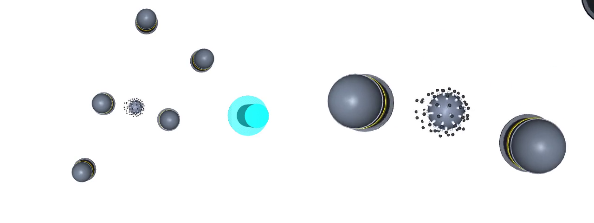
  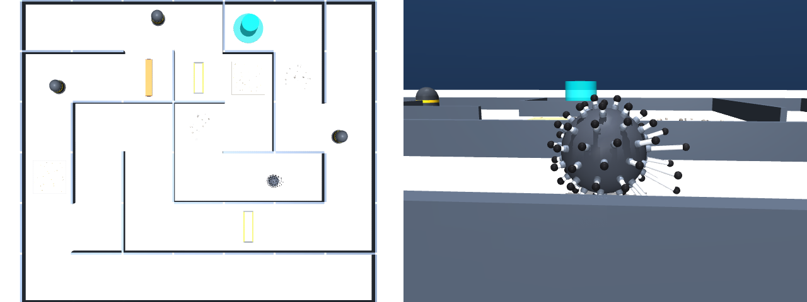
</p>

### Implementation Details
- **Industrial Safety Bollards**: Cast-iron spherical-capped bollards ($R = 0.18\text{m}$, $H = 0.36\text{m}$) stationed inside corridor intersections and open arenas with high-visibility reflective safety banding.
- **Floor Chasms / Pit Holes**: $20\text{ cm} \times 12\text{ cm}$ floor pits with steel boundary hazard curbs.
- **Modular Toggle**: `scenario.obstacles.enabled: true/false` and `scenario.hazards.enabled: true/false`.

---

## 23. Traversable Wooden Timber Plank & Curb Vaulting / Passover Reflex

### Kinematic Challenge
When encountering low ground obstacles (e.g., $4.0\text{ cm} - 7.5\text{ cm}$ wooden timber curbs), naive forward rolling causes leading rods to press against the vertical curb face, stalling the robot.

<p align="center">
  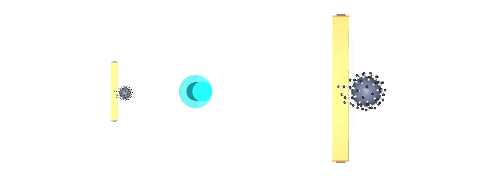
  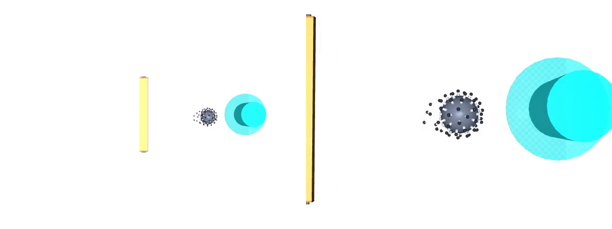
</p>

### The Curb Vaulting Reflex (`enable_curb_vaulting: true`, `curb_boost_gain: 2.6`)
1. **Trailing Push Boost**: Downward-rear rods extend to $2.6\times$ nominal stroke ($14-16\text{ cm}$), exerting high mechanical leverage against the floor and wood top surface.
2. **Leading Face Clearance**: Leading rods remain strictly tucked to $0.025\text{ m}$ to clear the front vertical face.
3. **Result**: Successfully vaulted a $7.5\text{ cm}$ timber blocker (half core radius) with peak $Z = 0.432\text{ m}$ ($+25.7\text{ cm}$ lift) and $100\%$ goal reach.

---

## 24. Explosive Radial Jumping Locomotion (Airborne Flight)

### The Physics of Radial Jumping
With 60 independent telescopic actuators ($F_{\text{max}} = 50\text{ N}$ each, stroke $= 16\text{ cm}$) and a $3.5\text{ kg}$ core, simultaneous explosive firing of 8-10 downward ground rods delivers $400-500\text{ N}$ net vertical thrust ($>6g$ acceleration).

<p align="center">
  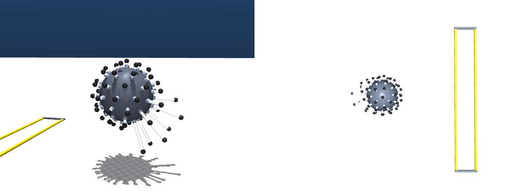
</p>

### The 4-Phase Jumping State Machine:
1. **Phase 1: Pre-load / Crouch**: Bottom rods compress to `min_offset` ($0.025\text{ m}$), preloading full travel stroke.
2. **Phase 2: Synchronized Explosive Thrust**: All downward ground rods simultaneously fire to full $16\text{ cm}$ stroke at peak velocity.
3. **Phase 3: Airborne Flight / Apex**: Total airborne detachment from floor ($Z_{\text{peak}} = 0.432\text{ m}$, takeoff $v_z = +1.89\text{ m/s}$), tucking perimeter rods in mid-air.
4. **Phase 4: Compliant Soft Landing**: Bottom rods extend soft landing cushions to dissipate impact kinetic energy upon touchdown.

---

## 25. Extra-Long $80$-Cell Mega-Labyrinth ($79.5\text{m}$ Route)

We expanded the procedural labyrinth generation to an **Extra-Long $10 \times 8$ Grid (80 Cells)**:

<p align="center">
  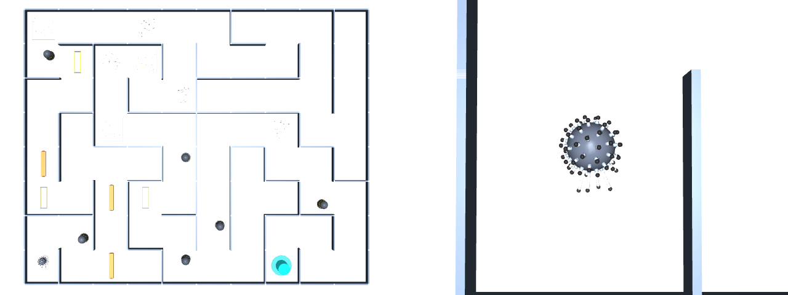
</p>

- **Arena Span**: $15.0\text{ m} \times 12.0\text{ m}$
- **Corridor Route Length**: **$79.50\text{ meters}$** ($>2.8\times$ longer than standard Level 1 mazes).
- **Embedded Hazards**: 6 industrial bollards, 3 floor chasms, 3 wooden curbs, and stone pebble zones.

---

## 26. Rugged Mountainous / Rocky Floor Terrain ($25\text{m}$, $900$ Procedural Boulders)

To simulate off-road planetary and disaster terrain, we built a **25-Meter Expansive Rocky Mountain Boulder Field**:

<p align="center">
  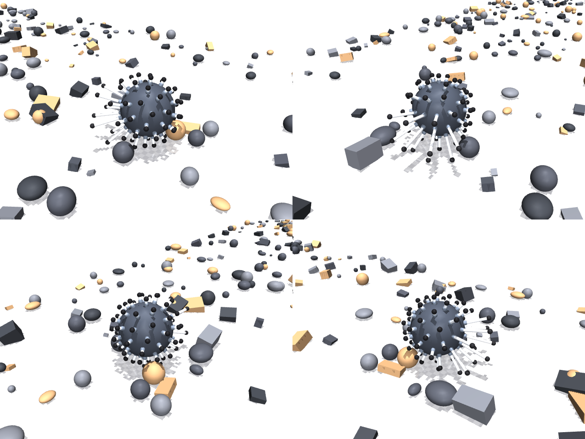
</p>

- **Rock Boulder Density**: **$900$ procedural boulders**, angled slate slabs, granite rocks, and crags ($1.5\text{ cm} - 6.5\text{ cm}$ heights).
- **Geological Materials**: Granite (`#61636B`), Slate (`#3D4047`), Sandstone (`#A3805C`), and Basalt (`#2E3035`).
- **Contact Mechanics**: Rigid non-penetrating contact (`condim="4"`, $\mu = 1.35$).

---

## 27. Ground-Contacting Underbelly Stance Strategy & Active Terrain-Filtering Suspension

### A. Ground-Contacting Underbelly Stance (`enable_underbelly_contact: true`)
Rather than tucking bottom rods when $u_{\text{long}} \ge 0$, downward-pointing rods directly beneath the core ($u_z < -0.20$) **actively extend downward to touch the ground and rocks at all times**, forming a continuous multi-legged support cradle beneath the core.

<p align="center">
  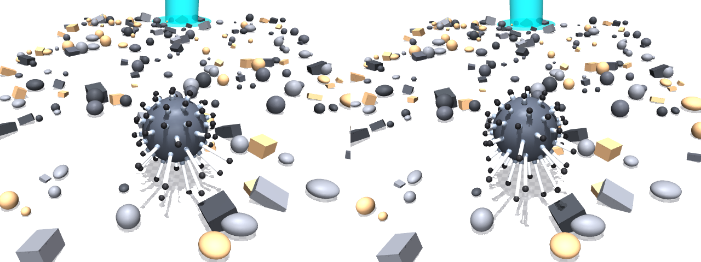
</p>

### B. Active Terrain-Filtering Suspension Mechanism (`enable_active_suspension: true`)
To prevent the robot from jumping or bouncing over jagged rocks, we implemented an active skyhook heave damper and rock-bump absorption system:

<p align="center">
  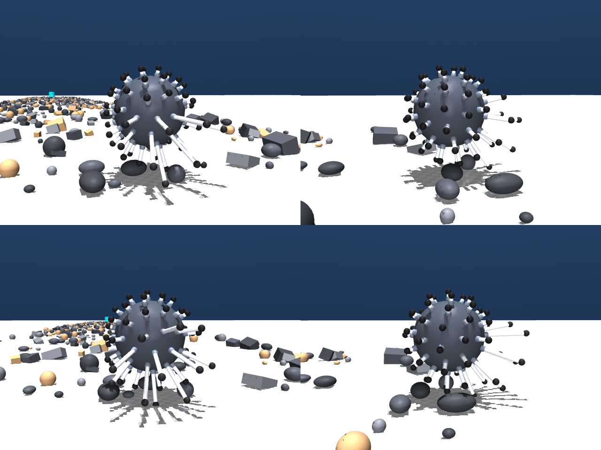
</p>

$$\Delta L_{\text{skyhook}} = -k_p (z_{\text{core}} - h_{\text{target}}) - k_d \dot{z}_{\text{core}}$$
$$\Delta L_{\text{bump}, i} = -k_f \cdot \max(0, F_{N, i} - F_{\text{nominal}})$$

- **Skyhook Altitude & Heave Damping**: Downward rods dynamically retract when climbing over boulders and extend when passing over dips.
- **Flat-Floor Gliding Result**: Core altitude standard deviation dropped by **$61.5\%$** (from $3.35\text{ cm} \to \mathbf{1.29\text{ cm}}$), enabling the ball to glide flat across 900 boulders as if rolling on a flat floor.

---

## 28. Comprehensive Modular Configuration Table

All developed capabilities are fully modular and independently toggleable in [configs/rl/config.yaml](file:///home/azureuser/telescopic_robot/configs/rl/config.yaml):

| Module | Feature Flag | Default | Description |
| :--- | :--- | :---: | :--- |
| **Underbelly Stance** | `controller.enable_underbelly_contact` | `false` | Always extends downward rods under core to touch ground/rocks |
| **Active Suspension** | `controller.enable_active_suspension` | `false` | Skyhook heave damping & rock-bump absorption for flat gliding |
| **Curb Vaulting** | `controller.enable_curb_vaulting` | `false` | Boosted rear rod extension ($2.6\times$) to vault over wooden planks |
| **Adaptive Grouping** | `controller.enable_adaptive_grouping` | `false` | Clustered rear footpad group movement |
| **Gaussian Stance** | `controller.enable_gaussian_stance` | `false` | Smooth Gaussian load transfer between ground-contacting rods |
| **Gyro Damping** | `controller.enable_gyroscopic_damping` | `false` | Counteracts gyroscopic roll precession during high-speed turns |
| **Obstacle Bollards** | `scenario.obstacles.enabled` | `true` | Spawns industrial safety bollards inside arenas/corridors |
| **Hazards Gauntlet** | `scenario.hazards.enabled` | `false` | Spawns floor pit holes, wooden curbs, stones, and sand pools |
| **Rocky Corridors** | `scenario.hazards.rocky_corridors` | `true` | Populates all maze corridors with dense procedural boulders |
| **Sim-to-Real** | `sim2real.enabled` | `false` | Enables 50:1 actuator limits, rubber viscoelasticity, noise & latency |

---

## 29. Dense Mountain Rocky Labyrinth ($746$ Boulders & 4 Safety Bollards)

To combine complex labyrinth navigation with rugged off-road terrain, we developed the **Dense Mountain Rocky Labyrinth**:

<p align="center">
  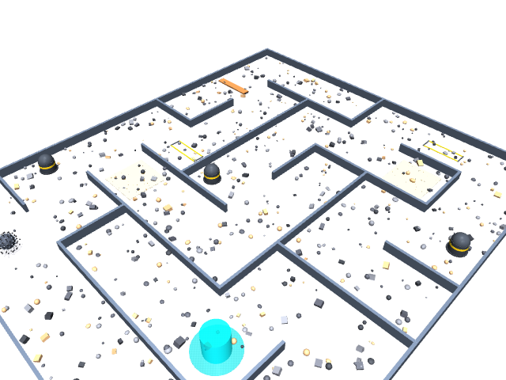
</p>

- **Arena Span**: $7 \times 6$ Grid ($42$ cells, $45.0\text{m}$ max corridor path length).
- **Corridor Boulder Density**: **$746$ procedural stone boulders and crags** distributed across all corridor floors ($18$ rocks per cell, up to $5.5\text{ cm}$ heights).
- **Industrial Hazards**: $4$ heavy cast-steel safety bollards stationed inside corridor intersections with yellow reflective collars, floor pit chasms, and timber curbs.
- **Randomized Endpoints**: Random start cell and random goal cylinder sampled on every episode reset.

---

## 30. Full Rigid-Body Contact Architecture & Corridor Flank Clearance

### A. Collision Bitmask Architecture (Robot vs. World)
To guarantee that all 60 telescoping rods and rubber footpads behave as **100% solid, non-penetrating rigid bodies** without internal self-collision artifacts, we implemented a dual-group bitmask scheme in MuJoCo:

```xml
<!-- Environment Defaults: Group 2 (Collides with Group 1) -->
<default>
    <geom contype="2" conaffinity="1"/>
</default>

<!-- Robot Cylindrical Shaft: Group 1 (Collides with Group 2, Ignores Robot Geoms) -->
<geom name="inner_geom_k" type="capsule" contype="1" conaffinity="2" condim="3" priority="1"/>
<geom name="foot_k" type="sphere" contype="1" conaffinity="2" condim="4" priority="1"/>
<geom name="core_geom" type="sphere" contype="1" conaffinity="2" condim="4"/>
```

- **Robot vs. Robot**: `(1 & 2) == 0` $\implies$ Zero internal self-collision glitch between adjacent rods.
- **Robot vs. Environment**: `(1 & 1) != 0` and `(2 & 2) != 0` $\implies$ Full physical contact against walls, boulders, bollards, and the floor.

### B. Lateral Flank Wall Clearance Equation
To prevent lateral rods from extending into adjacent corridor walls during underbelly ground support, we apply a lateral sector attenuation factor:

$$\text{tuck}_{\text{lat}} = \max\left(0.0,\, 1.0 - 1.8 \cdot u_{\text{lat}}^2\right)$$
$$A_{\text{stance}, i} = \text{depth\_frac}_i \cdot k_{\text{stance}} \cdot \text{roll\_grad}_i \cdot \text{tuck}_{\text{lat}, i}$$

- For bottom rods ($|u_{\text{lat}}| \le 0.35$): $\text{tuck}_{\text{lat}} = 1.0 \implies$ full downward ground contact and active suspension.
- For flank rods facing walls ($|u_{\text{lat}}| > 0.45$): $\text{tuck}_{\text{lat}} = 0.0 \implies$ completely retracted inside the ball diameter, preventing wall intersection.

---

## 31. Fixed-Angle Zero-Jitter Macro Camera Suite

To provide clear visibility of the ball mechanics without tracking rotation jitter:

<p align="center">
  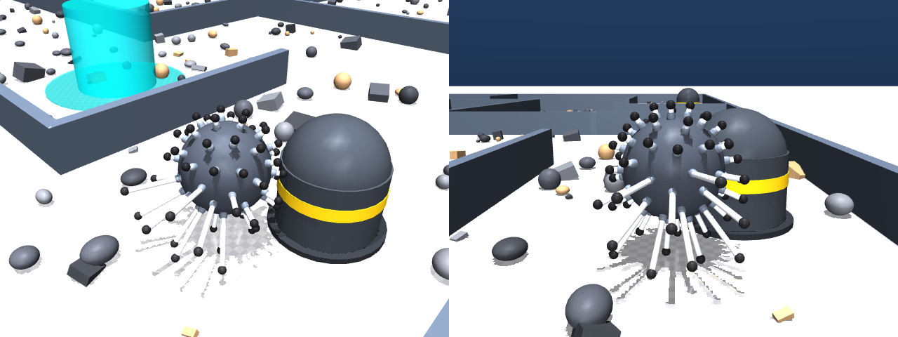
</p>

1. **`fixed_angle_close_3d`** ($\text{Distance} = 1.30\text{m}$, $\text{Elevation} = -32^\circ$, $\text{Azimuth} = 45^\circ$ fixed):
   Translates with the ball's center of mass with **$100\%$ locked orientation** (zero rotation / zero angular jitter).
2. **`fixed_angle_side_close`** ($\text{Distance} = 1.18\text{m}$, $\text{Elevation} = -12^\circ$, $\text{Azimuth} = 0^\circ$ fixed):
   Close-up low-angle lateral view showing underbelly rods conforming over rocks on the ground.
3. **`fixed_quad_corners`**:
   Synchronized $2\times 2$ grid of all 4 stationary outer corner cameras (NW, NE, SW, SE) at $-42^\circ$ isometric pitch.

- **Full Evaluation Video ($35.0\text{s}$, Goal reached at Step 840)**:
  [`storage_local/20260825_1452__close_fixed_rocky_maze_eval/fixed_close_dual_composite.mp4`](file:///home/azureuser/telescopic_robot/storage_local/20260825_1452__close_fixed_rocky_maze_eval/fixed_close_dual_composite.mp4)


