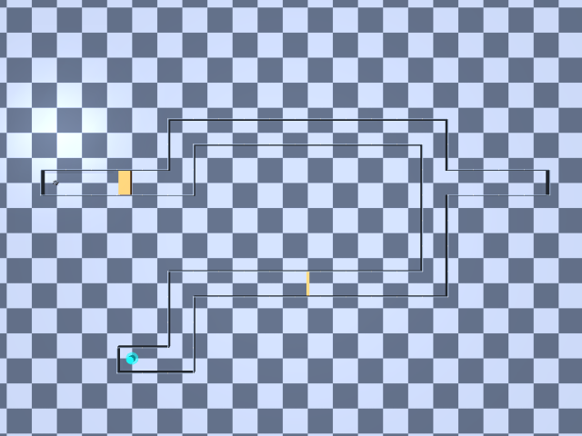
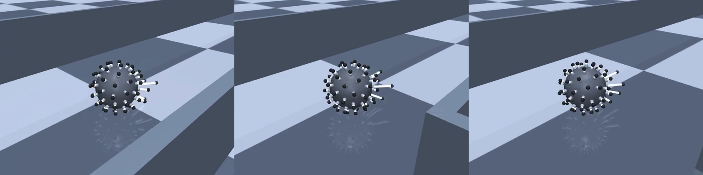
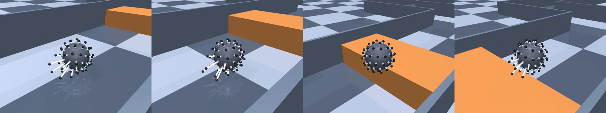

# 02 — A named skill library, and a course built to exercise it

Period: 2026-08-27 (one working session).
Scope: turning the 60-bar robot into something you drive by **naming a
skill** rather than by writing rod maths — plus the obstacle course built to
prove each skill does what its name says.

Companion docs: `skills/README.md` (API reference and how to run),
`docs/ENV_OVERVIEW.md` (env spec),
`docs/project_journey/01_hierarchical_imitation_and_60d_rl_locomotion.md`
(the RL chapters that precede this one).

Evidence used for the numbers in this file:

| source | what it holds |
|---|---|
| `tests/test_skills.py` | the asserted per-skill measurements, re-run after every change |
| `scripts/skills/run_course.py` console output | per-leg distances, jump clearances, contact counts |
| `storage_local/20260827_*__run_course__skill_course/` | course renders |
| `storage_local/20260827_*__run_skill__combo/` | side-by-side locomotion renders |
| parameter sweeps run in-session | every "measured" table below |

## Key terminology

- **Skill** — a pure function: robot state in, a `(60,)` array of rod
  extension targets out. No memory, no env access, no side effects.
- **Phase skill** — a skill that is a state machine. The caller passes a
  `phase` string (`"crouch"`, `"launch"`, `"freefall"`, …) and gets the
  targets for that one step.
- **Runner** — `skills/runner.py`. Reads what each skill needs off the env
  (heading, velocity, wall normal) and hands it over. Also owns the phase
  timings so callers do not rediscover them.
- **Skill course** — the hand-drawn corridor circuit in
  `radial_sphere/scenario.py` (`kind: skill_course`), used as the test rig.
- **`back_gain`** — amplitude of the peristaltic push wave. It turned out to
  be the *only* real speed knob (§4).
- **Clearance** — while the ball is above an obstacle, the gap between the
  underside of the tucked ball and the obstacle's top. The honest measure of
  whether a jump worked.

## 1. Motivation

Everything before this chapter drove the robot through either the scripted
look-ahead controller or a learned policy. Both answer "go toward that
point". Neither lets you say **"now reverse"**, or **"stop here"**, or
**"jump over that"**.

The goal of this chapter: a small vocabulary of named motions, each one
independently verified, that a planner (scripted or learned) can call.

The starting point was a `skills/` folder with 11 functions and a registry,
written in an earlier session with a different assistant. The functions
existed and imported cleanly. The question was whether they *worked*.

---

## 2. How a skill actually works

Every skill in the library is the same four-step template. Understanding it
once explains all twelve, and explains why some of the failures in §8 were
inevitable.

### 2.1 The contract

```python
targets = skill(quat, dirs_body, max_extend, **params)   # -> (60,) metres
```

In: the core's orientation quaternion, the fixed body-frame rod directions,
the stroke limit, plus whatever that skill needs (a heading, a velocity, a
wall normal, a phase). Out: one extension target per rod, in metres, inside
$[0, e_{\max}]$.

No env handle, no memory, no randomness. A skill cannot read the last step's
output, cannot see the goal, and cannot know how long it has been running.
Anything stateful lives in the caller.

### 2.2 Step 1 — put the rods in the world

Rod $k$ has a fixed direction in the body frame, $\hat u_k^{\text{body}}$,
from the Fibonacci sphere. It never changes. What changes is the ball's
orientation, so the first thing every skill does is rotate:

$$\hat u_k = R(q)\,\hat u_k^{\text{body}}$$

This is the whole reason the skills are stateless. The ball is spinning, so
"the rod that is currently at the bottom" is a different rod every few
steps — but "the direction that is currently down" is always just $-\hat z$.
Score directions, not rods, and the rotation is handled for free.

### 2.3 Step 2 — project into a task frame

Given a task direction $\hat d = (d_x, d_y)$ in the ground plane, each rod
gets three numbers:

$$u^{\parallel}_k=\hat u_k\cdot(d_x,\,d_y,\,0),\qquad
u^{\perp}_k=\hat u_k\cdot(-d_y,\,d_x,\,0),\qquad
u^{z}_k=\hat u_{k,z}$$

All three lie in $[-1,1]$ and say where the rod points relative to the task:

| value | meaning |
|---|---|
| $u^{\parallel}=+1$ | straight ahead, along travel |
| $u^{\parallel}=-1$ | straight back, trailing |
| $u^{\perp}=\pm1$ | straight out to the left / right |
| $u^{z}=-1$ | straight down at the floor |

This projection is the pivot of the whole design. Change what $\hat d$ means
and the same code does a different job: for locomotion it is the heading,
for `push_against_wall` it is the wall normal.

### 2.4 Step 3 — score every rod with smooth windows

Each rod gets a scalar weight $w_k\in[0,1]$: how hard it should push. It is
a product of soft window functions, one per geometric condition. For
`move_forward`:

$$w_k=\operatorname{clip}\!\big(r_k^{1.1}\; s_k\; t_k\; g,\;0,\;1\big)$$

$$r_k=\operatorname{clip}\!\Big(\tfrac{-u^{\parallel}_k-0.10}{0.90},0,1\Big)
\qquad
s_k=\operatorname{clip}\!\Big(1-\tfrac{|u^{z}_k+0.35|}{0.85},0,1\Big)
\qquad
t_k=\operatorname{clip}\!\big(1-1.8\,(u^{\perp}_k)^2,0,1\big)$$

- $r_k$ — **rear window.** Ramps from 0 to 1 as the rod swings from sideways
  to trailing. Only trailing rods make forward torque.
- $s_k$ — **stance window.** A triangular peak centred at $u^{z}=-0.35$, not
  at $-1$. The rods that do useful work are down *and slightly back*, at the
  contact patch; a rod pointing straight down just lifts the ball.
- $t_k$ — **lateral tuck.** A quadratic falloff that shuts down rods pointing
  out to the sides, so the robot does not widen itself into corridor walls.
- $g$ — **`back_gain`**, the single scalar that sets speed (§4).

Because these are smooth, the wave that travels around the shell as the ball
rotates is smooth too. Rods fade in and out of the push rather than
switching, which is what makes the gait roll instead of hop.

### 2.5 Step 4 — hard masks, then map to metres

Two conditions are absolute rather than smooth:

$$w_k \leftarrow 0 \quad\text{if}\quad u^{\parallel}_k>-0.05
\qquad\text{(leading sector)}$$
$$w_k \leftarrow 0 \quad\text{if}\quad u^{z}_k>0.10
\qquad\text{(upper hemisphere)}$$

The first is the important one. **A rod that extends in front of the contact
point is a brake**: it plants a kickstand ahead of the roll and produces
counter-torque $\tau = r\times F$. That is exactly the effect §3 exploits to
build a real `stop`, and exactly the bug that made the launch in §8.2 stop
the robot dead instead of throwing it over the box.

Finally the weight becomes a length:

$$e_k=e_{\min}+\sigma\,(e_{\max}-e_{\min})\,w_k$$

$e_{\min}$ is a small standoff so retracted rods still clear the shell, and
$\sigma$ scales the stroke. §4 is the story of why $\sigma$ looks like a
speed control and is not one.

### 2.6 The whole library is this template, re-aimed

Every non-jump skill is the same four steps with a different projection axis
and a different window centre. Nothing else changes.

| skill | driving projection | stance centre | extra factor |
|---|---|---|---|
| `move_forward` | $-u^{\parallel}$ (trailing) | $u^z=-0.35$ | — |
| `go_slow` / `go_fast` | same | same | only $g$ differs (1.15 / 3.2) |
| `reverse` | same, with $\hat d\!\rightarrow\!-\hat d$ | same | — |
| `move_right` | $+u^{\perp}$ (left flank) | $u^z=-0.30$ | — |
| `move_left` | $-u^{\perp}$ (right flank) | $u^z=-0.30$ | — |
| `stop` | $+u^{\parallel}$ (**leading**) | $u^z=-0.45$ | scales with current speed |
| `push_against_wall` | $-$(wall normal) | $|u^z|$, mid-height | keeps a bottom stance |

Two of these are worth calling out.

`stop` is `move_forward` with the sign of $u^{\parallel}$ flipped — it fires
the sector every other skill masks off. Its strength term
$\min(1, v/v_{\text{ref}})\cdot k$ scales with the speed still to be killed,
so the brake fades out as the ball settles rather than slamming.

`push_against_wall` shows why the projection is kept abstract. It passes the
wall normal in place of the heading, so "trailing" becomes "facing the
wall". Its one real difference is the stance window: locomotion wants
*downward* rods, wall-pushing wants *horizontal* ones, so it weights by
$\operatorname{clip}(1-|u^z|/0.80,\,0.2,\,1)$ instead.

### 2.7 Jump and fall skills: discrete phases instead of a score

Four skills cannot be written as one smooth field, because they are
sequences: you must crouch *before* you extend, and the ordering carries the
energy. These take a `phase` string and return a fixed pattern per phase.

| skill | phases |
|---|---|
| `jump_up` | `crouch` → `takeoff` → `airborne` → `landing` |
| `jump_forward_while_stopped` | same, take-off biased forward |
| `jump_forward_while_moving` | `sprint` → `dip` → `launch` → `airborne` → `landing` |
| `fall_down` | `edge` → `freefall` → `absorb` → `settle` |

The patterns themselves stay simple — `crouch` is `targets[:] = 0`,
`airborne` is a uniform tuck — because the geometry work is still done by
the same masks. `launch`, for instance, is a full-stroke extension over
$u^z<0.10$ with the leading sector shut, which is §2.5's mask doing its job.

**Who advances the phase is the caller's problem, and that is where the real
difficulty sits.** §8.3 and §9 are both about this: step-count schedules
fire the launch at whatever point the rolling gait happens to be in, so both
jumps ended up triggered on measured geometry — distance to the obstacle,
height above the deck — instead.

### 2.8 Why keep them pure

- **Testable in isolation.** Every entry in the §13 table is an assertion on
  one function, run against real MuJoCo physics with nothing else moving.
- **Composable.** `go_fast` *is* `move_forward` with a different gain;
  `reverse` *is* `move_forward` with a negated heading. No duplication.
- **Debuggable.** When the launch was braking the robot (§8.2) the cause was
  a single mask on a single line, not an interaction between subsystems.
- **Swappable.** A learned policy can replace any one of them without
  touching the others, because the interface is just an array of lengths.

The cost is that all the sequencing, timing and obstacle awareness has to
live in the caller. `skills/runner.py` carries the reusable part of that —
argument routing and default phase schedules — and everything
course-specific stays in `scripts/skills/run_course.py`.

---

## 3. Auditing what was already there

### What we believed

That the 11 skills worked, because a test file existed and passed.

### What we did

Ran `tests/test_skills.py` and read what each assertion actually checked.

### What happened

Nine of eleven were genuinely verified. Two were not:

| skill | the test's claim | what the test actually did |
|---|---|---|
| `stop` | "passive stable stance" | started the robot **at rest** and checked it did not drift |
| `push_against_wall` | "brace against a wall" | ran it in an **empty arena**, with no assertion at all |

Both passed for the wrong reason.

### Measurement

Re-tested honestly. `stop` was given real speed to kill;
`push_against_wall` was run in a maze with the wall found by lidar.

| skill | honest test | result |
|---|---|---|
| `stop` | accelerate to 1.12 m/s, then brake for 80 steps | 36 % speed cut, coasted 0.77 m |
| `push_against_wall` | lidar-locate a maze wall, push for 80 steps | pushed the robot **3.3 cm** off the wall |

`push_against_wall` was fine — it had simply never been checked.
`stop` was not a stop. It was a coast.

### What changed

`stop` was rewritten to brake actively. Rods in the *leading* downward
sector extend into the floor ahead of the contact point; the kickstand
contact produces a counter-torque opposing the roll. Brake stroke scales
with speed so the ball settles instead of slamming.

| metric | before | after |
|---|---|---|
| speed cut in 80 steps | 36 % | **99 %** |
| coast distance | 0.77 m | **0.35 m** |
| final speed | 0.72 m/s | **0.015 m/s** |

**Rule produced:** a test that never puts the system in the state the skill
is *for* is not a test. Braking must be tested from speed; wall-pushing must
be tested against a wall.

---

## 4. The speed knob is not the speed knob

### What we believed

That `go_slow` was a working slow crawl. Its implementation scaled the rod
stroke down (`speed=0.35`), which reads as the obvious way to go slowly.

### What happened

In a 30 s continuous run it covered 0.86 m and ended at 0.01 m/s. It was not
crawling. It had stalled.

### Failure analysis

The stroke *is* what reaches the ground. Scaling it down does not weaken the
push — it stops the rods touching the floor at all. Below roughly 60 %
stroke the gait has no ground contact and the robot simply stops.

### What we did

Swept the two candidate knobs at full stroke over 600-step runs on flat
ground, measuring cruise speed over the last 250 steps.

| `back_gain` (at full stroke) | cruise speed | core height std |
|---|---|---|
| 1.00 | 0.33 m/s | 0.001 m |
| 1.15 | 0.44 m/s | 0.001 m |
| 1.30 | 0.57 m/s | 0.001 m |
| 1.60 | 0.86 m/s | 0.001 m |
| 2.00 | 1.22 m/s | 0.001 m |
| 2.40 | 1.57 m/s | 0.001 m |
| 3.20 | 2.25 m/s | 0.001 m |
| 4.00 | 2.80 m/s | 0.002 m |

Monotonic, and stable at every setting — core height standard deviation
never exceeded 2 mm, so nothing tips.

A second knob was tested and rejected: narrowing the rear push sector
(raising the `rear_factor` threshold from 0.10 to 0.45) killed motion almost
entirely at every gain, rather than slowing it.

### What changed

The three forward speeds were re-cut along the `back_gain` axis, all at full
stroke. `reverse` was raised to match.

| skill | before | after | distance in 30 s |
|---|---|---|---|
| `go_slow` | stalled | `back_gain` 1.15 | 2.91 m @ 0.50 m/s |
| `move_forward` | 0.91 m/s | `back_gain` 2.00 | 8.30 m @ 1.29 m/s |
| `go_fast` | 1.44 m/s | `back_gain` 3.20 | 15.42 m @ 2.32 m/s |
| `reverse` | 0.49 m/s | `back_gain` 1.60 | −5.99 m @ 0.96 m/s |

**Rule produced:** for a peristaltic roller, amplitude of the push wave sets
speed; stroke length sets whether it moves at all. Never trade stroke for
speed.

---

## 5. Two mistakes about the videos themselves

Both cost real time, and neither was a robot problem.

### 5.1 The floor was invisible

The arena floor uses a checker texture with `texrepeat="35 35"`, which makes
each square about 1 cm. At any camera distance the checker averages out to
flat colour. Both square colours were also near-white (0.94 and 0.86), and
the scene lights sum above 1.0, so both saturated. The result was a robot
apparently floating in a white void — no way to see it move.

Fixed by sizing the squares in metres and giving them real contrast. Now
configurable under `floor:` in `configs/rl/config.yaml`.

| setting | before | after |
|---|---|---|
| square size | ~0.01 m | 0.40 m |
| light square | `0.94 0.94 0.95` | `0.42 0.45 0.51` |
| dark square | `0.86 0.86 0.88` | `0.20 0.23 0.28` |

A later consequence: enlarging the floor plane to give long runs room made
the robot **disappear** from close-up cameras. MuJoCo derives the near clip
plane from the model extent, so a 200 m plane pushed `znear` past the 1.5 m
chase cameras and the robot sat inside it. Fixed by pinning
`<statistic extent="4" center="0 0 0.4"/>` in the MJCF, which decouples
floor size from camera clipping.

### 5.2 Every video was in slow motion

One env step advances 0.01 s of simulated time (2 ms timestep × 5
action-repeat). Frames were being written one-per-step at 24 fps, so one
second of physics stretched to **4.2 seconds** of video. Every clip produced
before this point plays at roughly quarter speed.

Fixed with `--frame-every 4 --fps 25`, which is exactly real time.

**Rule produced:** state the sim-time-per-step in the render path. Video fps
and env step rate are unrelated numbers and will silently disagree.

---

## 6. Making skills comparable: one continuous take

### What we believed

That one video per skill was the clearest presentation.

### What happened

It was not. From a standstill `move_forward` and `reverse` look identical.
`go_slow` means nothing without `go_fast` beside it.

### What we did

Added `--combo`: all seven ground skills run back to back in one take with
**no reset**, so each inherits the momentum the last one left. Every frame
is stamped with the active skill, live speed, vx, vy and distance
(`skills/overlay.py`).

Two arena bugs surfaced immediately and are worth recording:

- The default jump track has guide rails at y = ±1.2 m and hurdles at
  x = 1.45 / 3.25 m. A 30 s roll hits them and stalls — `go_fast` covered
  2 cm. Long runs now switch to an open arena with the goal parked 400 m
  off-path.
- Repeating a jump cycle without letting the ball land **compounds**. Speed
  built to 5.68 m/s and 23 m of travel across nine "jumps" — an artefact,
  not a result. Each jump cycle now brakes to rest first.

**Rule produced:** a skill demo that resets between skills hides exactly the
transitions that make skills distinguishable.

---

## 7. The skill course

A hand-drawn circuit, transcribed to a cell grid so the wall generator can
place a wall on every open-cell face whose neighbour is closed. That handles
the dead-end spur's T-junction with no special casing.



- Arena: 34 m × 16 m, corridors 1.8 m wide, route 82.8 m.
- Route: start → right → up → long top straight → down the right side →
  **into a dead-end spur and back out in reverse** → bottom corridor →
  down → goal.
- Generator: `skill_course_scenario` in `radial_sphere/scenario.py`
  (`kind: skill_course`); driver: `scripts/skills/run_course.py`.

Each leg is driven by a named skill, chosen to match the sketch's own
labels. Steering is pure pursuit with a monotonic waypoint index — needed
because the spur doubles back on itself, so a nearest-point tracker would
lock up at the junction. `reverse` is fed the *negated* heading, since the
skill drives opposite to `d_hat`.

Result: goal reached, 77.3 s of real time, 157 wall-contact steps out of
7,731 (2.0 %).

---

## 8. The jump-over box, and three separate faults

A solid box was placed across the bottom corridor, where the sketch says
"stop here for a moment". The robot has to clear it.



### 8.1 The first success was fake

The first tuning reported a 0.35 m box "cleared". Measuring clearance with
the box **removed** showed free flight only clears about 0.11 m. The robot
had not been jumping the box — it had been hitting it and bouncing off.

**Rule produced:** measure an obstacle-clearing manoeuvre with the obstacle
deleted. If the trajectory changes, the obstacle was load-bearing.

### 8.2 The launch was braking the robot

`jump_forward_while_moving`'s launch fired every ground-facing rod. On a
rolling ball the *leading* rods act as a kickstand — the identical mechanism
used deliberately in `stop`. At one setting the horizontal speed flipped
from −2.9 m/s to +0.5 m/s at take-off: the robot stopped dead and climbed
the box.

Fixed by masking the leading sector shut and biasing the impulse rearward,
matching the standing forward jump's take-off.

### 8.3 The launch was timed by step count

A fixed step schedule fires the launch at whatever point the rolling gait
happens to be in. Take-off height swung between 0.17 m and 0.30 m run to
run. Both crouch and launch are now triggered by **distance to the box**.

### Measurement

| metric | first attempt | after fixes |
|---|---|---|
| box contacts | 3 | **0** |
| clearance over box | +0.040 m | **+0.085 m** |
| verdict | scraped | **clean** |

Approach speed turned out to be the opposite of intuition:

| approach | take-off vz |
|---|---|
| full sprint (`back_gain` 3.2) | 1.12 m/s |
| moderate (`back_gain` 2.0) | 1.39 m/s |

At 3 m/s the crouch cannot seat the rods, so there is no stored stroke to
launch with.

---

## 9. The platform: jump on, steady, fall off — and a twelfth skill

A second box, deeper and taller, on the start corridor. The robot jumps
**onto** it, steadies itself, then has to get down to carry on.



Getting down is its own problem, so it became skill 12.

### `fall_down` (`skills/falling.py`)

Four phases:

| phase | what it does |
|---|---|
| `edge` | creeps forward at low power until the ball tips over the lip |
| `freefall` | retracts every rod — a compact ball drops predictably |
| `absorb` | downward rods extend part way, acting as a spring on touchdown |
| `settle` | low stance, ready to drive |

Two things that had to be right:

1. **The creep must be slow.** A hard push throws the robot clear of the
   ledge and it lands flat instead of rolling on.
2. **Phases are height-driven, not step-driven.** How long the creep to the
   lip takes varies with where the ball settled, so a fixed schedule tucks
   the rods at the wrong moment.

Measured: drops 35 cm, lands upright at 0.206 m, peak fall speed 2.26 m/s.

### Sizing the platform

The deck must be long enough to brake on. A 1.2 m deck let the robot land
0.23 m from the far edge; it could not stop and rolled straight off. The
final geometry is 0.36 m tall × 0.85 m deep × 1.7 m wide, and the landing is
clean — **zero contact** with the front face on the way up.

---

## 10. The height ceiling, and why it is a mechanism limit

### What we believed

That a taller platform was a tuning problem, or at worst an actuator-force
problem.

### What we did

Measured a standing vertical jump while sweeping actuator force limit and
rod stroke independently.

| actuator force | rod stroke | jump rise |
|---|---|---|
| 100 N | 0.16 m | 0.40 m |
| 200 N | 0.16 m | 0.26 m |
| 350 N | 0.16 m | 0.26 m |
| 500 N | 0.16 m | 0.26 m |
| 100 N | 0.20 m | 0.68 m |
| 100 N | 0.24 m | 0.99 m |
| 100 N | 0.26 m | 1.14 m |
| 100 N | 0.28 m | 1.26 m |

**Force does nothing.** Raising it changed nothing and slightly hurt. Jump
height is set almost entirely by stroke.

So a long-stroke build (0.26 m) was made and tested against a 1.08 m
platform. It failed, and the reason is the useful part:

- A **standing** jump with the long stroke reaches 1.22 m — plenty — but
  carries almost no forward speed. The robot goes straight up *beside* the
  box and never lands on it.
- The **running** jump is the only one with forward reach, and it cannot use
  the long stroke: while the ball is rolling the crouch has no time to seat
  the rods, so the launch is weak. Measured peak with the long stroke: 0.66 m,
  *worse* than the standard build.

The stroke change was reverted. The findings are recorded in
`configs/rl/skill_course.yaml`.

### Where the ceiling actually is

| quantity | value |
|---|---|
| running leap peak (core height) | ~0.60 m |
| underside of tucked ball | peak − 0.165 m |
| tallest surface it can land on | **0.36 m** (0.40 m clips, 0.44 m misses) |
| jump-over box in use | 0.25 m, cleared with +0.085 m to spare |

**Rule produced:** height and reach are not independently purchasable on
this mechanism. Whatever loads the crouch has to work while the ball is
already moving; until it does, jump height is capped by the standing case
and forward reach is capped by the rolling case.

---

---

## 11. Planning the jump instead of tuning it

Up to here every jump number was a constant found by sweeping: where to start
the crouch, how long to hold it, how fast to run up. The robot did not know
any of them. It also had no idea whether a given box was within its reach, so
the only way to find out was to drive at it.

This section replaces all of that with a calculation.

### What we believed

That the parameters could be derived from the obstacle by ballistics alone:
work out the required apex, invert for take-off velocity, done.

### What happened

The launch is not repeatable. Running the *identical* command sequence while
varying only where the crouch begins — by 0 to 29 env steps, covering several
gait cycles — gives:

| crouch start delay (steps) | resulting peak (m) |
|---|---|
| 0 | 0.378 |
| 2 | 0.601 |
| 8 | 0.366 |
| 10 | 0.610 |
| 16 | 0.385 |
| 20 | 0.577 |

Same command, peaks from 0.35 m to 0.61 m. The pattern repeats about every
8 steps, so it tracks the rolling gait's own cycle.

Two candidate predictors were tested and both were too weak to trigger on:

| predictor at crouch start | correlation with peak |
|---|---|
| core height / rod extension | none — both are flat to 3 mm |
| vertical thrust the launch mask can command | +0.52 |
| share of ground support inside the launch mask | +0.56 |

So the take-off cannot be predicted from a cheap state reading.

### What we did

Gave up on predicting a single jump and characterised the *distribution*
instead. `scripts/skills/calibrate_jump.py` sweeps run-up gain against crouch
length, and for each pair samples eight crouch-start offsets — a whole gait
cycle — then stores the **worst** peak of the set.

| gain | crouch | worst peak | mean peak | best peak |
|---|---|---|---|---|
| 1.6 | 12 | 0.371 | 0.487 | 0.576 |
| 1.6 | 24 | 0.418 | 0.476 | 0.559 |
| 2.0 | 12 | 0.355 | 0.507 | 0.587 |
| 2.4 | 12 | 0.409 | 0.506 | 0.551 |
| 2.4 | 18 | 0.288 | 0.383 | 0.458 |

Planning against the worst column turns a lottery into a guarantee.

The table also records the shape of the flight — where it takes off, how high
it peaks, how far downrange that peak falls, and how far the ball travels
between starting the crouch and leaving the ground. Three of those pin the
arc down completely, because ballistic flight is a parabola.

### The calculation

`skills/jump_planner.py` then works backwards from the obstacle:

1. **Required height** = obstacle height + ball underside (0.165 m) + margin.
2. **Search** every calibrated row and every take-off stand-off. The ball must
   leave the ground *before* the box, never inside its footprint.
3. **Evaluate the arc** at both box edges. It is concave, so if it clears the
   near and far edges it clears everything between.
4. For landing *onto* a box, also solve where the arc comes back down, and
   require the deck to have room for the landing **plus the braking
   distance** — 0.36 m of coast per m/s, measured from `stop`.
5. **Return** run-up gain, crouch length and trigger distance — or `None`.

That last option matters as much as the rest. A robot that knows it cannot
make a jump can stop; one that assumes it can will drive into the box.

### Results

The planner's own limits, derived rather than assumed:

| question | answer |
|---|---|
| tallest box it can guarantee clearing | 0.16 m |
| tallest box it can guarantee landing on | 0.18 m, given a 1.4 m deck |
| deepest box it can clear | ~0.20 m |

Course obstacles were resized to those numbers. Both jumps then ran clean
with parameters nobody tuned:

| jump | planner promised | measured |
|---|---|---|
| over the box | +0.042 m clearance | **+0.223 m, 0 contacts** |
| onto the platform | +0.064 m clearance | **on the deck, 0 face contacts** |

Delivering more than promised is the point: the plan is the worst gait phase,
and a given run usually lands on a better one.

Generalisation was checked by changing the box and re-running with no other
edit. Every height cleared, and the predicted clearance tracked the geometry:

| box height | predicted clearance | measured | verdict |
|---|---|---|---|
| 0.06 m | +0.132 m | +0.313 m | clean |
| 0.10 m | +0.092 m | +0.273 m | clean |
| 0.14 m | +0.052 m | +0.233 m | clean |
| 0.16 m | +0.032 m | +0.213 m | clean |
| 0.20 m | — | — | **refused** |
| 0.30 m | — | — | **refused** |

The deck constraint behaves the same way: an 0.85 m platform is rejected for
being too short to brake on, and 1.40 m accepted.

### What changed

`JUMP_TUNING` — the hand-tuned constants in `run_course.py` — is no longer
consulted. The course now asks the planner for each obstacle at start-up and
prints what it decided. The old constants remain only as a fallback for the
case where no plan exists.

**Rule produced:** when an actuator's output is not repeatable, do not try to
predict a single shot. Measure the spread, plan against the worst of it, and
let the system refuse the jumps it cannot guarantee.


---

## 12. Every skill parametric, and a pillar ladder to prove it

### 12.1 There is no forward

The shell is a Fibonacci sphere. Driving at eight compass headings covers
4.40–4.60 m over the same run: a 4.5 % spread. The robot is direction-blind.

That made three of the eleven skills wrong by construction. `move_right`,
`move_left` and `reverse` were separate hand-written gaits, and each was
strictly worse than simply rotating the heading of `move_forward`:

| command | distance in the commanded direction |
|---|---|
| `move_right` (own gait) | 1.80 m |
| `move_forward`, heading turned −90° | **4.50 m** |
| `move_left` (own gait) | 1.66 m |
| `move_forward`, heading turned +90° | **4.43 m** |
| `reverse` (own gait) | 3.14 m |
| `move_forward`, heading turned 180° | **4.52 m** |

The 8 % left/right asymmetry listed as an open bug in §11 was never physical;
it was two hand-written copies drifting apart. One gait removed it.

What is *not* symmetric is momentum. Re-aiming a rolling ball costs time:

| turn | time to regain 90 % of cruise |
|---|---|
| 30° | 0.10 s |
| 90° | 0.57 s |
| 180° | 0.82 s |

**Rule produced:** on an isotropic body, define forward as the commanded
direction and derive every other direction from one gait — but cost a
direction change, because the state is not isotropic even when the geometry
is.

### 12.2 One gait, two numbers

The whole locomotion library collapsed to a single skill:

```python
move(quat, dirs_body, max_extend, d_hat, turn=-0.7, speed=1.4)
```

`turn` is radians off the reference, continuous. `speed` is **metres per
second**, converted through the measured `SPEED_CURVE` (§4's table) so that
a planner or a policy asks for a physical quantity. Verified against the
simulator:

| asked | achieved | | asked | achieved |
|---|---|---|---|---|
| 0.40 m/s | 0.41 | | −90° | −84.5° |
| 1.20 m/s | 1.20 | | 0° | −0.5° |
| 2.40 m/s | 2.41 | | +90° | +87.1° |

`move_forward`, `go_fast`, `go_slow`, `move_right`, `move_left`, `reverse` are
one-line presets. `stop` took `stop_distance` in metres (refit: 0.62 m of
coast per m/s, accurate to 0.1 m, floor 0.45 m from 2 m/s). `fall_down` took
`drop_height`, scaling its landing cushion with √h.

A side effect: the platform course of §11 halved, 53.5 s → 26.9 s, with no
change to the course. Its `reverse` repositioning between decks was now the
main gait rather than a weak copy.

### 12.3 The pillar course, and why the standing jump

Narrow columns — 0.90 m pads, the ball 0.34 m across — so there is nowhere to
roll on top and every hop starts from a standstill. That suits the standing
jump: it goes high (1.11 m rise on the long-stroke build; the standard
0.16 m stroke tops out at a 0.42 m pad) but travels only ~0.4 m.

The first attempt used the open-loop `jump_forward_while_stopped` scaled by
a `power` parameter. Height responded cleanly (0.19 m at 0.45, 1.11 m at
1.00). Horizontal travel did not:

| power | forward travel |
|---|---|
| 0.75 | 0.48 m |
| 0.85 | 0.34 m |
| 0.95 | off the course |

Non-monotonic, and wider than the pad. A 0.60 m pad proved smaller than the
jump's own scatter. **Wider pads were ruled out**; the scatter had to go.

### 12.4 `jump_to`: aim the take-off by velocity, with feedback

Skill 13. Instead of a fixed impulse, the burn is servoed against the live
velocity every step while the rods are still on the ground:

- horizontal: the leading rod sector attenuates in proportion to the forward
  speed still missing; the trailing sector attenuates on overshoot;
- lateral: sideways speed is trimmed to zero — un-trimmed y-drift threw the
  ball off the *side* of pads as often as short of them;
- vertical: the burn ends when measured vz meets the command, or when vz
  starts falling, which means the ball is already ballistic.

Four things had to be learned to make it work, each by measurement.

**Fake calibration.** The first calibration "jittered" by adding settle
steps — which does not rotate a standing ball. It sampled one orientation
three times and reported a spread five times tighter than reality. The
orientation is now randomized outright, 10 samples per cell.

**Fire the rods that are there.** Weighting thrust by downward-ness read as
cleaner but cost up to 0.35 m of rise at some orientations: whichever rods
sit under the ball are all the thrust there is. Only the near-horizontal
ring is tapered — those push sideways in a direction the orientation
lottery chooses, and add no lift.

**Lift-off is when vz peaks.** At weak orientations the phase machine kept
"burning" after the ball had left the ground and recorded mid-flight state
as the launch state. The state at the vz peak is the launch state.

**Ground run is nil.** An earlier "0.3 m of burn travel" was coasting
misattributed; the standing burn moves the ball 0–5 cm.

`wall_lock` keeps the leading sector shut for the whole burn so the robot can
stand 0.24 m from a face without punching it.

### 12.5 The hop planner brackets, and refuses

`skills/hop_planner.py` plans each hop from the target pad's geometry and the
calibrated **lift-off envelope** — worst vz, vx bracket, lift height — over
random orientations. Every parabola in the bracket must land inside the pad's
safe band and clear its lip by 0.12 m; the planner also chooses *where to
stand*, the one part of a hop the robot controls exactly. No cell qualifies →
`NO PLAN`, and the run refuses.

That refusal shaped the course. Across all orientations the guaranteed rise
floors at about 0.6 m, so a single leap from the floor onto a 0.85 m pillar
cannot be promised. The course became a **ladder**:

| pad | height | × core | step |
|---|---|---|---|
| starter | 0.40 m | 1.3 | +0.40 |
| pillar 1 | 0.85 m | 2.8 | +0.45 |
| pillar 2 | 1.05 m | 3.5 | +0.20 |
| pillar 3 | 0.65 m | 2.2 | −0.40 |

Each *step* stays inside the envelope; the tall pillars are reached by
climbing, as a platformer would stage it.

The descent does not jump at all. The 0.12 m gap between pads is narrower
than the ball, so `fall_down` rolls it off the lip: controlled, no scatter,
and the drop's own energy only. Jumping down bounced off at 4.3 m/s.

### 12.6 Two cheap improvements that were not what they looked like

**"Rotate to a good orientation before jumping."** Nothing measurable at the
stance predicts the jump — thrust capacity of the firing set correlates
r = 0.28 with the outcome, ground-support share r = 0.56. But the burn *in
progress* predicts itself almost perfectly:

| predictor | target | r | residual |
|---|---|---|---|
| vz at burn step 8 | vz at lift-off | **0.97** | 0.06 m/s |
| vx at burn step 5 | vx at lift-off | **0.95** | 0.08 m/s |

So the first steps of the real jump are the probe. A launch already outside
the plan's bracket — too weak, or strong enough to overshoot — is aborted by
tucking while the ball is still centimetres up, the footing is re-dealt with
a growing sideways shuffle, and it tries again. Gates come from the fitted
lines, not from thresholds picked by hand.

**"Side-lane recovery."** A ball that falls beside the pillars drives back
down the side lane to the start and climbs again. Two things had to change
for that to work. The corridor walls were 0.22 m and a deflected 1.5 m hop
simply flew out of the arena; they are 1.8 m now. And the lane was too
narrow: the robot pins itself against any wall within its 0.41 m rod reach —
sliding away from a wall 0.34 m off does not move it at all, from 0.40 m it
slides freely — so the corridor widened from 2.2 m to 2.8 m to give the lane
clearance on both sides.

### 12.7 Result

Fourteen runs with the starting orientation randomized:

| seeds | outcome |
|---|---|
| 14 / 14 | **4/4 pillars** |
| 10 | clean, no intervention |
| 4 | one probe abort each, then clean |
| 3 | one miss each, retried in place |
| 0 | needed the side-lane recovery |

Typical run 18–26 s of real time. The recovery path was exercised — a
deflected ball drove down the lane, re-centred, and climbed again — before
the settle-then-judge fix removed the miss that used to trigger it; the
video shows it with a staged fall.

**Rule produced:** when nothing predicts a stochastic actuator before it
fires, let the first moments of the real action be the probe, and abort
cheaply. Verify-and-retry is a control strategy, not an admission.

### 12.8 Two adjustments from watching the video

**Stand further from the box.** The planner had been choosing the *closest*
stand point that still landed the worst-case launch inside the pad —
0.24–0.30 m from the face, which reads on camera as the ball pressed against
the box. Standing further back needs reach, and reach is the horizontal
bracket's *lower* edge. That edge no longer has to be the raw worst case:
the probe refuses any launch weaker than whatever the plan assumed. So the
planner now assumes the cell's mean vx (`PROBE_TRUST = 1.0`), the minimum
face stand-off is 0.40 m, and the score rewards distance. Result: 0.45,
0.45 and 0.54 m from the three faces. The cost is more probe-aborts —
roughly a third of launches fall below the mean and are re-dealt. Six
random-orientation seeds: 6/6 complete.

**Open the rods underneath while falling — not done as asked.** The
request was that a falling ball should land on extended rods, not on its
shell, with some front rods out when a wall is ahead. `fall_down` gained
`gear` (bottom rods to a fraction of stroke in free fall) and `brace_front`
(leading rods part-way out as a bumper). Measured on the 0.36 m platform
drop the gear changed nothing — no rebound either way — but on the 0.40 m
*roll-off* between pillars it was harmful: with forward motion, rods
already extended below reach the lower deck while the ball is still leaving
the lip and pole-vault it clean over the pad. Four of six seeds overshot.

The stop-gap in the code opens the gear in the air only on drops of 0.5 m
or more, and at touchdown otherwise — which means on this course the rods
do *not* open underneath during the fall, and the request stands unmet.
The right fix is to trigger the gear on clearing the lip (a position the
planner already knows), or to open only the trailing-and-below rods so the
leading ones cannot vault. Both are untried; see `handoff.md`.

**Rule produced:** a landing gear is a lever if the ground arrives before
the fall has begun. Geometry decides, not preference.

---

## 13. The library as it stands

Fourteen skills. `move` is the gait and six of the names are presets of
it; `jump_to` is the aimed standing hop. Twelve carry a physics assertion in
`tests/test_skills.py`.

| # | skill | measured |
|---|---|---|
| 1 | `move_forward` | 1.29 m/s cruise |
| 2 | `move_right` | −0.072 m sideways in 40 steps |
| 3 | `move_left` | +0.053 m sideways in 40 steps |
| 4 | `stop` | 2.02 → 0.010 m/s, 0.36 m of coast per m/s |
| 5 | `go_fast` | 2.32 m/s cruise |
| 6 | `go_slow` | 0.50 m/s cruise |
| 7 | `reverse` | 0.96 m/s backward |
| 8 | `push_against_wall` | pushes 3.3 cm off a real maze wall |
| 9 | `jump_up` | peak 0.589 m, net lift +41.5 cm |
| 10 | `jump_forward_while_stopped` | peak 0.577 m, +0.41 m forward |
| 11 | `jump_forward_while_moving` | peak 0.483 m, +3.60 m forward, 2.55 m/s |
| 12 | `fall_down` | drops 35 cm, lands upright at 2.26 m/s |

Adding a thirteenth is three steps, documented in `skills/README.md`.

## 14. Known weaknesses

- **`fall_down` does not open its landing gear on short drops.** Asked for,
  implemented, then gated off below 0.5 m because it vaulted the ball off
  the next pad (§12.8). Trigger on lip clearance instead. Untried.
- **Probe-abort rate is high by choice.** `PROBE_TRUST = 1.0` buys 0.45 m of
  stand-off from each face at the price of re-dealing about a third of
  launches. The constant is the trade.

- **The launch itself is still not repeatable.** §11 plans around this rather
  than fixing it: identical commands give peaks from 0.35 m to 0.61 m
  depending on the gait phase. Planning against the worst case costs real
  capability — the guaranteed ceiling is 0.16 m, while a lucky phase clears
  well over 0.25 m. A launch that could sync to the gait would recover that.
- **Course tuning is coupled.** Changing the platform changed the state in
  which the robot arrived at the far end of the course, which broke the
  jump-over box 60 m later and forced a re-tune. Legs are not independent.
- **Corner speed.** The robot drops to `back_gain` 1.15 for 90° turns, so
  straights dominate the lap time.

## Rules produced along the way

1. A test that never puts the system in the state the skill is for is not a
   test.
2. For a peristaltic roller, wave amplitude sets speed and stroke sets
   whether it moves at all. Never trade stroke for speed.
3. Measure an obstacle-clearing manoeuvre with the obstacle deleted. If the
   trajectory changes, the obstacle was load-bearing.
4. On a rolling body, extending a leading rod is a brake. This is useful in
   `stop` and ruinous in a launch.
5. Trigger manoeuvre phases on geometry (distance, height), not on step
   counts, whenever the approach speed can vary.
6. A skill demo that resets between skills hides the transitions that make
   skills distinguishable.
7. Video fps and env step rate are unrelated numbers. State the
   sim-time-per-step wherever frames are written.
8. Model extent drives camera clipping in MuJoCo. Pin it, or a large floor
   will delete the robot from close-up shots.
9. When an actuator's output is not repeatable, do not predict a single shot.
   Measure the spread, plan against the worst of it, and let the system refuse
   what it cannot guarantee.

## Next

- Make `fall_down` open its gear on every drop, triggered by clearing the
  lip rather than by drop height, and verify the pillar roll-off across
  seeds. This is the one request from this chapter that is not yet met.

- Sync the launch to the gait cycle. §11 shows the take-off varies by 0.26 m
  of peak with the gait phase, and planning around that is what caps the
  robot at a 0.16 m obstacle. Firing in phase would raise the guarantee
  toward the 0.61 m the mechanism already reaches on a good step.
- A latch or spring that lets the crouch load while rolling. That is the one
  change that would lift the height ceiling in §10.
