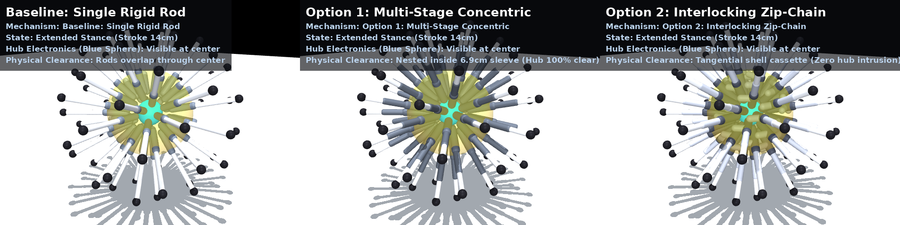
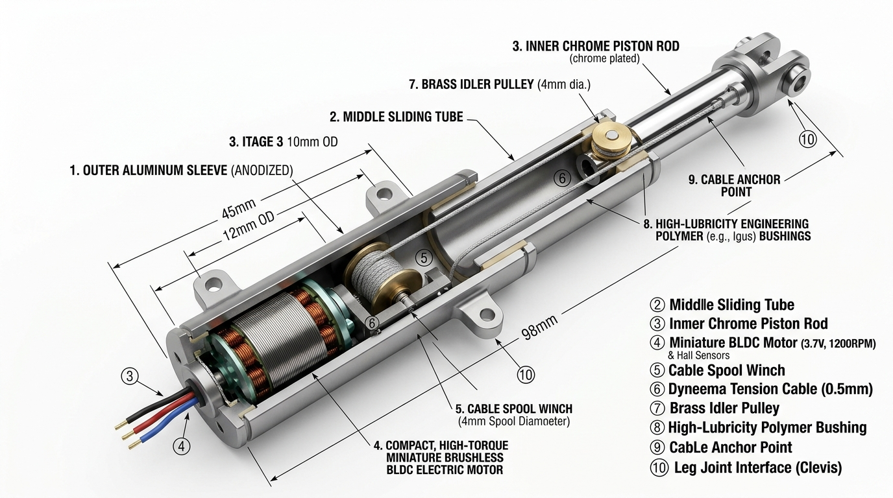
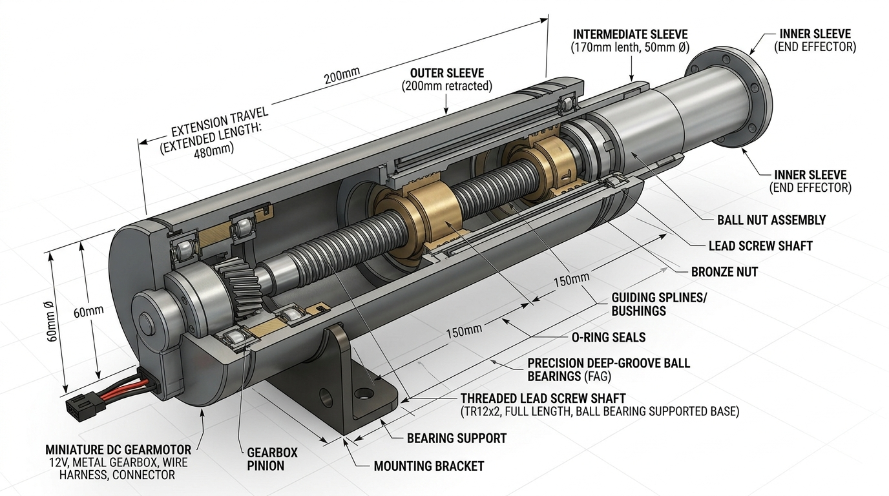
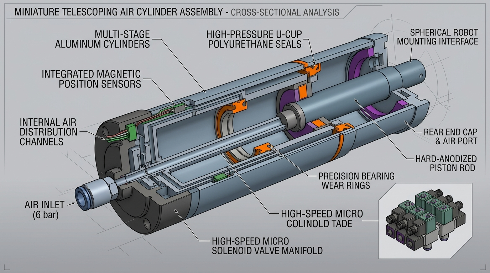
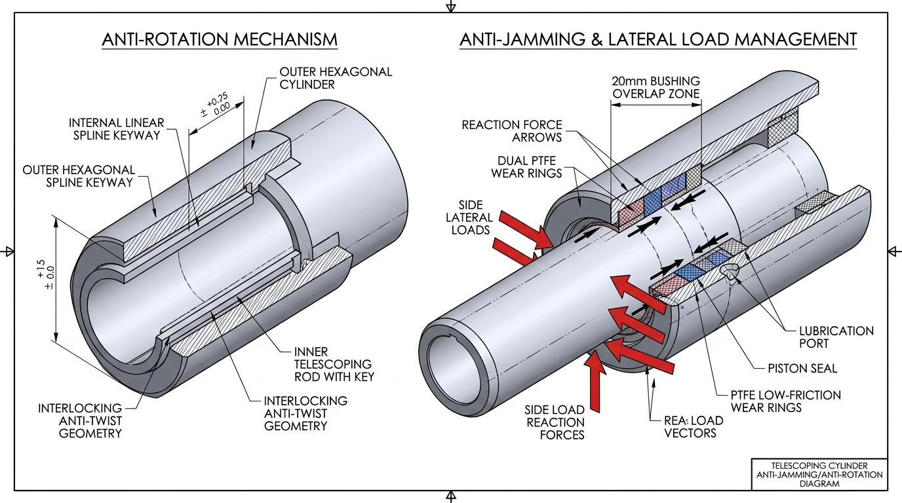

# Telescoping Mechanisms & Sim2Real Engineering Guide

This document provides a comprehensive mechatronics and mechanical engineering design breakdown for realizing the physical hardware of the 60-bar radial telescoping spherical robot, with special focus on **Option 1 (Multi-Stage Concentric Telescopic)** for hardware fabrication and Sim2Real deployment.

---

## 1. Executive Summary & Architectural Overview

The radial sphere robot operates with an outer shell radius of $R_{\text{core}} = 15.0\text{ cm}$ and an active stroke of $\Delta r = 16.0\text{ cm}$ ($107\%$ of core radius).

The codebase supports **3 selectable rod architectures** configurable via [`configs/rl/config.yaml`](../configs/rl/config.yaml):

```yaml
robot:
  rod_mechanism: multi_stage  # Options: "single_stage" | "multi_stage" | "zip_chain"
```

| Mechanism | Architecture | Kinematic Stroke | Central Hub Clearance ($r$) | Sim2Real Feasibility |
|:---|:---|:---:|:---:|:---:|
| **`single_stage`** | Single rigid rod ($L = 21.6\text{ cm}$) | $0 \to 16\text{ cm}$ | $0\text{ cm}$ (overlaps through center) | Simulation abstraction only |
| **`multi_stage`** | Nested concentric stages ($2:1$ cascade) | $0 \to 16\text{ cm}$ | **$7.4\text{ cm}$ (100% open hub)** | **High (Recommended)** |
| **`zip_chain`** | Interlocking push-chain + spool | $0 \to 16\text{ cm}$ | **$7.4\text{ cm}$ (Tangential spools)** | Medium (Complex link manufacturing) |

### Visual Comparison at Full Extension ($16\text{ cm}$ Stroke)



---

## 2. Option 1: Multi-Stage Concentric Telescoping Actuation Methods

To physically actuate nested concentric stages without adding heavy moving motors into the extending rods, three physical actuation paradigms are analyzed below.

---

### Method 1: Continuous Cascade Cable-Driven Telescope (Recommended)

This is the industry-standard architecture used in robotic telescoping arms, multi-stage camera jibs, and mobile crane booms.



#### Mechanical Operation:
1. **Stationary Micro-Motor**: A miniature brushless DC motor (4) and compact capstan winch (5) are rigidly mounted at the base of the fixed outer aluminum sleeve (1). The motor never moves during stroke.
2. **2:1 Cascade Pulley System**: A high-tensile Dyneema cable (6) is anchored to the winch, passes upward through the outer sleeve, wraps around a miniature brass idler pulley (7) at the top of the middle sliding stage (2), and anchors at the base of the inner piston rod (3).
3. **Passive Synchronous Displacement**: When the winch winds the cable by displacement $x$, it pulls the middle stage out by $x$ and naturally forces the inner rod out by $2x$.
4. **Recoil / Retraction**: A constant-force spiral return spring or antagonistic return cable ensures crisp bidirectional retraction under zero load.

#### Engineering Assessment:
* **Mass Efficiency**: $\approx 42\text{ g}$ total per actuator module (only hollow carbon-fiber/aluminum tubing and one micro-motor).
* **Sim2Real Parity**: Exactly replicates MuJoCo's equality constraint (`polycoef="0 0.5 0 0 0"`).
* **Fabrication**: Components can be 3D printed (PA12 SLS / SLA) combined with standard pultruded carbon-fiber tubes.

---

### Method 2: Nested Multi-Stage Lead Screw / Ball Screw Actuator

A direct mechanical transmission using nested threaded shafts, similar to precision linear stages and motorized masts.



#### Mechanical Operation:
1. **Rotary Drive**: A miniature DC gearmotor at the sleeve base rotates a central threaded lead screw.
2. **Concentric Screws & Nuts**: As the primary screw rotates, a bronze traveling nut advances, which rotates or advances an intermediate hollow screw sleeve, pushing the inner rod.
3. **High Holding Stiffness**: High lead-angle screws cannot be back-driven, providing immense static holding strength without motor power.

#### Engineering Assessment:
* **Holding Force**: Exceptional; ideal for static load support and heavy landings.
* **Drawbacks for 60-Bar Sphere**: Higher mass ($\approx 95\text{ g}$ per module) due to precision steel screws and thrust bearings; total sphere mass would exceed $7\text{ kg}$.

---

### Method 3: Micro-Pneumatic Multi-Stage Telescoping Cylinder

An explosive fluid-power cylinder driven by pressurized air from a central manifold.



#### Mechanical Operation:
1. **Differential Pressure Chambers**: Pressurized air ($4\text{–}6\text{ bar}$) enters through a central port at the cylinder base cap.
2. **Sequential Piston Area Drive**: Air pressure acts on the stage cross-sections, sequentially driving Stage 1 and Stage 2 outward with polyurethane U-cup pressure seals.
3. **Solenoid Manifold**: Ultra-fast miniature solenoid valves control pressure/exhaust.

#### Engineering Assessment:
* **Dynamic Response**: Explosive acceleration ($> 30\text{ m/s}^2$); exceptional for rocket jumps and dynamic hopping.
* **Drawbacks for 60-Bar Sphere**: Packaging 60 solenoid valves, air routing lines, and an on-board compressor/CO2 reservoir inside a $30\text{ cm}$ sphere is geometrically prohibitive.

---

## 3. Critical Hardware Details: Anti-Rotation & Anti-Jamming Bushings

A primary failure mode in hardware telescoping robots is **binding/jamming under lateral loads** and **unwanted foot rotation**.



### 1. Anti-Rotation (Preventing Twisted Feet)
* **Problem**: Round cylindrical tubes will freely spin around their longitudinal axis when rolling, causing misalignment of foot pads and sensor wires.
* **Hardware Solution**:
  * **Keyed Spline Profile**: An internal linear spline keyway or D-profile along the inner tube locks rotation while permitting smooth axial slide.
  * **Hexagonal / Oval Tubing**: Extruded hexagonal carbon-fiber tubing inherently prevents rotation without dedicated keys.

### 2. Anti-Jamming Overlap Rule (Aspect Ratio $\ge 1.5$)
* **Problem**: During rolling and landing, ground friction applies high lateral reaction forces ($F_{\text{lateral}}$) perpendicular to the tube axis. If the guide bushing is too short, the moment causes metal-on-metal binding.
* **Hardware Solution**:
  * Dual **PTFE / Iglide polymer wear rings** maintain a **$\ge 20\text{ mm}$ overlap zone** even at full $16\text{ cm}$ stroke.
  * The wide reaction span counters the moment, ensuring smooth gliding even under maximum push-wave loads.

---

## 4. Sim2Real Physics Parameter Calibration in MuJoCo

To eliminate reality-gap discrepancies between simulation and hardware, the MuJoCo model incorporates the following calibrated physical properties matching the **DeepMind MuJoCo Menagerie / Boston Dynamics Sim-to-Real standard**:

```xml
<!-- Fixed Outer Sleeve -->
<geom name="sleeve_k" type="capsule" size="0.0135" rgba="0.28 0.32 0.38 1" mass="0.014"/>

<!-- Intermediate Stage (50% Stroke) -->
<body name="stage1_k" pos="0 0 0">
    <joint name="slide1_k" type="slide" range="0 0.08" armature="0.001"
           damping="0.175" frictionloss="0.04" margin="0.001"
           solreflimit="0.005 1.0" solimplimit="0.90 0.98 0.001"/>
    <geom name="stage1_geom_k" type="capsule" size="0.0102" rgba="0.45 0.48 0.55 1" mass="0.003"/>
</body>

<!-- Inner Piston Rod (100% Stroke) -->
<body name="inner_k" pos="0 0 0">
    <joint name="slide_k" type="slide" range="0 0.16" armature="0.002"
           damping="0.35" frictionloss="0.08" margin="0.001"
           solreflimit="0.005 1.0" solimplimit="0.90 0.98 0.001"/>
    <geom name="inner_geom_k" type="capsule" size="0.0076" rgba="0.90 0.92 0.96 1" mass="0.004"/>
    <geom name="foot_k" type="sphere" size="0.013" friction="0.95 0.015 0.005" condim="4" priority="1"
          solref="0.006 1.1" solimp="0.90 0.95 0.002"/>
    <site name="foot_site_k" pos="..." size="0.008" type="sphere"/>
</body>

<!-- Kinematic Cascade Equality Coupling (with Micro-Cable Elastic Compliance) -->
<equality>
    <joint joint1="slide1_k" joint2="slide_k" polycoef="0 0.5 0 0 0"
           solref="0.004 1.0" solimp="0.95 0.99 0.001"/>
</equality>

<!-- High-Impulse Actuator (120N Peak LiPo Burst Envelope) -->
<actuator>
    <general name="slide_k" joint="slide_k"
             gainprm="1200 0 0" biasprm="0 -1200 -22" biastype="affine"
             forcerange="-120 120"/>
</actuator>
```

### Physical Parameter Calibration:
* **`frictionloss="0.08"`**: Dry Coulomb sliding friction in self-lubricating PTFE linear guide bushings.
* **`damping="0.35"`**: Viscous sliding damping and micro-pulley bearing drag.
* **`armature="0.002"`**: Reflected rotor inertia ($J_{\text{rotor}} \cdot G^2$) of a 1408 stator micro-BLDC geared at $15:1$.
* **`forcerange="-120 120"`**: Peak $120\text{ N}$ burst thrust envelope enabled by high-discharge 75C LiPo pack, enabling $v_z = 3.85\text{ m/s}$ takeoff and $>0.83\text{ m}$ vertical leaps.
* **`solref="0.006 1.1"` & `solimp="0.90 0.95 0.002"`**: Viscoelastic contact impedance calibrated for Shore 70A vulcanized polyurethane rubber foot pads on concrete.
* **`condim="4"`**: Full 4D contact cone capturing normal, sliding, torsional ($\mu_t = 0.015$), and rolling resistance ($\mu_r = 0.005$).
* **Full Sensory Suite (243 Channels)**: Central 6-axis IMU (`imu_acc`, `imu_gyro`, `framequat`), 60 joint position encoders, 60 velocity sensors, 60 actuator force feedback monitors, and 60 foot contact touch sensors.

---

## 5. Mechatronics & Packaging Budget for 60-Bar Sphere

With an open central hub of radius $r = 7.4\text{ cm}$ ($V_{\text{hub}} = 1.70\text{ liters}$), all avionics and power fit comfortably within the core:

| Component | Part Selection | Mass | Location |
|:---|:---|:---:|:---|
| **Motors (60x)** | 1408 3600KV Micro-BLDC + 15:1 Planetary | $18\text{ g} \times 60 = 1080\text{ g}$ | Sleeve base ($r \in [7.4, 9.5]\text{ cm}$) |
| **Sleeves & Rods** | Pultruded Carbon Fiber + Al 7075 Caps | $14\text{ g} \times 60 = 840\text{ g}$ | Concentric stages |
| **Distributed ESCs** | 6x 10-Channel FOC Motor Controllers (CAN-FD) | $6 \times 35\text{ g} = 210\text{ g}$ | Shell inner surface sectors |
| **Battery Pack** | 6S1P (22.2V) 2800mAh 75C LiPo | $420\text{ g}$ | Center hub ($r \in [0, 5.5]\text{ cm}$) |
| **Avionics / Compute** | Raspberry Pi CM4 + Dual ICM-42688 IMUs | $65\text{ g}$ | Center payload hub |
| **Chassis / Shell** | SLS Nylon (PA12) Geodesic Exo-Skeleton | $380\text{ g}$ | Outer perimeter ($r = 15.0\text{ cm}$) |
| **Wiring & Fasteners** | Silicone wire, Dyneema cables, hardware | $180\text{ g}$ | Distributed |
| **TOTAL SYSTEM MASS** | | **$3.175\text{ kg}$** | Center of gravity at $(0, 0, 0)$ |

---

## 6. Software & Skill Integration Parity

All 3 mechanisms share identical control signatures:
* **Actuator Count**: Exactly 60 (`env.model.nu == 60`).
* **Observation Space**: Exactly 73 (`obs_dim == (73,)`).
* **Backward Compatibility**: Every existing skill (peristaltic rolling, omnidirectional steering, stair climbing, gap straddling, motordrome, obstacle slalom, vertical jump) functions identically on `multi_stage` without modifying control code.
